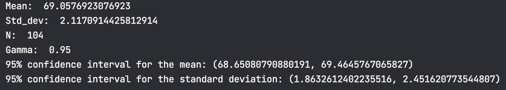
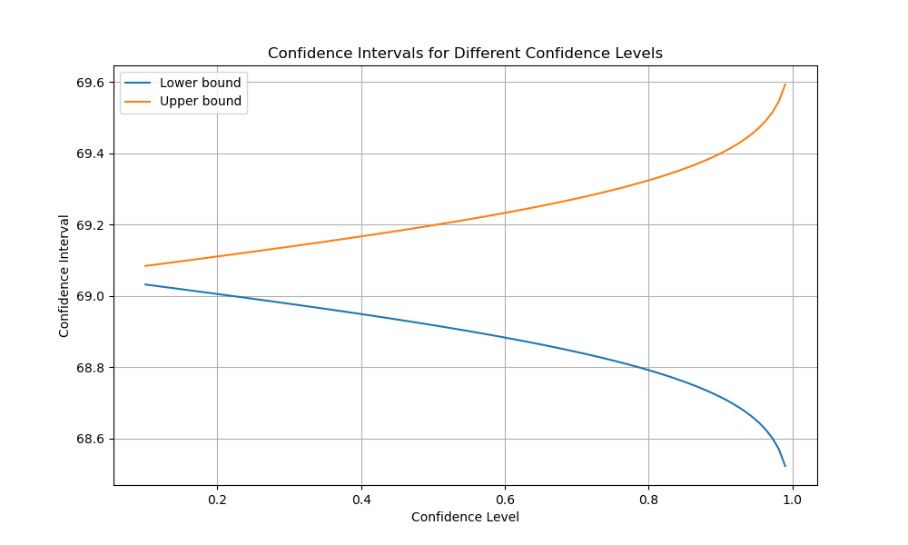
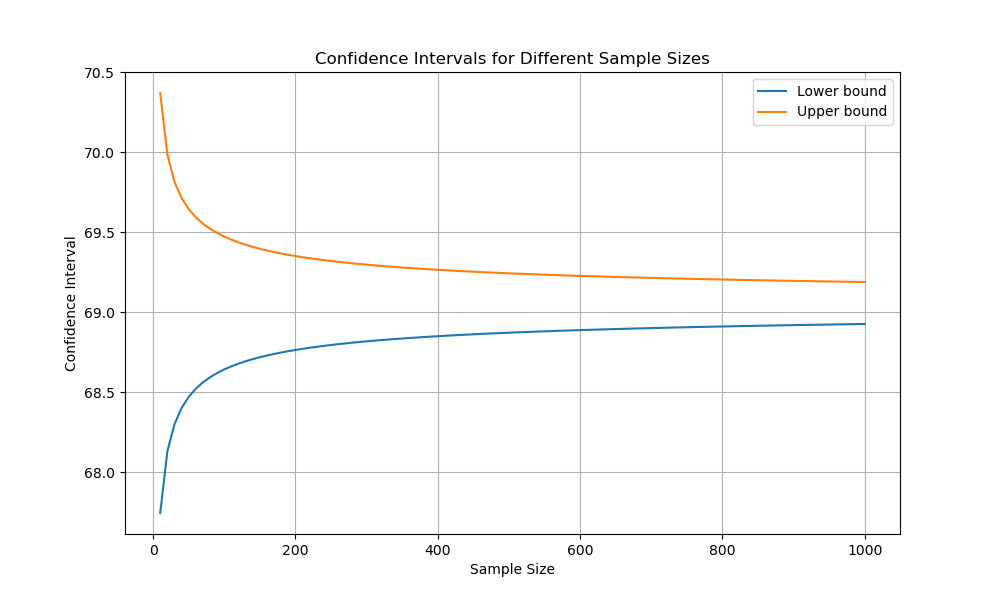
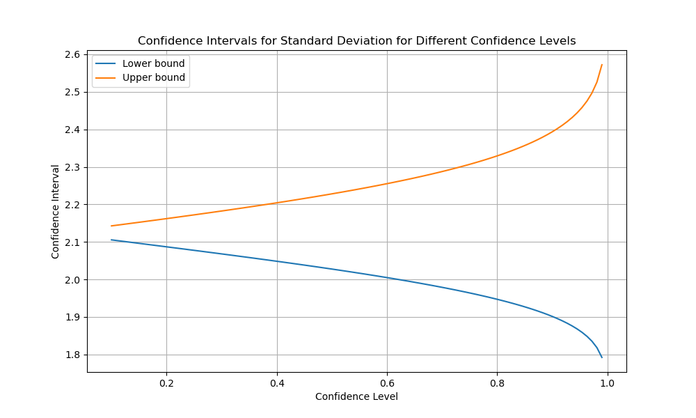
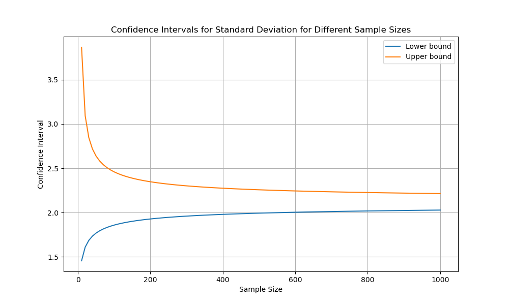

# Лабораторна робота №2

## Тема

Інтервальні оцінки параметрів розподілу

## Мета

Ознайомитись з методикою визначення інтервальних оцінок параметрів
розподілу та дослідити, що впливає на якість інтервальних оцінок.

## Завдання

Продовжити роботу зі згенерованими вибірками у л/р No1 та:

1. Побудувати 95% двосторонні довірчі інтервали на математичне
сподівання та середньоквадратичне відхилення.
2. Дослідити залежність оцінок від рівня довіри та обсягу вибірки.

## Виконання

### Розрахуємо інтервал на математичне сподівання

Основна формула:

$(\overline{x} - t_{kp} * \frac{s}{\sqrt{n}}; \overline{x} + t_{kp} * \frac{s}{\sqrt{n}})$

Знаходимо значення tkp за таблицями функції Лапласа

$Ф(t_{kp}) = \gamma/2 = 0.95/2 = 0.475$

$t_{kp}(\gamma) = (0.475) = 1.96$

Тоді остаточний інтервал буде

$(69.057692307692 - 0.407;69.057692307692 + 0.407) = (68.65;69.46)$

### Розрахуємо інтервал на середньоквадратичне відхиллення

Тут по суті так само але використовується розподіл хі-квадрат

Онлайн калькулятор сказав що в нас інтервал

$(1.86, 2.45)$

### Виконання коду

Як видно, наші розрахунки та онлайн калькулятор співпадають з розрахунками в коді, тому можна переходити до аналізу параметрів.

### Теоретичний аналіз

#### Розмір вибірки

Якщо говорити про розмір вибірки, то чим вона більша - тим більш точні значення середнього та середньоквадратичного до справжніх значень генеральної сукупності, тоді якщо в нас сукупність розміром нескінченність або в нас просто генеральна сукупність, інтервал повинен бути неймовірно малим, або зовсім дорівнювати справжньому значенню.

#### Рівень довіри

Це по суті відсоток того що ми помилимось(або будемо праві). Якщо нам потрібні дуже точні значення, то ми виставимо цей відсоток на десь 99, та наш інтервал повинен бути дуже малим.

### Запітоніти аналіз

Ми зафіксуємо значення одного параметра та переглянемо як впливає він на інтервали, побудуємо з цього графічки

#### Мат сподівання від довіри

#### Мат сподівання від розміру

#### Відхилення від довіри

#### Відхилення від розміру

#### Аналіз

Як видно наші прогнози співпали, коли зростає довіра - зростає інтервал, та коли зростає розмір, він зменшується, але можна побачити асиметрію в графікає для стандартного відхилення, це можна пояснити коренем у формулі, який сильніше впливає на менші значення, тому графііки типу сплюснуті донизу

## Висновок

На цій лабораторній роботі ми навчилися будувати довірчі інтервали на середнє значення та стандартне відхилення, також проаналізували залежність цих інтевалів від різних параметрів вибірок та побудували на основі цього графіки.
