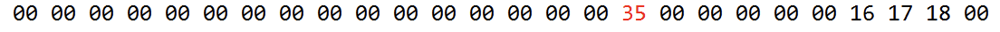

# Лабораторна робота No 2. Дослідження команд передачі керування, виклику та повернення із підпрограм

## Тема

команди передачі керування

## Мета

користуючись налагоджувачем дослідити виконання команд передачі
керування у покроковому режимі.

## Порядок виконання лабораторної роботи

1) Вивчити теоретичні відомості з теми «Команди передачі керування». Дослідити формати (типи) команд, представлення операндів і роботу програми, що наведено у лабораторній роботі як приклад. Вміти коментувати команди, які наведено у таблиці 1.3.
2) Ввести програму з наведеними нижче командами передачі керування у симулятор AVR-Studio 4.
3) За допомогою програмно-налагоджувальних засобів (ПНЗ) у AVR- Studio 4 проаналізувати виконання програми з наведеними нижче командами передачі керування. Переконатися в правильному виконанні програми. При негативному результаті здійснити зміну програми та повторити перевірку.
4) Розробити алгоритм для виконання індивідуального завдання.
5) Розробити програму для виконання індивідуального завдання.
6) Ввести програму індивідуального завдання у симулятор AVR-Studio 4.
7) За допомогою програмно-налагоджувальних засобів (ПНЗ) у AVR-Studio 4 проаналізувати виконання індивідуальної програми. Переконатися в правильному виконанні індивідуального завдання, при негативному результаті здійснити зміну алгоритму або програми, повторити перевірку.
8) Роздрукувати лістинг правильно працюючої програми.
9) Відповісти на контрольні питання викладача.

## Виконання

Варіант 7

Код можна знайти в [цьому файлі](lab2/lab2/main.asm)

### Завдання 1

Вміст регістра SREG необхідно помістити в: R21, якщо [R19] >1Fh; R22, якщо [R19] < 1Fh.

В прикладі виділено r23, тобто значення було записано в r22, що відповідає умові.

### Завдання 2

Написати підпрограму, яка переписує послідовність чисел з одних регістрів у інші. Якщо молодший біт регістра R21 встановлений, то запис відбувається так: R12→ R22, R13 → R23, R14 → R24, інакше R22→ R12, R23 → R13, R24 → R14

Для того щоб побачити наші зміни, я записав до регістрів 22,23,24 відповідні до номерів числа(там шістнадцяткова, тому замість 22 в нас 16).  

В нашому виподку я не чіпав регістр 21, тому запис повинен іти з 22 до 12 і так далі. Як бачимо значення дійсно перезаписались  

## Висновок

На цій лабораторній роботі я позйомився з по суті if та goto, частини програмування з якими можна зробити що завгодно. Типо циклів.
