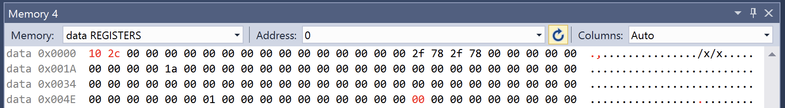

# Лабораторна робота №3

## Тема

Нові команди AVR-мікроконтролерів

## Мета

Користуючись налагоджувачем дослідити виконання нових команд AVR-мікроконтролерів у покроковому режимі.

## Виконання

Лабораторну роботу виконано на мікропроцесорі AtMega645A, на ньому нажаль немає кількох команд. Код команд знаходиться [у цьому файлі](./lab3/lab3/main.asm)

### Множення беззнакових чисел

### Множення знакових чисел

### Множення знакового числа на беззнакове

### Множення дробових беззнакових чисел

### Множення дробових знакових чисел

### Копіювання слова

### Завантаження регістра з памяті програм з адресою в індексному регістрі

### Додати без та з перенесенням

### Відняти без перенессення

## Висновок

На цій лаборторній роботі я познайомився з новими командами для мікропроцесора та подивився як вони працюють. Я також повибирав різні мікроконтролери щоб більшість команд працювала.
