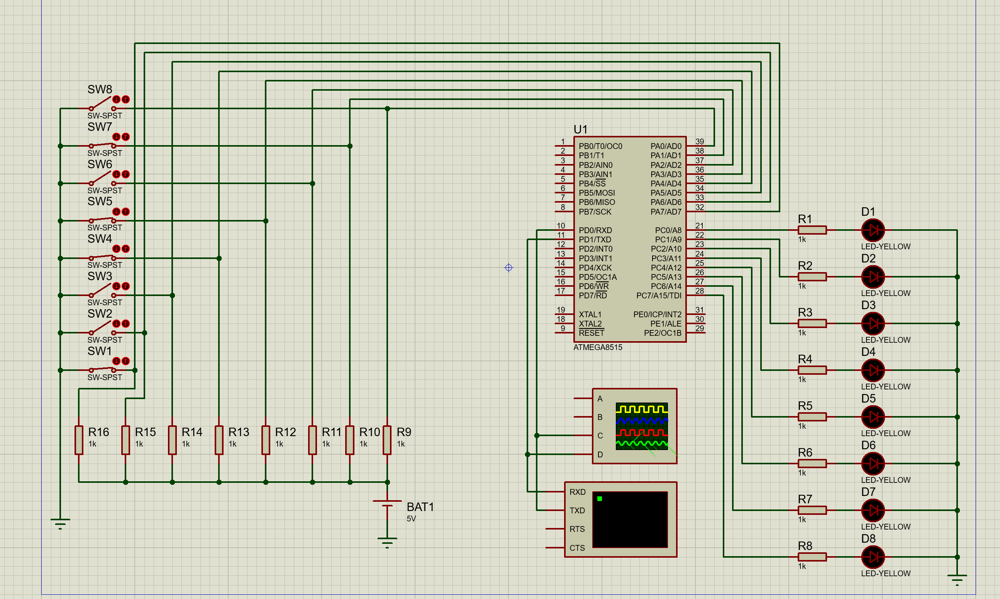
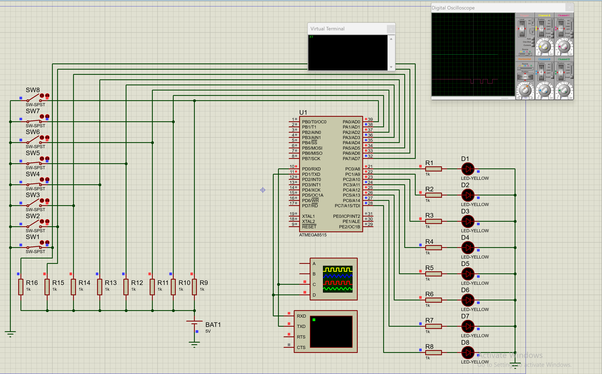
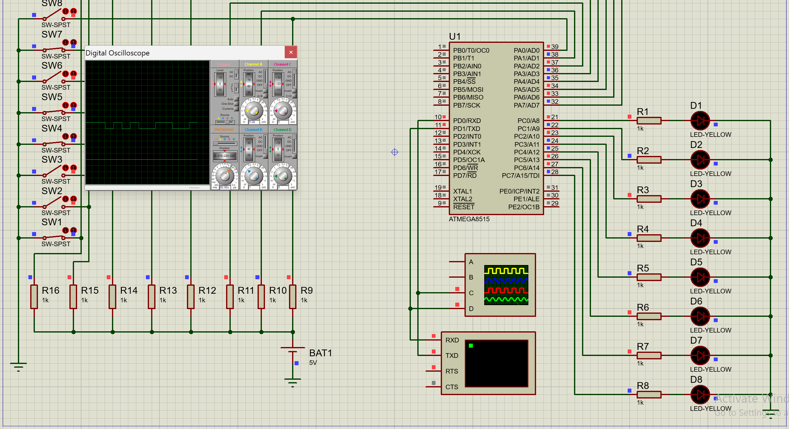
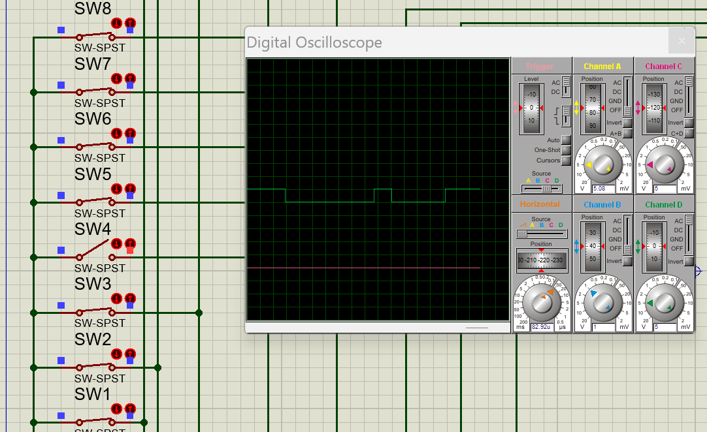

# Лабораторна робота №4

## Тема

Моделювання модуля універсального асинхронного приймача-передавача сім’ї AVR

## Мета

Користуючись пакетом PROTEUS дослідити моделювання модуля
універсального асинхронного приймача-передавача сім’ї AVR

## Порядок виконання

1) Створити модель пристрою в пакеті Proteus 8.6.
2) Розробити схему алгоритму роботи моделі та робочу програму.
3) Створити hex-файл та підключити його до мікроконтролера.
4) Запустити модель та виконати її дослідження згідно методичних
вказівок.
5) Зробити відповідні висновки.

## Виконання

### Схема

### Використання терміналу

Як видно з осцилографа ми отримали таку комбінацію: `...1110111011001`. Якщо відкинути просто 111 які були там коли передача не почалась отримаємо `0111011001`, перший біт - старт біт, далі 8 біт самого коду `11101100`, оскільки в нас вага такого слова 5, тому біт контролю парності приймає одиницю, та далі вже йдуть 1111 з мовчання в каналі. Отже наше повідомлення - 37H, що підтверджує наші розрахунки

### Кнопочки

Це положення, які були встановленні в схемі.

А це приклад одинокої кнопочки посередині

## Висновок

На цій лабораторній роботі я використав модуль універсального асинхронного приймача-передавача сім'ї AVR в середовищі Proteus. Також я повторив коди, що виправляють помилки з Теорії інформації та кодування, бо код з контролем парності та непарності ми якраз там проходили, та засоби зв'язку в комп'ютерних мережах з попереднього семестру.
