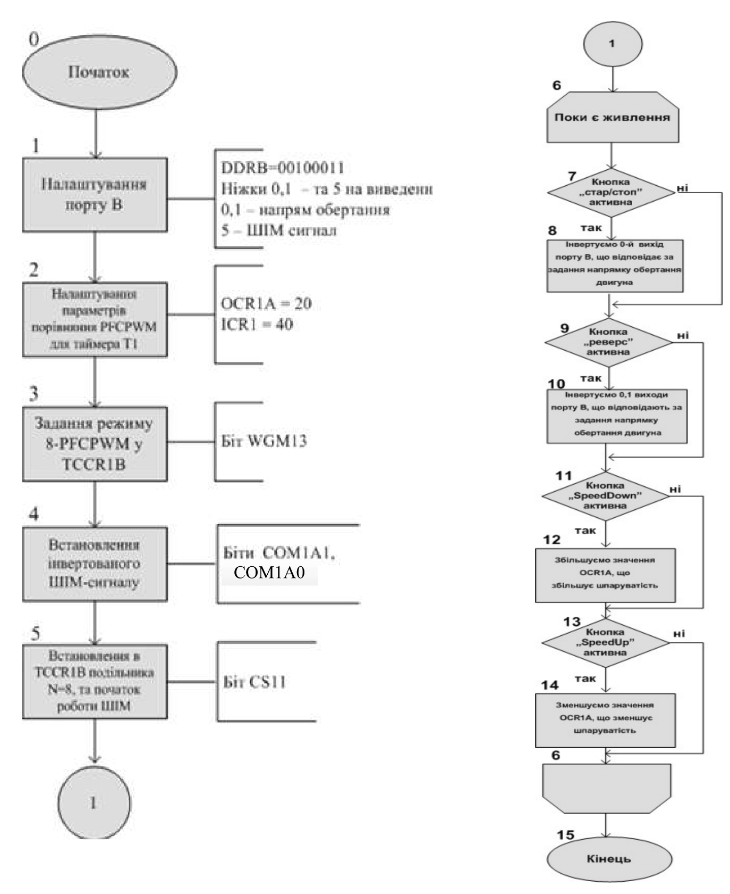
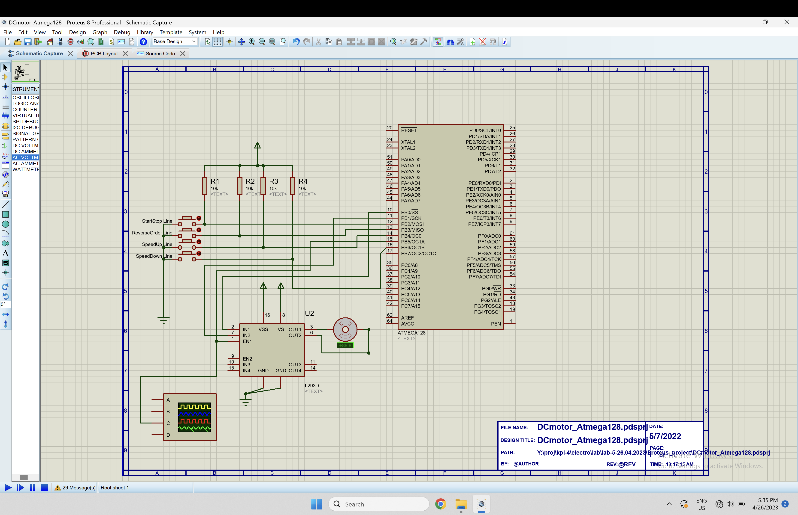
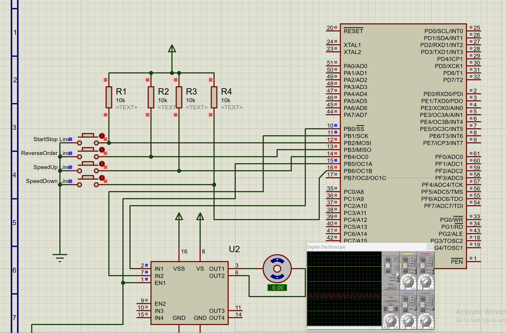
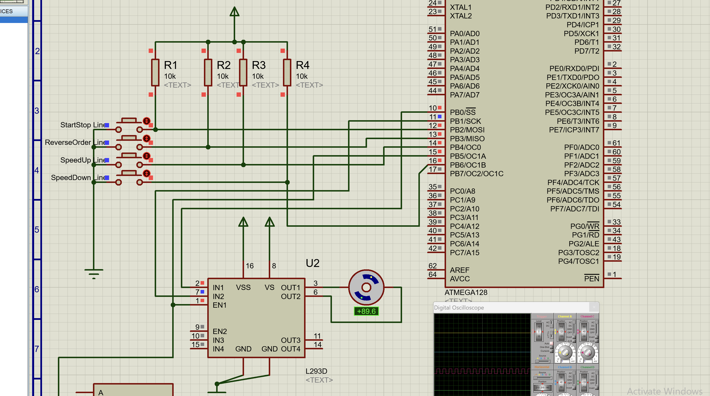
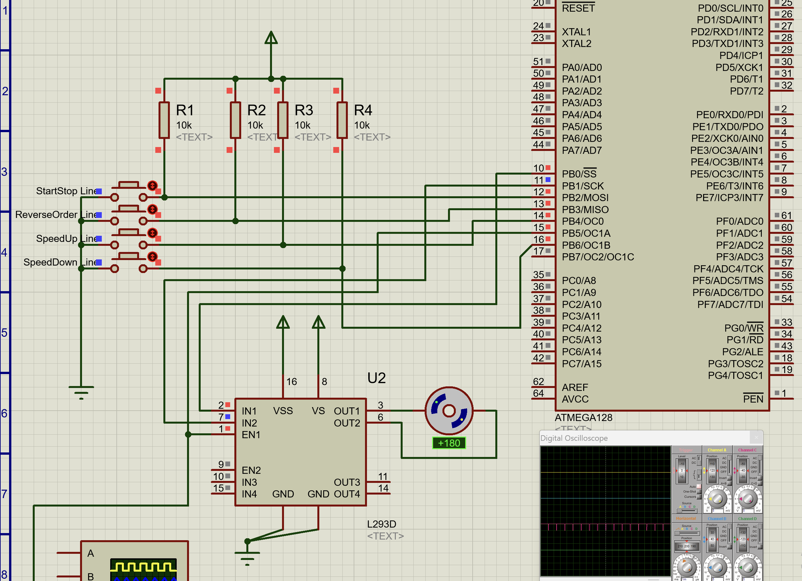
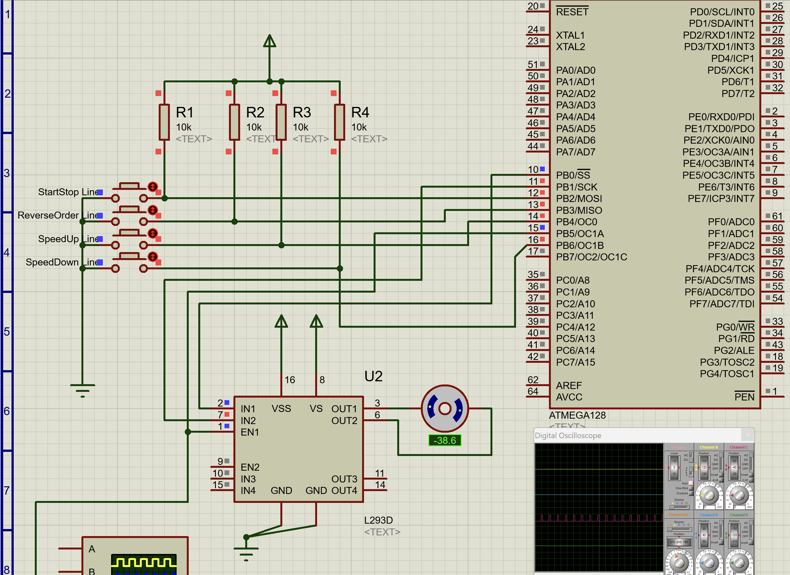

# Лабораторна робота №5

## Тема

Моделювання пристрою керування двигуном постійного струму з використанням мікроконтролера сім’ї AVR.

## Мета

Користуючись пакетом Proteus 8.6 дослідити роботу пристрою керування двигуном постійного струму.

## Порядок виконання

1) Створити модель пристрою в пакеті Proteus 8.6.
2) Розробити схему алгоритму роботи моделі та робочу програму.
3) Створити hex-файл та підключити його до мікроконтролера.
4) Запустити модель та виконати її дослідження згідно методичних вказівок.
5) Зробити відповідні висновки.

## Виконання

### Алгоритм роботи

### Модель

А тепер запустимо її.

Як видно схема на осцилографі, мікроконтрллер видає ШІМ-сигнал який надходить до схеми, але мотор не обертається, оскільки на входах однакові сигнали, це видно з того що вони однакового кольору, запустимо мотор натисканням на кнопку.

Після натискання на кнопку старту, мікроконтроллер подасть на один з входів логічну одиницю, тому двигун почав обертатися. Прискоримо двигун.

Ми кілька разів натиснули на кнопку пришвидшення, та в нас шпаруватість стала набагато менше за 2, тому еквівалентна постійна напруга дуже висока та двигун обертається швидше. Змінимо напрям та сповільнимо його.

Тут ми змінили напрям натисканням на відповідну кнопку, та в нас тепер інші сигнали на входах схеми, через це двигун отримує ток в іншому напрямі та обертається також в іншому напрямі, також ми збільшили шпаруватість ШІМ-сигналу, це видно на осцилографі(пімпочки короткі), та швидкість мотора впала.

## Висновок

На цій лабораторній роботі я навчився керувати двигуном за допомогою мікроконтроллера сім'ї AVR, спробував писати та розуміти низькорівневий код на C для мікроконтроллера та працювати з модулем таймера;