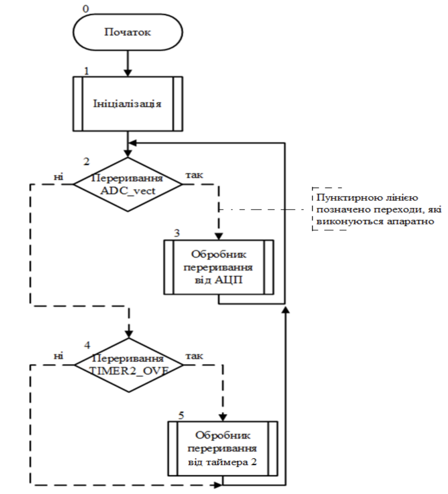
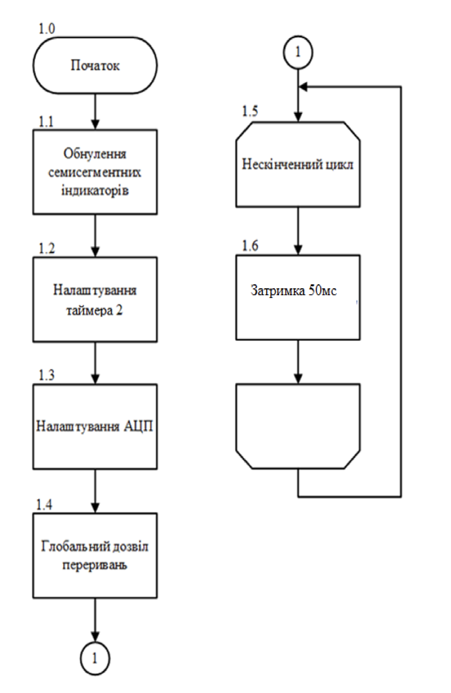
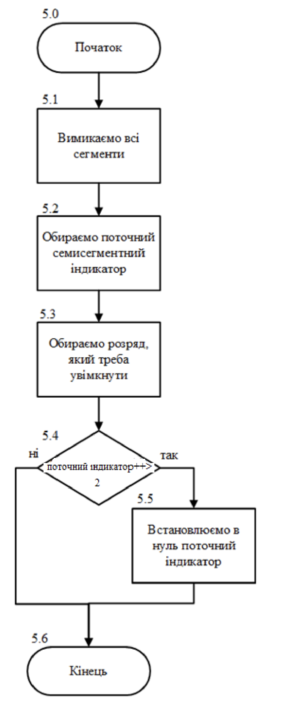
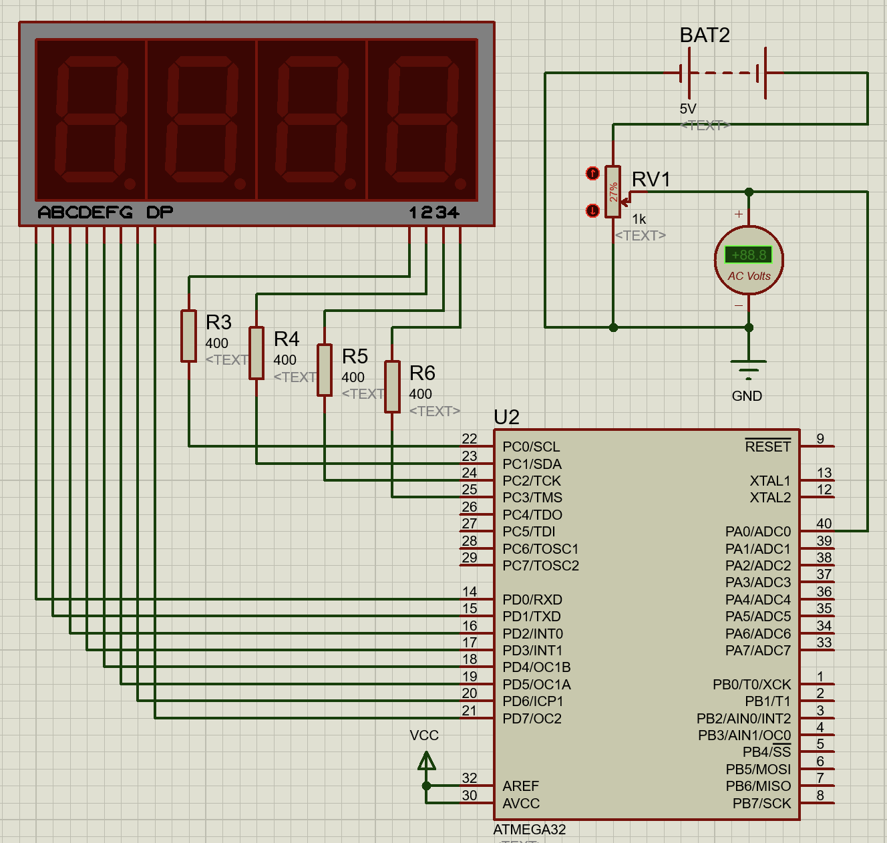
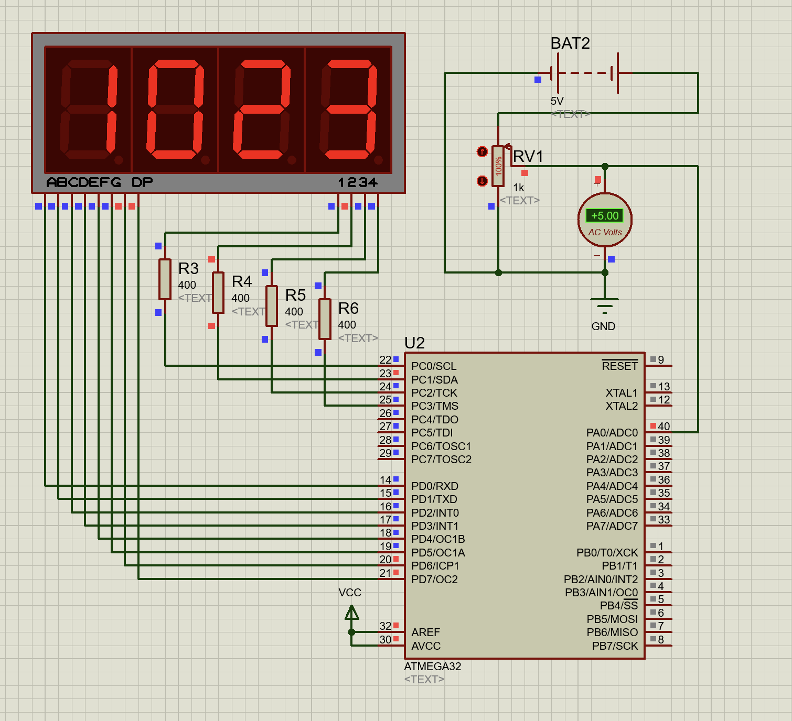
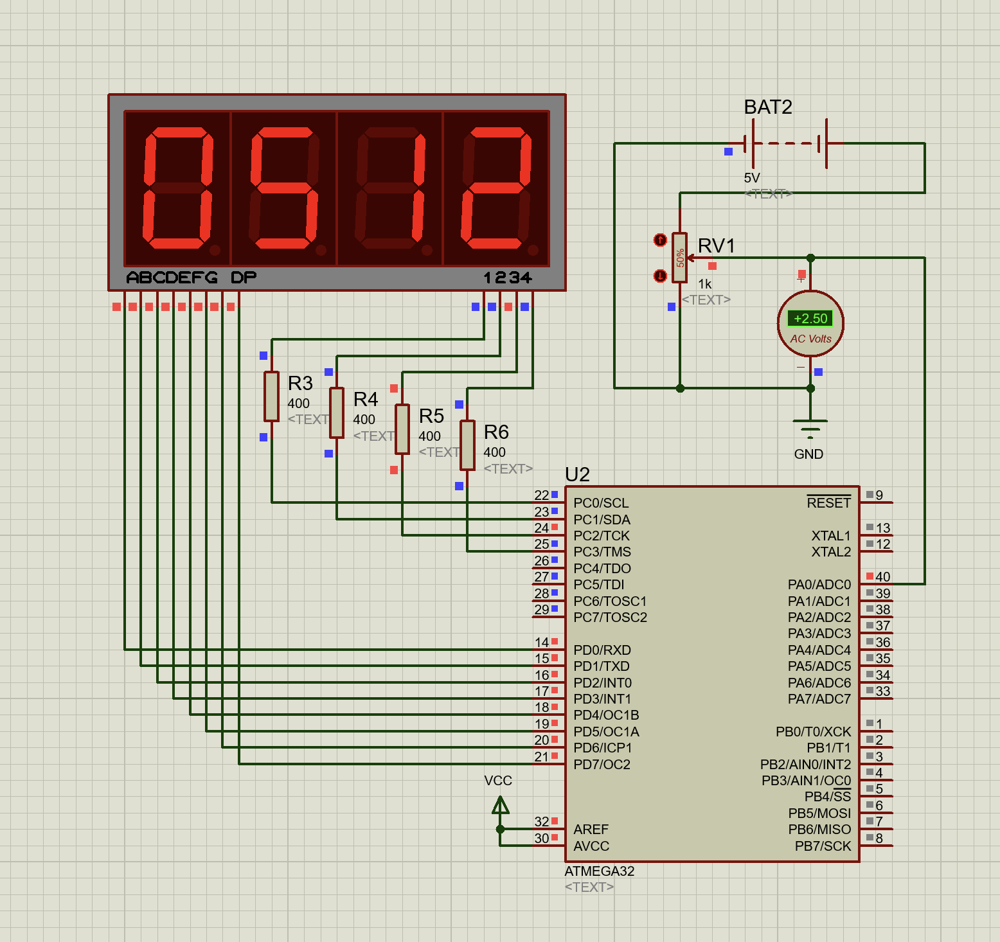
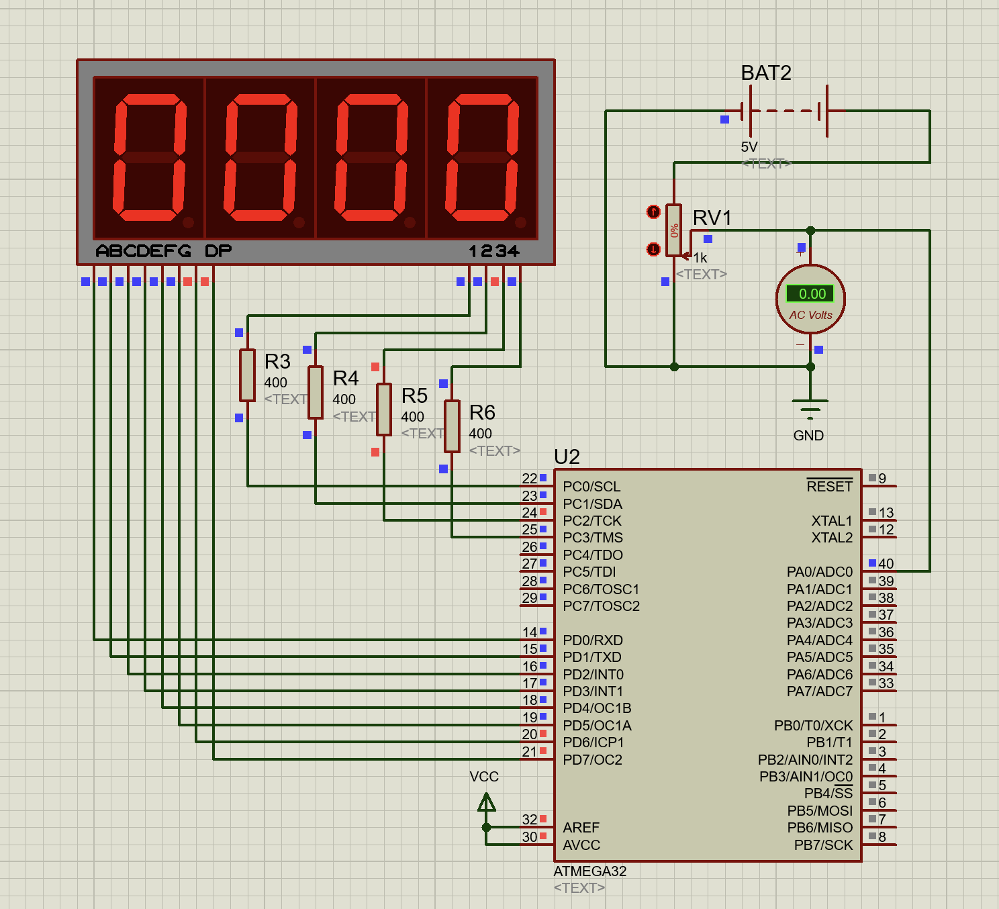

# Лабораторна робота №6-7

## Тема

Моделювання модуля АЦП мікроконтролерів сім’ї AVR. Моделювання цифрового вольтметра

## Мета

Користуючись пакетом Proteus 8.6 дослідити роботу модуля АЦП та дослідити моделювання цифрового вольтметра

### Виконання

#### Алгоритми роботи

##### Загальна схема

##### Ініціалізація

##### Обробка переривань від таймера

##### Переривання АЦП

#### Код

Код робочої прогами наведено у файлі [prog.c](./prog.c)

#### Схема

## Висновок

На цій лабораторній роботі я познайомився з новою частиною мікроконтроллера сім'ї AVR - АЦП. За допомогою застосунку proteus дослідив його роботу та змоделював кілька використань
