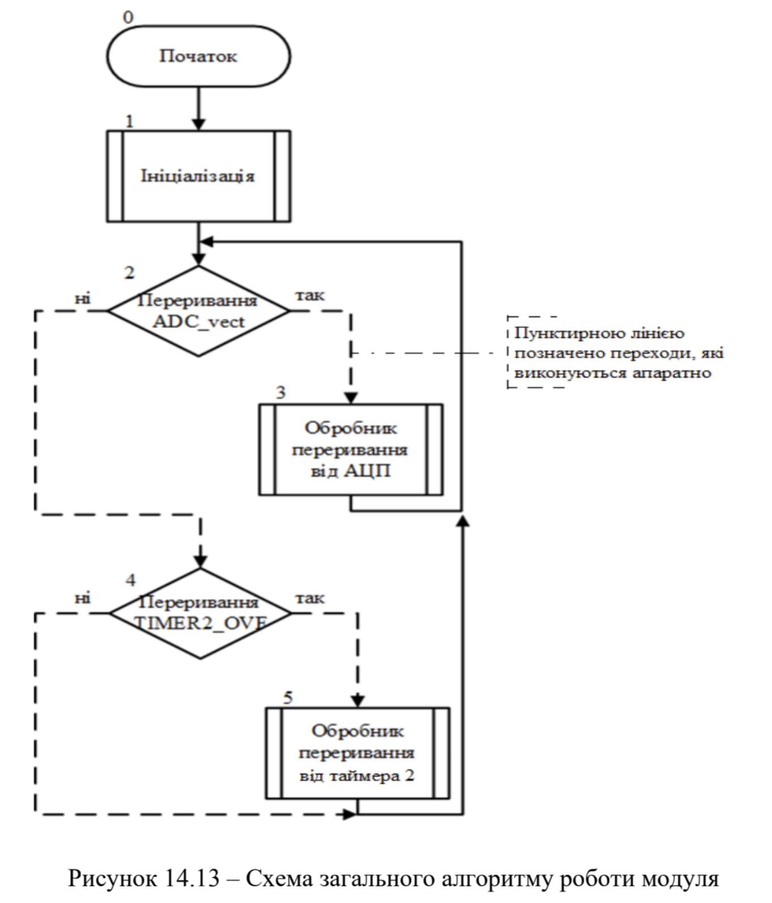
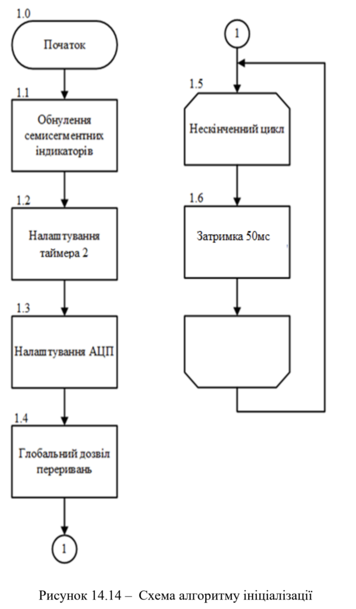
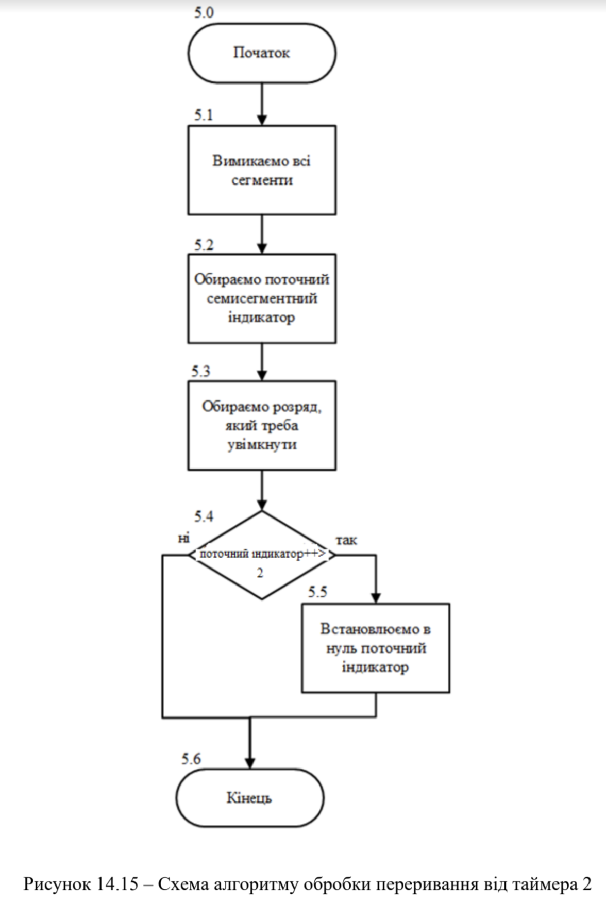
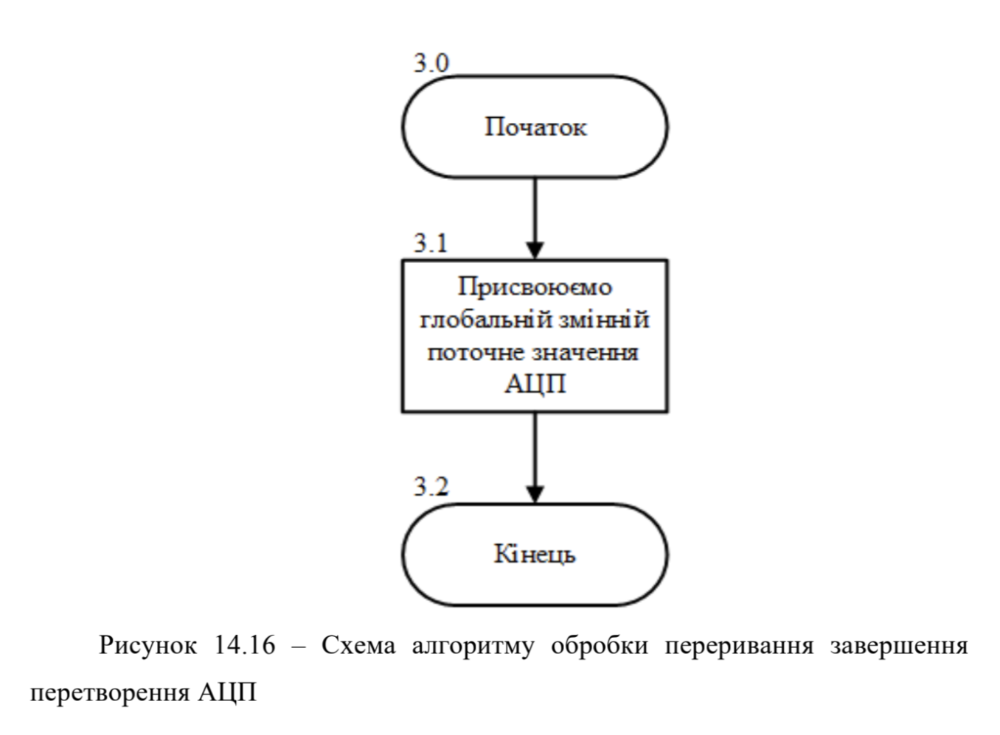
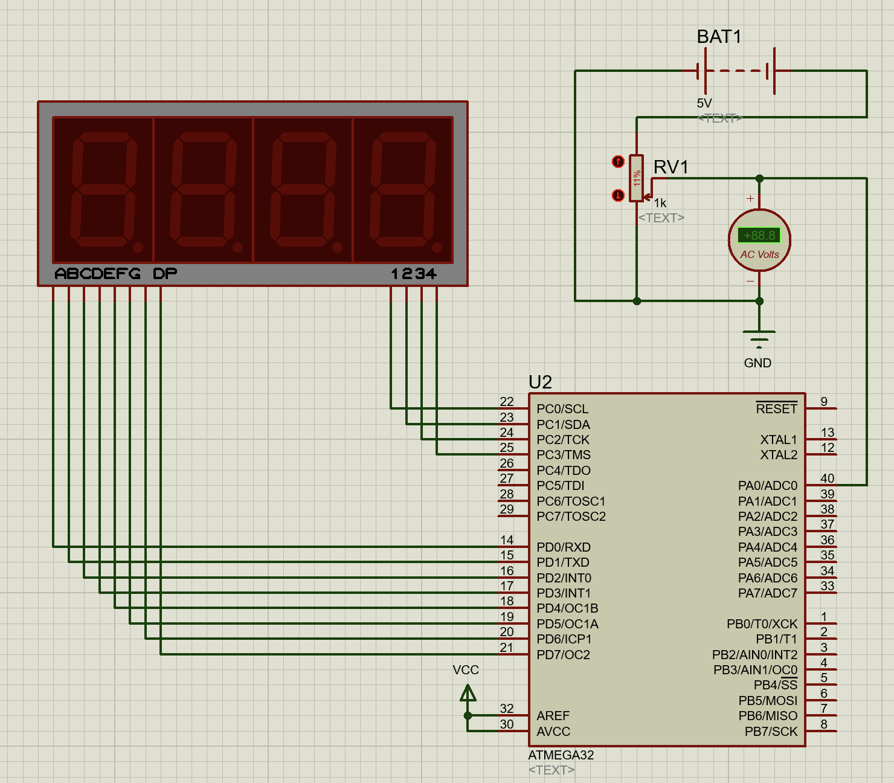
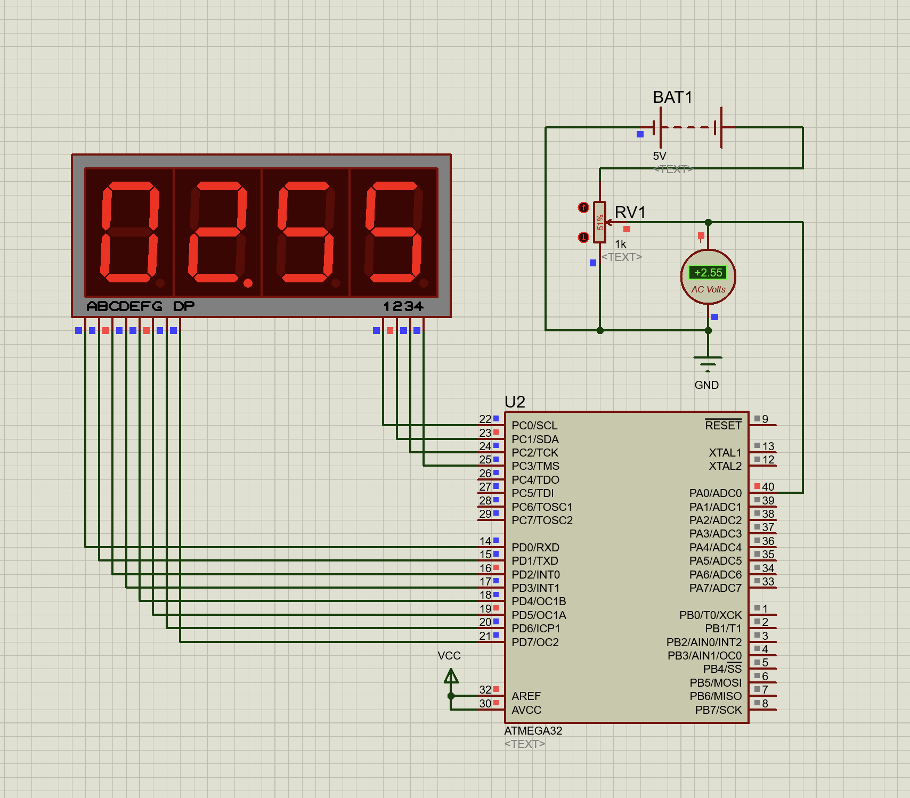

# Лабораторна робота №6-7

## Тема

Моделювання модуля АЦП мікроконтролерів сім’ї AVR.
Моделювання цифрового вольтметра

## Мета

Користуючись пакетом Proteus 8.6 дослідити роботу модуля АЦП
та дослідити моделювання цифрового вольтметра

## Порядок виконання

Порядок виконання роботи

1) Створити модель модуля АЦП та модель цифрового вольтметра в
пакеті Proteus 8.6.
2) Розробити схеми алгоритмів роботи цих моделей та робочі програми.
3) Створити відповідні hex-файли та підключити їх до
мікроконтролера.
4) Запустити моделі та виконати їх дослідження згідно методичних
вказівок.
5) Зробити відповідні висновки.

## Виконання

### Алгоритми

### Схема

Протеус проект знаходиться у папці [ADC](./ADC-%D0%A6%D0%92/)

Різниця цієї роботи від попедньої в тому що значення яке виводиться узгоджується з реальним значенням за допомогою множення на коефіцієнт 5/1023 в частині `display = (ADC_value)*(5/1023)*100;`

## Висновок

На цій лабораторній роботі ми використали результати досліджень з попередньої роботи та додали узгодження з реальними значеннями, що дозволило точно виводити значення з вольтметра на табло.
