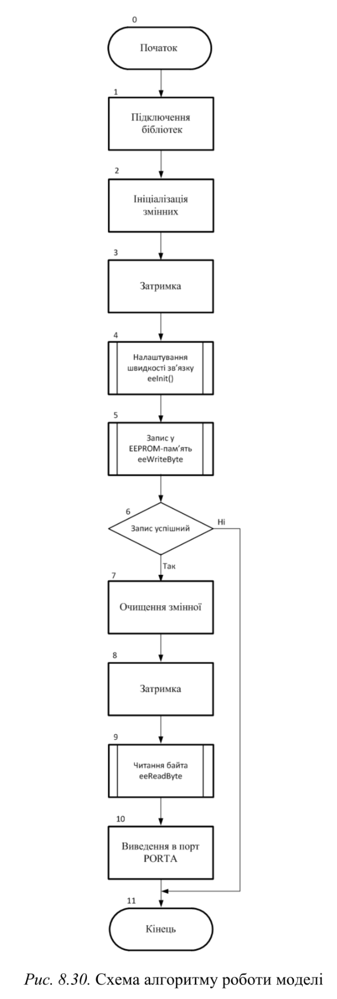
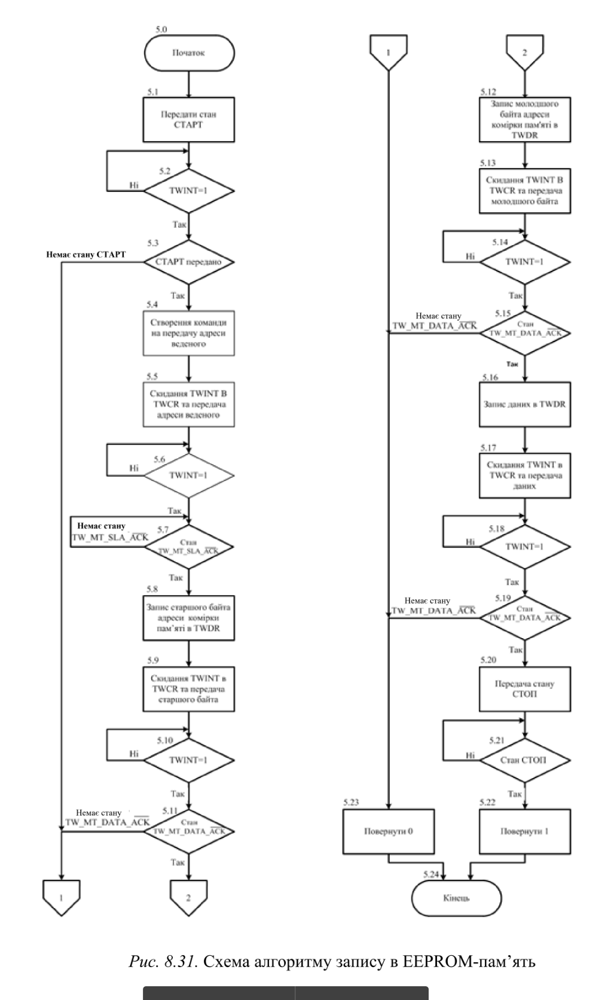
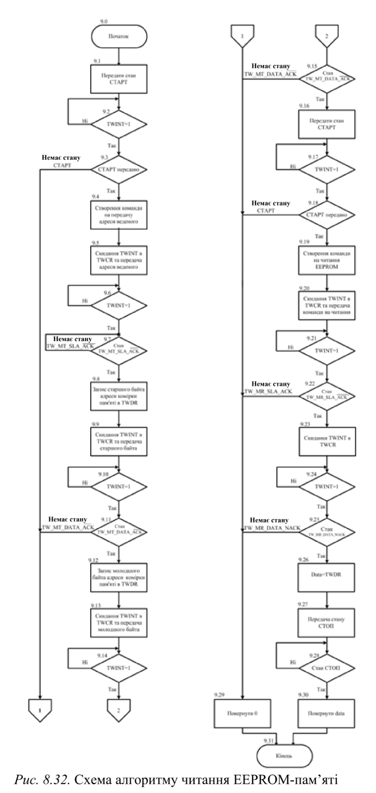
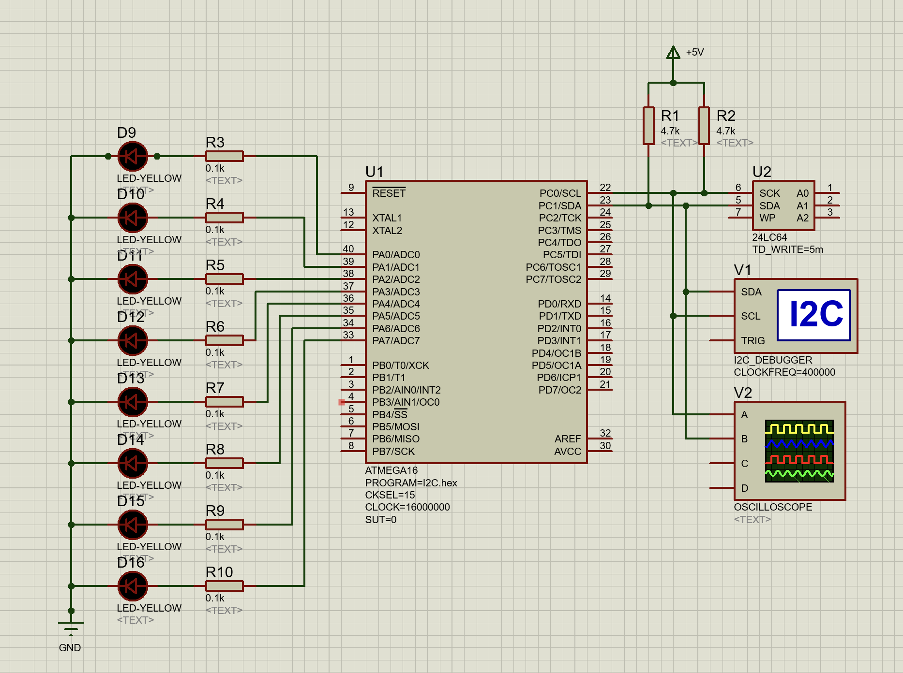
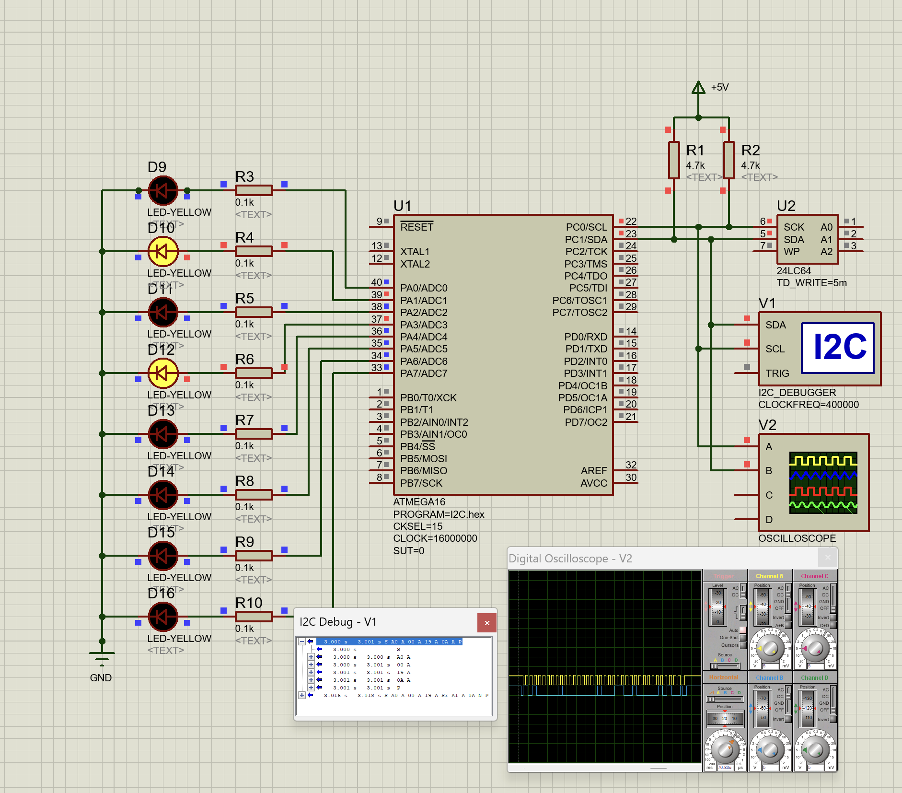
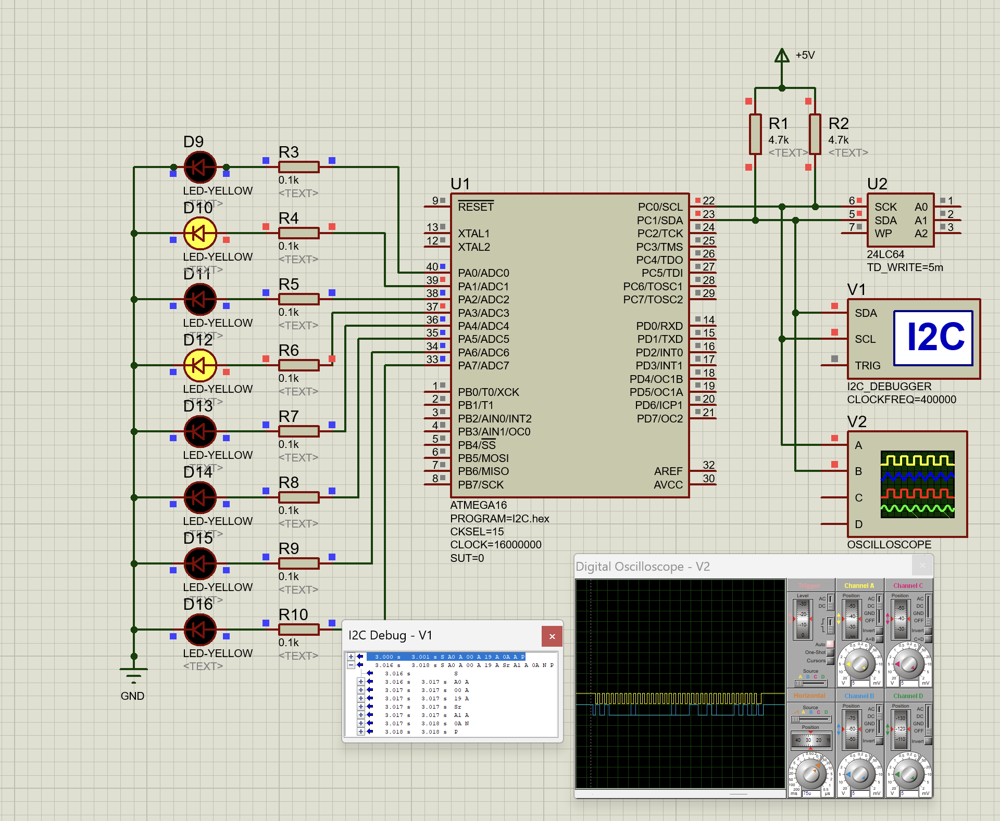

# Лабораторна робота №8

## Тема

Досліження послідовного синхронного інтерфейсу IIC(TWI)

## Мета

Користуючись пакетом Proteus 8.6 дослідити роботу модуля IIC

## Порядок виконання роботи

Порядок виконання роботи

1) Створити модель модуля I2C в пакеті Proteus 8.6.
2) Розробити схеми алгоритмів роботи цих моделей та робочі програми.
3) Створити відповідні hex-файли та підключити їх до мікроконтролера.
4) Запустити моделі та виконати їх дослідження згідно методичних вказівок.
5) Зробити відповідні висновки.

## Виконання

### Алгоритми

### Схема

## Висновок

На цій лабораторній роботі я познайомився з першим синхронним модулем. Він дозволяє багатьом елементам обмінюватись інформацією в одній мережі, за певними протоколами. Я змоделював викорстання цього модуля та зміг записати та прочитати за допомогою нього інформацію.
