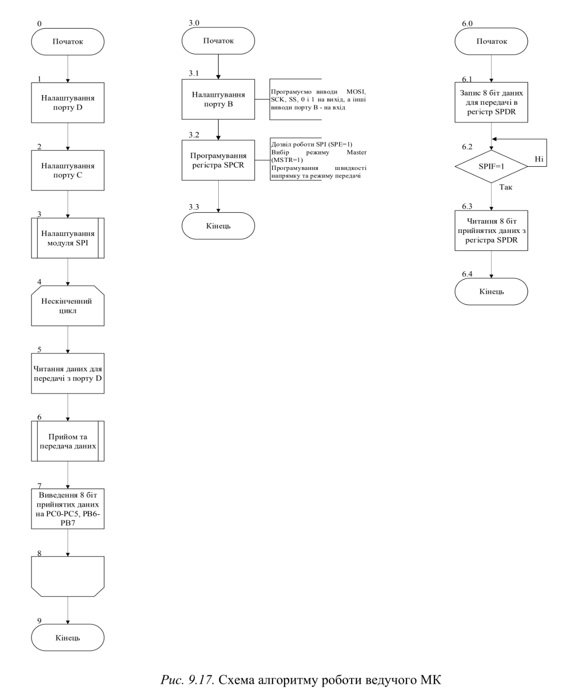
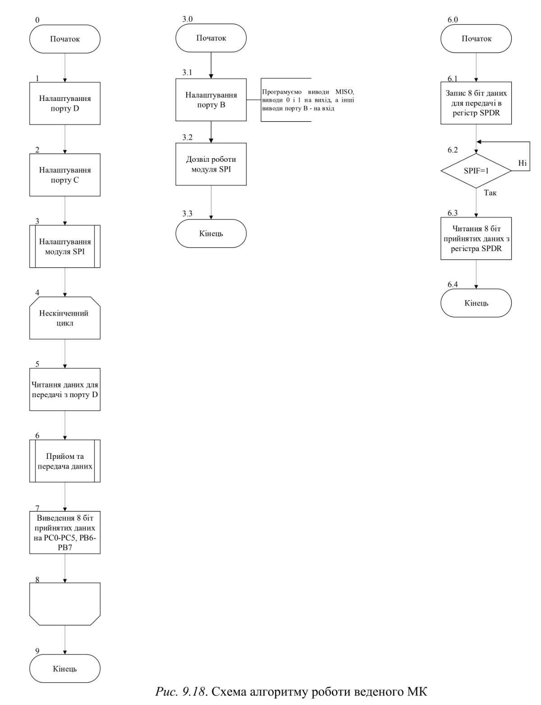
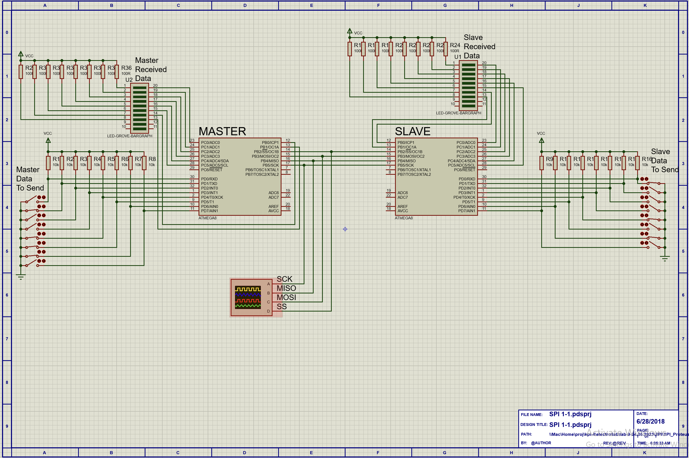
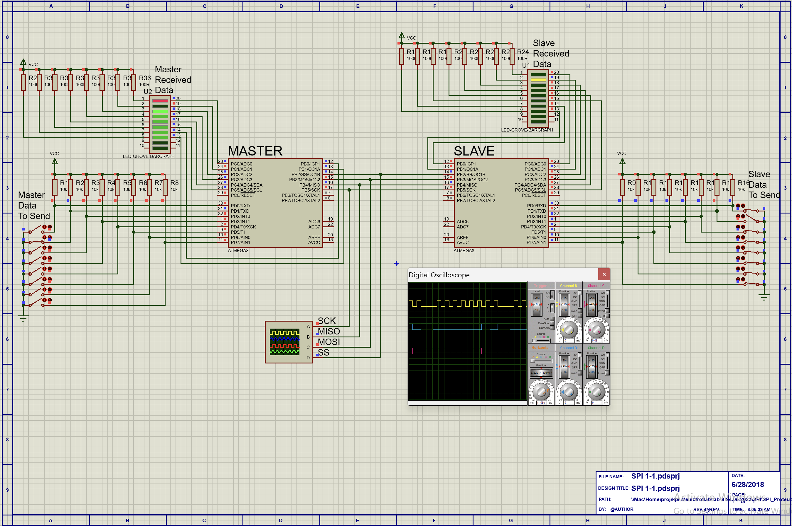
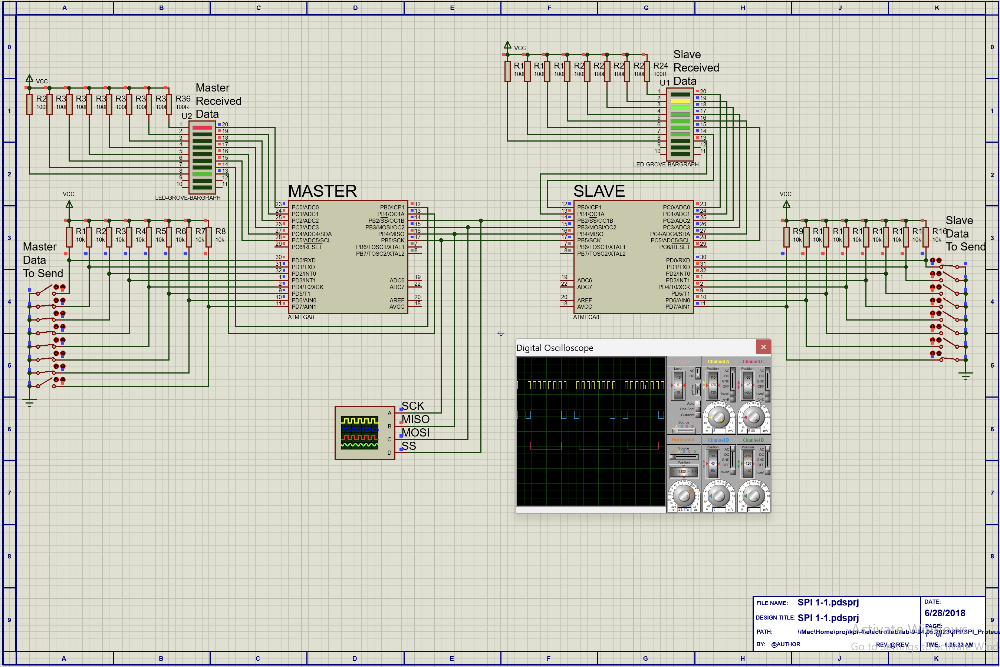
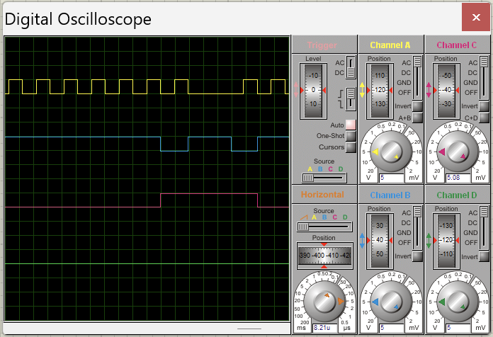

# Лабораторна робота №9

## Тема

Моделювання модуля SPI мікроконтролерів сім’ї AVR.

## Мета

Користуючись пакетом Proteus 8.6 дослідити роботу модуля SPI.

## Порядок виконання

1) Створити модель модуля SPI в пакеті Proteus 8.6.
2) Розробити схеми алгоритмів роботи цих моделей та робочі програми.
3) Створити відповідні hex-файли та підключити їх до мікроконтролера.
4) Запустити моделі та виконати їх дослідження згідно методичних вказівок.
5) Зробити відповідні висновки.

## Виконання

### Алгоритми

### Схеми

### Розрахунок швидкості передачі

$\frac{1}{0.00821} * 1000 = 121802$

## Висновок

На цій лабораторній роботі я дізнався про більш потужний метод комунікації між мікроконтроллерами та переферійними приладами - модуль spi. Цей популярний модуль дозволяє легко обмінюватись інформацією між двома мікроконтроллерами та за допомогою його сучасних варіантів, для цього не потрібно так багато коду. Під час таких передач обидві сторони можуть отримувати та надсилати данні одночасно.
