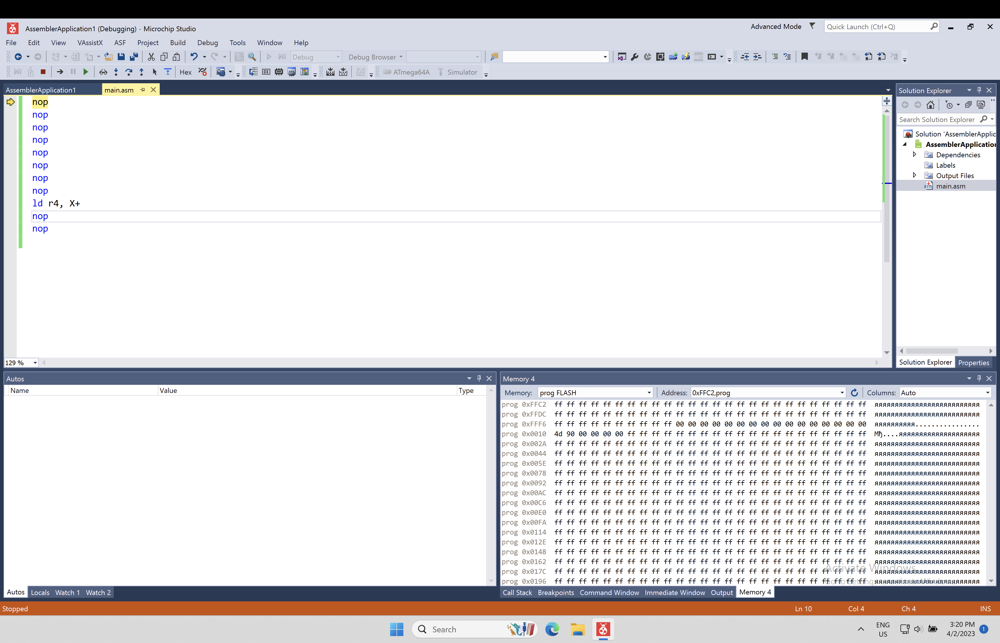

# Модульна контрольна робота №1

- [Модульна контрольна робота №1](#модульна-контрольна-робота-1)
  - [Завдання 1](#завдання-1)
    - [Завдання](#завдання)
    - [Рішення](#рішення)
  - [Завадання 2](#завадання-2)
    - [Завадання](#завадання)
    - [Рішення](#рішення-1)
      - [Коментар до команди](#коментар-до-команди)
      - [Способи адресації операндів](#способи-адресації-операндів)
      - [Довжина команди](#довжина-команди)
      - [Час виконання](#час-виконання)
      - [Вплив на прапорці](#вплив-на-прапорці)
      - [Машинний код](#машинний-код)

## Завдання 1

### Завдання

### Рішення

LDI R18, A1; R18←A1=00011010
EOR R17, R18;  R17←R17$\oplus$(R18=A1=00011010)

$$
\frac
{\oplus\frac{xxxxxxxx \leftarrow R17 }{00011010 \leftarrow R18}}
{x x x \overline{x} \overline{x} x \overline{x} x \rightarrow R17}
$$  

$x \oplus 1 = \overline{x}$  
$x \oplus 0 = x$

## Завадання 2

### Завадання

### Рішення

#### Коментар до команди

$$X \leftarrow X+1, R4 \leftarrow СПД(X)$$

#### Способи адресації операндів

R4 - пряма регістрова  
СПД(X) - непряма с постінкрементом  
X: R27, R26  
X - адресація неявна

#### Довжина команди

2 байти

#### Час виконання

$$t_k = 2 такти; t_T = \frac{1}{f_T} = \frac{1}{10*10^{-6}} = 0.1 мкс$$

#### Вплив на прапорці

Не впливає на прапорці

#### Машинний код

Команда має другий формат Згідно з яким машинний код має наступний вигляд

КОП 0 0 0 1 0 0 КОП

Нижче наведено стан пам’яті програм AVR-мікроконтролера після після компіляції наведеної вище команди у симуляторі

Як видно з цього зображення пам’яті, команду розміщено з адреси: PCпоч = = $0010 та вона має машинний код, який складається з двох байтів: старший байт – $90 = 10010000b та молодший байт – $4D = 01001101b. Тобто команда має машинний код: 1001000001001101b, в якому код операції (КОП) дорівнює – 10010001010b. Інші розряди відповідають формату команди, який наведено вище, тобто у двійковому коді містять номер 4-го регістра загального призначення (R4).
