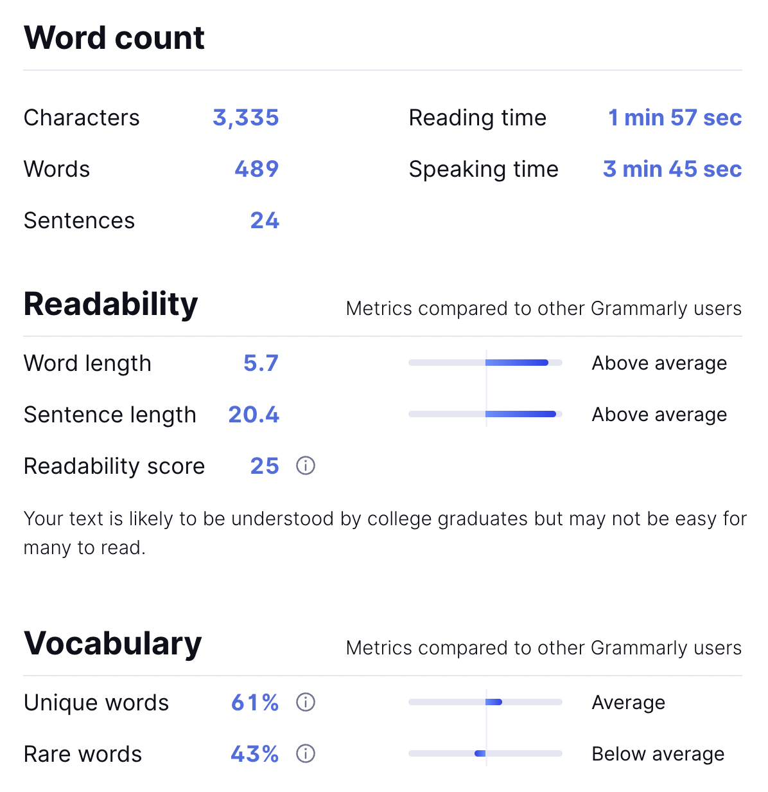

# HA 17

## Assignment

ESSAY (in Word/Google Docs format) - 150 words.
Writing Task:
You have decided to leave your current job and look for a new one.
Write a letter to a friend. In your letter
explain why you want to leave your current job
describe what kind of job you are looking for
ask for some help or advice

## A little explanation of what that is

Ok, maybe that too much, but I wanted to have fun for the last time with English in this semester,soooo... Yeah... That. In school we used to do theater spectacles in English, and that got me into reading some of Shakespeare... I wanted to do something simmilar here and just went all in on difficult phrases, forms, spent probably way too much time with dictionary finding just the perfect pool of scary words I wanted to use. I used them all here. I will admit I used some poems, and books while looking for some juicy sentence forms. And spell checked it all.

Here is a score from Grammarly

I have no idea how my Rare words meter is below average, but I hope you like this.

## Super Solution

Dear Valeriya,

I trust this missive finds you hale and hearty. As the wheel of life ceaselessly spins, we find ourselves meandering through its labyrinthine corridors, periodically arriving at intersections that urge us to veer off into unforeseen directions. One such intersection now lies ahead of me, and I am writing to confide in you about this impending transition.

I am currently poised on the precipice of a monumental decision, contemplating a professional transmutation from the realm of philosophy to that of Information Technology (IT). There exists a compendium of reasons for this contemplated departure from my current occupation, which I shall attempt to delineate in this correspondence.

Ever since my embarkation into the world of philosophy, I've been engrossed in the quest for knowledge, unraveling the mysteries of existence, consciousness, and reality. Yet, the further I venture, the more I find myself ensnared in an ontological conundrum, mired in metaphysical quandaries, and enshrouded in an insurmountable degree of abstraction. The ethereal nature of philosophical discourse, though intellectually stimulating, appears to lack the tangibility I yearn for, a touchstone to the practical world that yields discernible, tangible results. As I gaze into the mirror of introspection, I am gradually growing more cognizant of my burgeoning inclination towards the concrete, the practical, the hands-on.

Therefore, it is the realm of IT that now beckons me, promising a synthesis of logical structure and practical application that I find irresistibly compelling. In this world of bits and bytes, I envisage myself not as a philosopher lost in abstract contemplations, but as an artisan meticulously crafting intricate digital tapestries, sculpting data, and breathing life into code. What fascinates me is the potential for creativity within the framework of technology; the capacity to create, innovate, and resolve issues that bear direct ramifications on everyday life.

I harbor a particular interest in cybersecurity and data analysis, fields that entail both the safeguarding of information and the drawing of meaningful inferences from vast data pools. These are realms that, in my assessment, resonate strongly with the analytical and investigative components of my philosophical training, thereby facilitating a less jarring, more harmonious transition.

However, this transformation would undoubtedly pose challenges of its own. Transitioning from an established field to one as dynamic and ever-evolving as IT requires a formidable accumulation of contemporary knowledge and practical skills. Given your vast experience and proven acumen in this field, I was hoping that you could assist me in navigating this daunting yet exciting endeavor. Perhaps you could share some sagacious advice regarding how to most effectively prepare for and immerse myself in this new arena? Additionally, recommendations on useful resources, essential skills, and potentially beneficial networking opportunities would be most appreciated.

Valeriya, your friendship has always been a lighthouse guiding me through life's tumultuous seas. I'm eagerly looking forward to hearing your thoughts and advice on this matter, and greatly appreciate your support during this metamorphosis.

Yours sincerely,

Mike Molchanov
