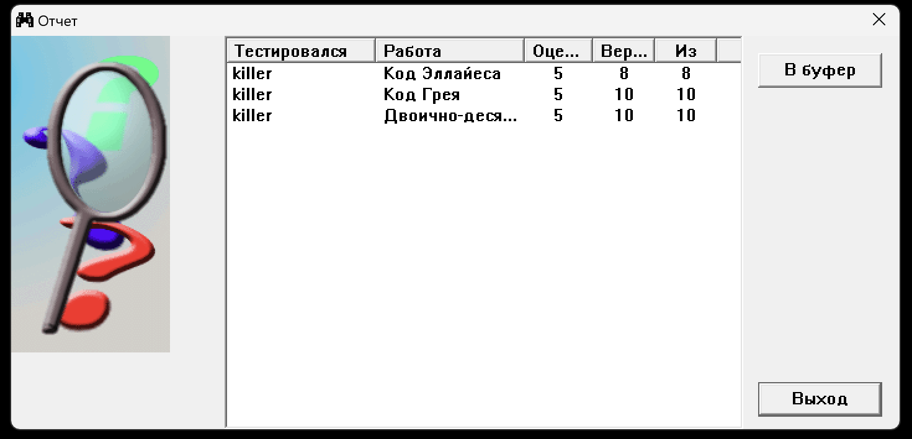

# Лабораторна робота 1

- [Лабораторна робота 1](#лабораторна-робота-1)
  - [Тема](#тема)
  - [Виконання](#виконання)
    - [Двійково-десятковий код](#двійково-десятковий-код)
    - [Код Грея](#код-грея)
    - [Код Еллайеса](#код-еллайеса)
    - [Результати теста](#результати-теста)
  - [Висновок](#висновок)

## Тема

Двійково-десятковий код. Код Грея. Код Еллайеса.

## Виконання

### Двійково-десятковий код

Для переводу в двійково десятковий код певного десяткового числа потрібно поступово віднімати від числа можливі біти з їх значеннями доки в нас не вийде нуль. Можливо не дуже точно описав, але ось приклад закодування числа 9751 кодом 8-4-2-1:

$
9-8 = 1; 1-4 < 0; 1-2 < 0; 1-1 = 0; 9 = 1001\\
7-8 < 0; 7-4 = 3; 3-2 = 1; 1 - 1 = 0; 7 = 0111\\
5-8<0; 5-4 =1; 1-2<0; 1-1=0; 5 = 0101\\
1 = 0001\\
$

Отже в двійково-десятковому коді 9751 з кодом 8421 буде 1001 0111 0101 0001

### Код Грея

Просте правило: для всіх розрядів окрім молодшого, значення дорівнює цей розряд сумма за модулем 2 з наступним

Приклад кодування 110010:  
$
Y_5 = X_5 = 1\\
Y_4 = X_4 \oplus X_5 = 0\\
Y_3 = X_3 \oplus X_4 = 1\\
Y_2 = X_2 \oplus X_3 = 0\\
Y_1 = X_1 \oplus X_2 = 1\\
Y_0 = X_0 \oplus X_1 = 1\\
$

Тоді код Грея буде 101011

### Код Еллайеса

Порахувати кількість одиничок, якщо парне - ставимо в контрольний 0, якщо непарне то 1.

$
\begin{bmatrix}1 & 0 & 1\\1 & 1 & 1\\ 0& 0& 0\end{bmatrix}
$

Тоді стовпець буде 010, а рядок 010(прямує до правого нижнього кута)

### Результати теста

## Висновок

На цій лабораторній роботі я вперше дізнався про різні типи коду окрім звичайного двійкового до якого я так звик, навчився переводити десяткові значення в різні коди на навпаки.
