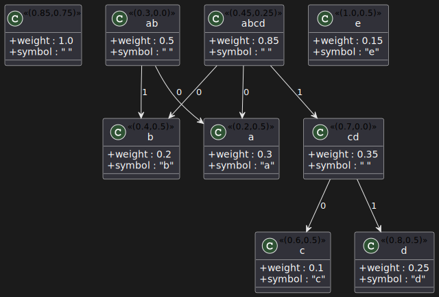
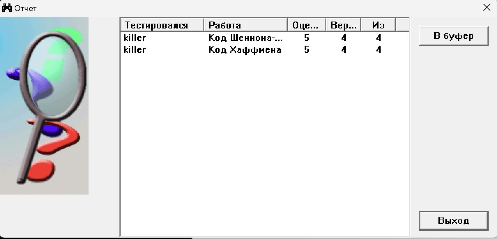

# Лабораторна робота №2

## Тема

Код Шеннона-Фано. Код Хаффмена

## Виконання

На цій лабораторній роботі вивчаються нерівномірні коди Шеннона-Фано та код Хаффмена. Вони зазвичай використовуютсья для зменшення довжини кодів для певних слів які зустрічаються з різним шансом. Ці коди дозволяють закодувати рідкісні повідомлення всього кількома бітами, а ті які зустрічаються раз на 1000 – найдовшими. Тоді ми будемо часто використовувати кородкі коди, та рідко прибігати до довгих.

### Код Шеннона-Фано

Алгоритм розбиває множину символів на дві підмножини з приблизно однаковими сумарними частотами входження. Потім рекурсивно застосовується до кожної з підмножин, доки не буде досягнуто одного символу. Для кожного символу присвоюється код з 0 або 1 в залежності від того, до якої підмножини він належить.

Отже, алгоритм можна описати наступним чином:

1. Обчислити сумарну частоту входження для всіх символів в множині.
2. Розбити множину символів на дві підмножини з приблизно однаковими сумарними частотами входження.
3. Присвоїти 0 або 1 кожному символу, в залежності від того, до якої підмножини він належить.
4. Рекурсивно повторити кроки 2-3 для кожної підмножини, доки не буде досягнуто одного символу.
5. Створити таблицю символів та їх кодів.
6. Застосувати отримані коди до стиснення даних.

Ось як можна закодувати множину символів {a, b, c, d, e} з частотами входження {0.3, 0.2, 0.1, 0.25, 0.15} за алгоритмом Шеннона-Фано:

1. Сортуємо символи за спаданням їх частот: {a, b, d, c, e}.
2. Ділимо множину на дві підмножини з приблизно однаковими сумарними частотами:
   1. Перша підмножина містить символи {a, b, d} з частотами {0.3, 0.2, 0.25}.
   2. Друга підмножина містить символи {c, e} з частотами {0.1, 0.15}.
3. Для кожної підмножини створюємо новий код:
   1. Для першої підмножини кодуємо символи {a, b, d} кодом 0.
   2. Для другої підмножини кодуємо символи {c, e} кодом 1.
4. Рекурсивно застосовуємо алгоритм для кожної підмножини:
   1. Для першої підмножини знову ділимо множину на дві підмножини з приблизно однаковими сумарними частотами:
      1. Перша підмножина містить символ a з частотою 0.3.
      2. Друга підмножина містить символи {b, d} з частотами {0.2, 0.25}.
      3. Для першої підмножини кодуємо символ a кодом 0.
      4. Для другої підмножини кодуємо символи {b, d} за допомогою кодів, що починаються з 1.
   2. Для другої підмножини знову ділимо множину на дві підмножини з приблизно однаковими сумарними частотами:
      1. Перша підмножина містить символ e з частотою 0.15.
      2. Друга підмножина містить символ c з частотою 0.1.
      3. Для першої підмножини кодуємо символ e кодом 1.
      4. Для другої підмножини кодуємо символ c кодом 0.
5. Записуємо код для кожного символу, з'єднавши коди, які відповідають їх підмножинам:
   1. Символ a: 0 0
   2. Символ b: 1 0 0
   3. Символ c: 1 0 1
   4. Символ d: 1 1
   5. Символ e: 0 1
6. Готово

| Символ | Частота | Код     |
|--------|---------|---------|
| a      | 0.3     | 00      |
| b      | 0.2     | 100     |
| c      | 0.1     | 101     |
| d      | 0.25    | 11      |
| e      | 0.15    | 01      |

### Код Хаффмена

Основні кроки алгоритму Хаффмена:

1. Побудувати таблицю частоти входження кожного символу в даних, які потрібно стиснути.
2. Відсортувати таблицю за зростанням частот входження.
3. Вибрати два символи з найменшими частотами входження.
4. Створити новий вузол дерева із сумою частот цих двох символів, вузол стає батьківським для двох символів.
5. Повторювати кроки 3 і 4, доки всі символи не були об'єднані в одне дерево.
6. Записати дерево вузлів зліва направо, з дочірніми вузлами на кожному кроці зліва направо.
7. Присвоїти бітову послідовність з 0 для лівого дочірнього вузла та 1 для правого дочірнього вузла.
8. Присвоїти бітову послідовність для кожного символу, що відповідає його шляху від кореневого вузла до листового вузла, що містить символ.
9. Стиснути дані, замінивши кожен символ на його відповідний бітовий код.
10. Записати таблицю частот входження символів та стиснуті дані

Далі потрібно буде побудувати дерево Хаффмана за допомогою знаходження двох найменш частотних символів у множині та їх об'єднання в один вузол дерева, який матиме частоту, що дорівнює сумі частот об'єднаних символів. Потім це повторюється до тих пір, поки всі символи не стануть листками дерева.

Після побудови дерева, кожен символ буде мати свій унікальний код - він визначається його місцем у дереві, при чому код символу буде складатись з бінарних цифр 0 і 1, які вказують на те, в якому напрямку потрібно рухатися від кореня дерева до листка, щоб дійти до потрібного символу.

Давайте розглянемо приклад з множиною символів {a, b, c, d, e} та частотами входження { 0.3, 0.2, 0.1, 0.25, 0.15 }

1. Сортуємо символи та їхні частоти за зростанням: cedba
2. Будуємо дерево, починаючи з двох символів з найменшою частотою. У нашому випадку це c та e
3. Обчислюємо частоту нового піддерева, що складається з c та e. Вона дорівнює сумі їхніх частот: 0.1 + 0.15 = 0.25.
4. Додаємо піддерево з c та e до множини, замість двох початкових символів
5. Повторюємо кроки 2-4, доки не залишиться лише одне піддерево

## Оцінка за тест

## Висновок

На цій лабораторній роботі я розібрав коди для зменшення кількості символів для представлення слів.
