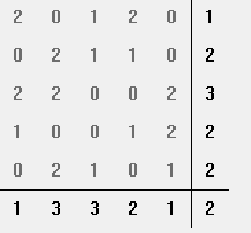
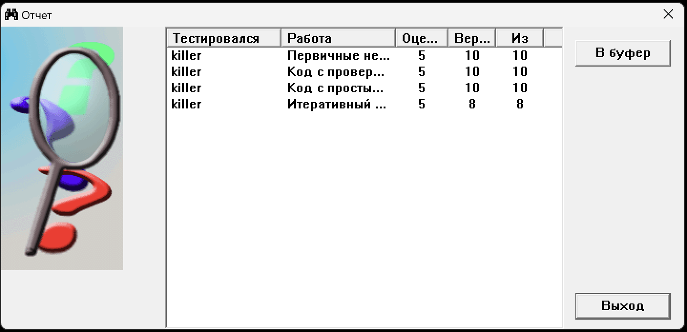

# Лабораторна робота №3

## Первинні недвійкові коди

Що можу сказати  
Тут комбінаторика просто  
Різні комбінації елементів утворюють різні слова  
Для прикладу код на всі співвідношення.  
Нехай в нас алфавіт asdf та довжина слова це 2, тобто в нас 4^2 слова  
Ось вони: aa as ad af sa ss sd sf da ds dd df fa fs fd ff  
Інші типи просто мають різні комбінації або перестановки або додаткові правила щодо них(не може бути двох однакових симловів поряд)  

## Код з перевіркою за моделем

Це як двійковий але не вдійковий. У двійковому в нас всього 2 варіанти та сумма за модулем 2, якщо в нас не двійковий, то формула трохи інша та сумма за модулем трохи інша.  
Для прикладу 111110, в нас сумма всіх значень 5, q = 3, тому останній символ = 3 - 5 mod 2 = 1

## Код з повторенням

Ну...  
Це код з повторенням...  
До нього додається надлишковість та "повторення" всіх значень ще раз.  
Якщо треба закодувати 1234 то вийде 12341234. Не знаю що тут ще додати

## Недвійковий ітераційний код

Це матричка як було раніше але тепер сумми за модулем не 2. По рядках та стовпцях повинно бути те як було там. Ось приклад кодування

## Тестування

## Висновок

На цій лабораторній роботі я познайомився з недвійковими кодами. Я не знаю де це може знадобитись у двійковому світі, але було цікаво попрацювати не тільки з 0 та 1. Коди які я розглянув можуть допомогти виправляти помилки під час передачі повідомлень
