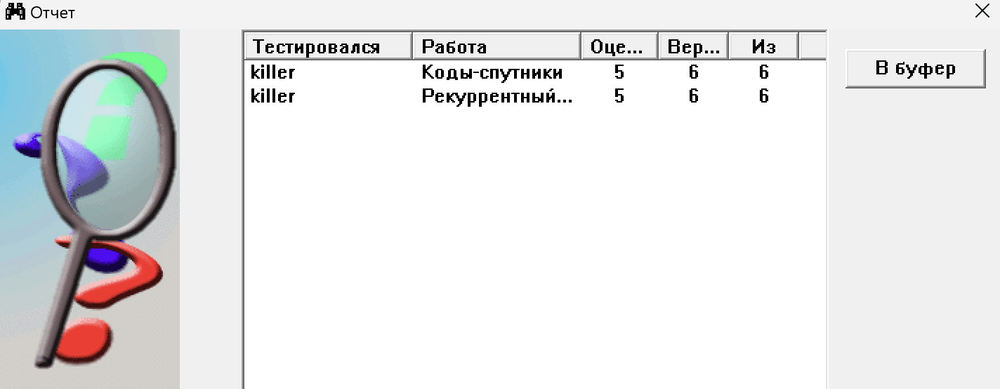

# Лабораторна робота №4

## Коди супутники

Ще один з кодів для виплавлення помилок. Алгоритм його доволі цікавий. Ми отримуємо певний інформаційний код який нам потрібно закодувати. Далі ми робимо суму за модулем 2 з вектором де одиничка стоїть на одному з розрядів. Так робимо для всіх можливих одиничних кодів, а потім робимо це з двома одиничками розміщеними на одих з цих розрядах. Так утворюються коди супутники. Далі якщо наша комбінація співпала з одним з кодів супутників, в нас виникла помилка яку можемо відновити.

Приклад використання:

Код супутників з d=1 для 101010 можна отримати, змінюючи один біт повідомлення на протилежний. Таким чином, отримаємо такі 6 кодів:

- 001010  
- 111010  
- 100010  
- 101110  
- 101000  
- 101011  

Та ось для d=2:

- 000010
- 110010
- 011010
- 111110
- 111000
- 111011
- 001110
- 001000
- 001011
- 100110
- 100000
- 100011
- 101110
- 101000
- 101011
- 100111

По суті змінили або один біт на протилежний або 2. Розом їх 21. 16 для 2 та 6 для 1

## Рекурентний код

А тут ми бедемо посилки за модулем 2 для того щоб отримати перевірки. З певним здвигом по бітам.

Ось приклад:

1. Розбиваємо повідомлення на послідовність інформаційних посилок з довжиною, рівною кроку слідування. У даному випадку крок слідування дорівнює 1, тому отримуємо наступну послідовність: 0 1 0 1 0 0

2. Для кожної інформаційної посилки aᵢ знаходимо перевіркову посилку bᵢ за допомогою операції XOR з інформаційною посилкою aⱼ, де j = i + k (mod n), n - загальна кількість інформаційних посилок у повідомленні, k - крок слідування.
a₀ = 0: b₀ = a₀ XOR a₁ = 0 XOR 1 = 1
a₁ = 1: b₁ = a₁ XOR a₂ = 1 XOR 0 = 1
a₂ = 0: b₂ = a₂ XOR a₃ = 0 XOR 1 = 1
a₃ = 1: b₃ = a₃ XOR a₄ = 1 XOR 0 = 1
a₄ = 0: b₄ = a₄ XOR a₅ = 0 XOR 0 = 0
Отже, отримуємо послідовність перевіркових посилок:
1 1 1 1 0

## Результати

## Висновок

На цій лабораторній роботі ми розібралися з ще двома різними кодами з якими можна буде виправляти помилки - код з супутниками та рекурентний код.
