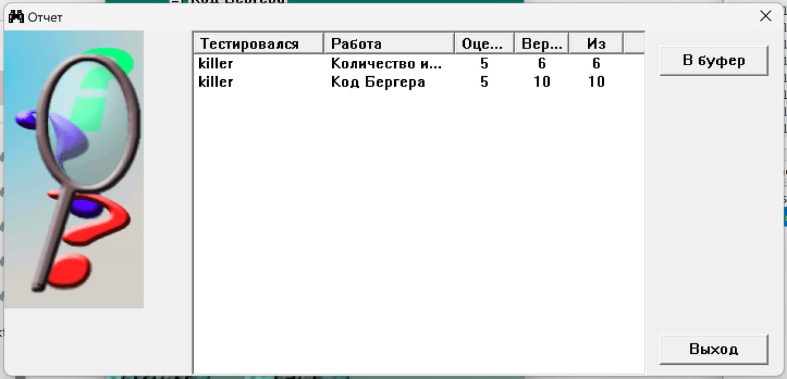

# Лабораторна робота № 5

## Тема

Код Бергера. Кількість інформації і ентропія.

## Виконання

### Код Бергера

Код Бергера - доволі простий код, який дозволяє виявляти та в деяких випадках виправляти помилки. В простому випадку нам треба порахувати кількість одиниць, перевести цю кількість у двійкову систему, інвертувати та додати до кінця повідомлення. В більш складному випадку потрібно рахувати не просто кількість, а їх "номінал". Номінал це типу вага кожного розяду, це числа від 0 і вгору без степенів двійки. Типу такого ряду: 3, 5, 6, 7, 9, 10, 11, 12...

Для прикладу закодуємо повідомлення 0011100010 складною версією коду. нам потрібні 3, 4, 5 та 9-ті розряди, тоді сумма ваг буде 6+7+9+13 = 35. З формул знаходимо, що m=4, r=7. Тоді двійковий запис цього буде 0100011, її інверсія відповідно 1011100, та саме повідомлення 00111000101011100.

### Кількість інвормаціх та ентропія

Це довольно цікава частина, ми це проходили на перших лекціях. Я раніше не знав чтому 0 або 1 це 1 біт, а тепер я вже знаю, що біт це кількість інформації яку рівноімовірне повідомлення 0 або 1 з множини {0, 1}. В методичці надано багато формул та ця частина лабораторної просто зводиться до їх використання для обрахунків, тому не буду тут приклади розписувати

## Результат

## Висновок

На цій лабораторній роботі я ще раз повторив матеріал лекцій про інформацію яку несе повідомлення та ентропії, а також дізнався про новий код - код Бергера. Навчився кодувати та декодувати повідомлення цим кодом та виявляти помилки за допомогою нього
