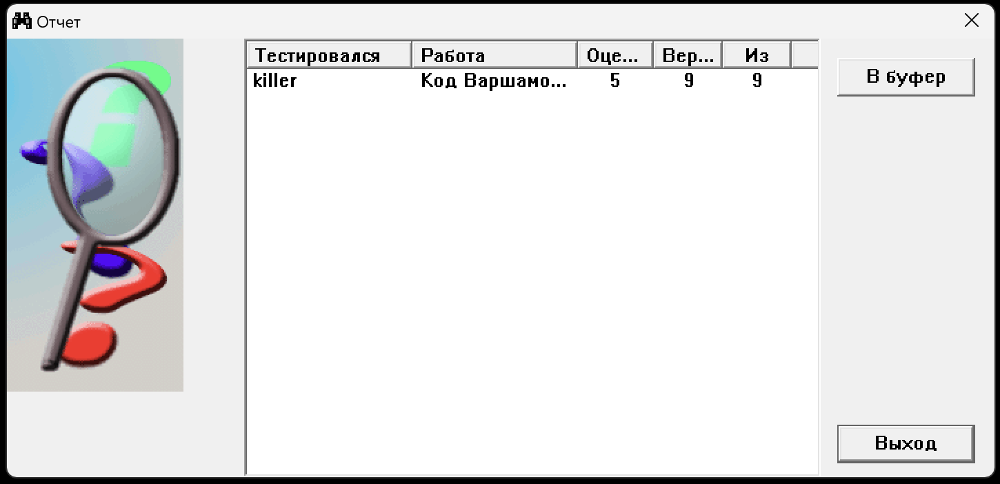

# Лабораторна робота №6

## Тема

Код Варшамова.

## Виконання

- Код Варшамова - це нелінійний блочний код, який був винайдений Робертом Варшамовим в 1957 році. Цей код використовується для корекції помилок в передачі даних, коли на каналі передачі можуть виникати помилки.

Код Варшамова має дуже високу корекційну здатність, тобто може виявити та виправити багато помилок, що зробляє його особливо корисним для передачі інформації в шумних каналах.

Алгоритм кодування Коду Варшамова полягає в наступному:

1. Вхідні дані розбиваються на блоки довжиною n.
2. До кожного блоку додається додаткова інформація, так звані "проверочні символи", щоб створити кодове слово довжиною k.
3. Ці проверочні символи обчислюються таким чином, щоб забезпечити високу корекційну здатність коду. Наприклад, для коду Варшамова з параметрами n та d, ми можемо створити проверочні символи, де будь-які d-1 символів кодового слова можуть бути помилковими, і код все ще зможе виявити та виправити цю помилку.
4. Кодове слово передається через канал з можливістю помилки.
5. Кодове слово декодується, тобто виявляється його вихідне повідомлення, та будь-які помилки в кодовому слові виправляються за допомогою проверочних символів.

Приклад кодування, декодування та визначення помилки для Коду Варшамова:
Нехай ми маємо код Варшамова з параметрами n=7 та d=3. Тобто, ми будемо кодувати блоки довжиною 7 та можемо виявити та виправити будь-які 2 помилки у кодовому слові.

Кодування:

1. Нехай вхідне повідомлення буде "1010101".
2. Додаємо 3 проверочних символи до повідомлення, отримуючи кодове слово довжиною 10: "1010101 000".
3. Обчислюємо значення проверочних символів. Наприклад, можна використовувати парність - зберегти число одиниць парним у кожному з трьох блоків з трьома бітами. Таким чином, перший символ відповідає парності першого, четвертого та сьомого бітів в кодовому слові; другий символ - парності другого, п'ятого та восьмого бітів; третій символ - парності третього, шостого та дев'ятого бітів. Таким чином, отримуємо кодове слово "1010101 011".

Декодування:

1. Припустимо, що кодове слово, яке ми отримали після передачі, має помилки: "1000101 011".
2. Ми можемо визначити, які біти містять помилки, порівнюючи отримане кодове слово з вихідним кодовим словом та роблячи операції над парностями, щоб знайти блок, який містить помилку.
3. В даному випадку, ми можемо побачити, що в першому блоку, парність не співпадає, тому перший біт є помилковим.
4. За допомогою цієї інформації ми можемо виправити помилку та отримати вихідне повідомлення: "0010101".

Визначення помилок:

1. Якщо на приймачі було отримано кодове слово, ми можемо використати парності, які були створені під час кодування, щоб перевірити, чи було зроблено помилки в передачі.
2. Якщо парності не співпадають з тими, які були створені, то ми можемо вважати, що є помилки в передачі. Ми можемо використовувати цю інформацію, щоб виявити та виправити помилки, які були зроблен
3. Якщо в кодовому слові з'явилися більше помилок, ніж може виправити код Варшамова, то ми не зможемо виправити всі помилки та повинні повідомити про це відправника повідомлення.

Отже, Код Варшамова - це блочний код, який забезпечує високу корекційну здатність та використовується для передачі даних в шумних каналах. Алгоритм кодування полягає в додаванні проверочних символів до вхідного повідомлення, алгоритм декодування полягає в виявленні та виправленні помилок в кодовому слові з використанням парностей, а визначення помилок включає в себе перевірку парностей на приймачі та виявлення кількості помилок.

## Тестування

## Висновок

На цій лабораторній роборі я познайомився з кодом, що виправляє помилки, за допомогою нього можна буде надійно передавати інформацію. Я навчився кодувати, дековувати та виправляти помилки за алгоритмом.
