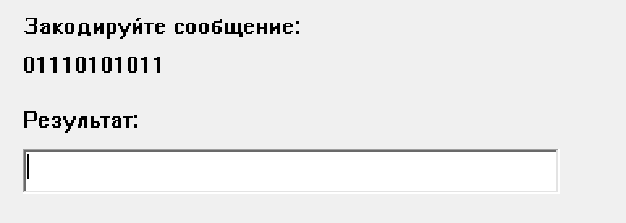
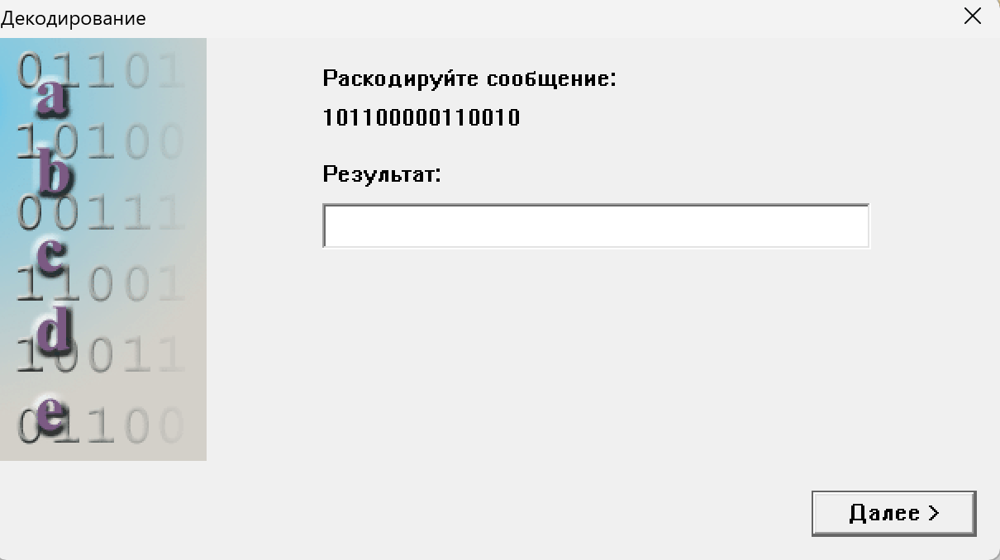
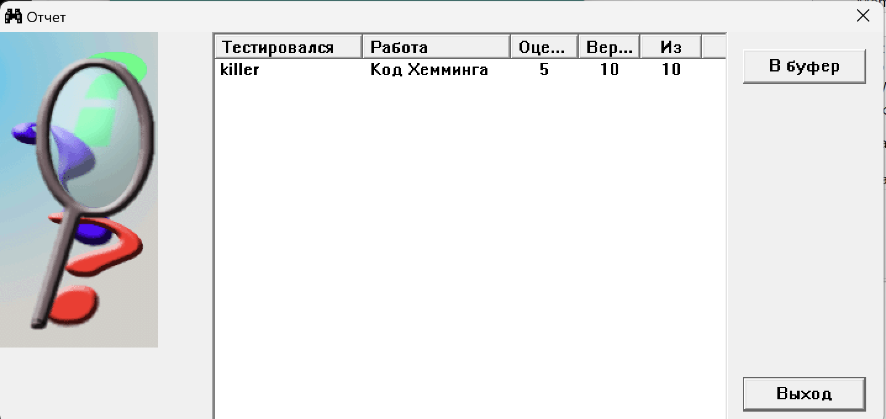

# Лабораторна робота №7

## Тема

Систематичний код Хеммінга

## Виконання

### Кодування

Алгоритм кодування Хеммінга включає в себе кілька кроків. Давайте розберемося, як закодувати повідомлення "01110101011" за допомогою систематичного коду Хеммінга.

Крок 1: Визначення кількості додаткових бітів
Спочатку потрібно визначити, скільки додаткових бітів потрібно додати до повідомлення. Кількість додаткових бітів обчислюється за формулою: 2^r ≥ k + r + 1, де k - кількість бітів повідомлення, а r - кількість додаткових бітів. В даному випадку k = 11.

Застосуємо формулу: 2^r ≥ 11 + r + 1
Отримуємо: 2^r ≥ r + 13

Ми бачимо, що при r = 4 формула виконується (16 ≥ 17), а при r = 3 формула не виконується (8 < 14). Тому потрібно вибрати r = 4.

Крок 2: Визначення позицій додаткових бітів
Позиції додаткових бітів у систематичному коді Хеммінга визначаються за допомогою степенів числа 2. У нашому випадку, додаткові біти будуть займати позиції 1, 2, 4 та 8. ab0c111d0101011

Крок 3: Вставка додаткових бітів
Розмістимо додаткові біти на їхніх позиціях у повідомленні. Отримаємо таку послідовність: "0 1 1 1 0 1 0 1 0 1 1". Порядок бітів не змінюється, ми просто додаємо додаткові біти на відповідних позиціях.

Крок 4: Обчислення значень додаткових бітів
u1 =  u3  (+) u5  (+) u7  (+) u9  (+) u11  (+) u13 (+) u15
u2 =  u3  (+) u6  (+) u7  (+) u10  (+) u11  (+) u14 (+) u15
u4 =  u5  (+) u6  (+) u7  (+) u12  (+) u13  (+) u14 (+) u15
u8 =  u9  (+) u10  (+) u11  (+) u12  (+) u13   (+) u14 (+) u15

Для кожного додаткового біта, обчислимо його значення, використовуючи правило Хеммінга. Для цього розглянемо позиції, де додаткові біти знаходяться (1, 2, 4, 8), і обчислимо значення для кожної з них.

Біт на позиції 1:
Обчислимо значення для біта на позиції 1, використовуючи інформацію з позицій 3, 5, 7, 9, 11 та 15.
Отримуємо таку суму: 0 + 1 + 1 + 0 + 0 + 0 + 1 = 1.

Аналогічно обчислюємо значення для бітів на позиціях 2, 4 та 8:

Біт на позиції 2:
Отримуємо таку суму: 0 + 1 + 1 + 1 + 0 + 1 + 1 = 1.

Біт на позиції 4:
Отримуємо таку суму: 1 + 1 + 1 + 1 0 + 1 + 1 = 0.

Біт на позиції 8:
Отримуємо таку суму: 1 + 0 + 1 + 0 + 1 + 1 = 0

Крок 5: Вставка значень додаткових бітів
Після обчислення значень додаткових бітів, вставимо їх у повідомлення на відповідних позиціях.
Отримаємо кодоване повідомлення: "110011100101011".

Отже, закодоване повідомлення за систематичним кодом Хеммінга для вихідної послідовності "01110101011" буде "110011100101011".

### Декодування та виправлення помилки

Для розкодування повідомлення за систематичним кодом Хеммінга, давайте розберемося, які кроки необхідно виконати.

Крок 1: Виявлення та корекція помилок
Для початку, перевіримо наявність помилок у закодованому повідомленні. Для цього розглянемо позиції додаткових бітів (1, 2, 4, 8) і обчислимо синдроми помилок. Синдроми обчислюються шляхом порівняння суми бітів на позиціях, які визначають значення додаткових бітів, з фактичним значенням додаткового біта.

Розглянемо закодоване повідомлення "101100000110010" і обчислимо синдроми:

Синдром на позиції 1:
Сума бітів на позиціях 1, 3, 5, 7, 9, 11, 13, 15 дорівнює 5. Значення біта на позиції 1 дорівнює 1.
Отже, синдром на позиції 1 дорівнює 1.

Синдром на позиції 2:
Сума бітів на позиціях 2, 3, 6, 7, 10, 11, 14, 15 дорівнює 3. Значення біта на позиції 2 дорівнює 0.
Отже, синдром на позиції 2 дорівнює 1.

Синдром на позиції 4:
Сума бітів на позиціях 4, 5, 6, 7, 12, 13, 14, 15 дорівнює 2. Значення біта на позиції 4 дорівнює 0.
Отже, синдром на позиції 4 дорівнює 0.

Синдром на позиції 8:
Сума бітів на позиціях 8, 9, 10, 11, 12, 13, 14, 15 дорівнює 1. Значення біта на позиції 8 дорівнює 0.
Отже, синдром на позиції 8 дорівнює 1.

Крок 2: Виявлення позиції помилки
Для виявлення позиції помилки, об'єднаємо синдроми у двійкове число, де кожен синдром становить один біт. У нашому випадку, двійкове число буде 1101.

Отримали число 1101. Це двійковий номер позиції, в якій відбулася помилка.

Крок 3: Корекція помилки
За допомогою номера позиції помилки, знайдемо його значення та відновимо правильне повідомлення.

Значення на позиції помилки 1101 (в десятковому представленні) дорівнює 13.

Отримали номер позиції помилки 13. Значення біта на позиції 13 дорівнює 1.

Крок 4: Видалення додаткових бітів
Після виявлення та корекції помилки, видалимо додаткові біти з кодованого повідомлення. Отримаємо оригінальне повідомлення без систематичного коду Хеммінга.

Вихідне повідомлення буде: "00111111101".

Таким чином, розкодоване повідомлення за систематичним кодом Хеммінга для вхідної послідовності "101100000110010" буде "00111111101".

## Результат тестування

## Висновок

На цій лабораторній роботі я познайомився с систематичним кодом Хеммінга, який на мою думку один з найкращих систематичних алгоритмів кодування. Я навчився кодувати та декодувати повідомлення коду Хеммінга
