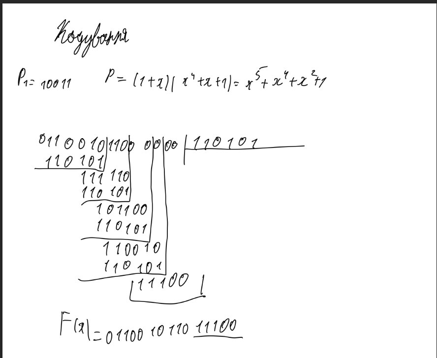
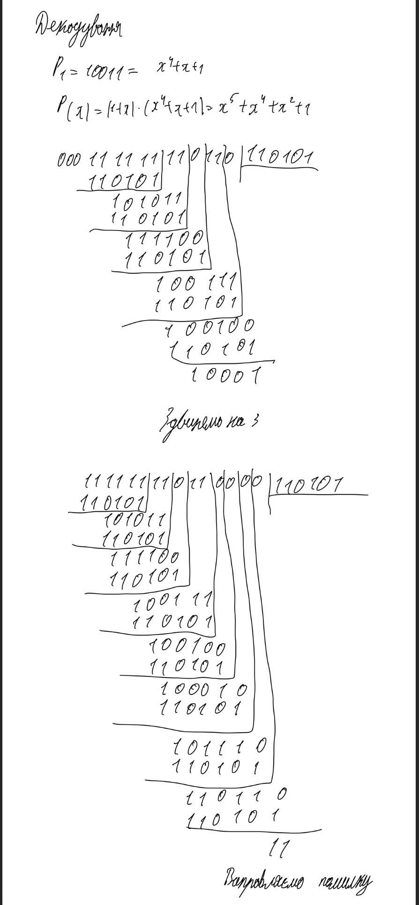
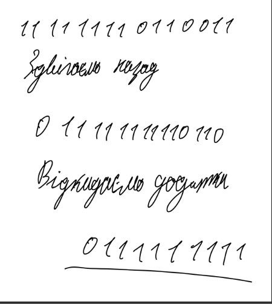
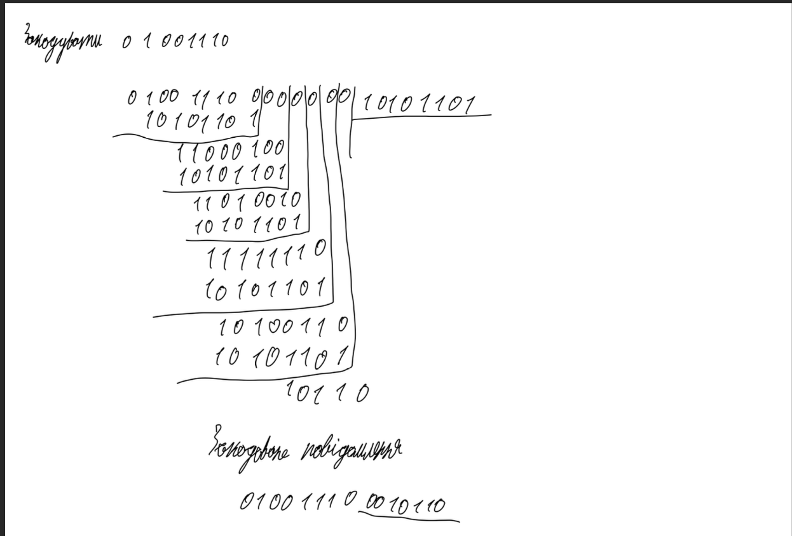
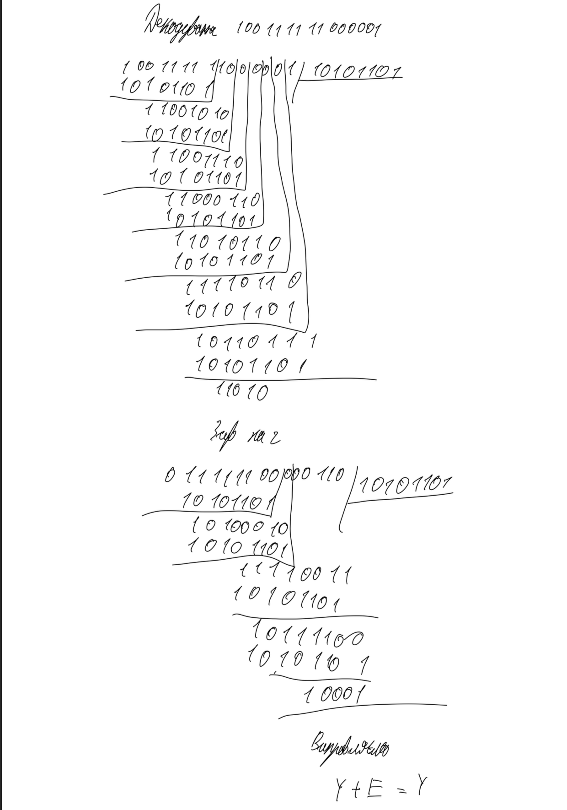
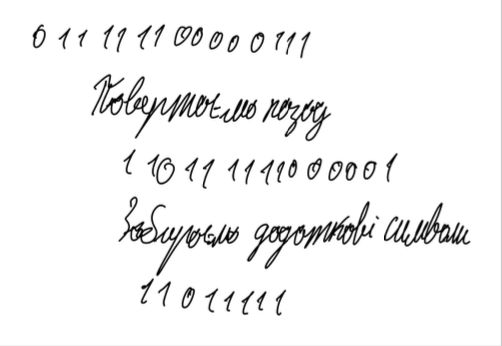

# Лабораторна робота №8

## Тема

Циклічні коди. Коди Абрамсона. Коди БЧХ.

## Виконання

### Код Абрамсона

### Коди БЧХ

## Висновок

На цій лабораторній роботі я дізнався про ще 2 нових циклічних кода. Я навчився кодувати та декодувати повідомлення за допомогою кода абпамсона та кодів БЧХ