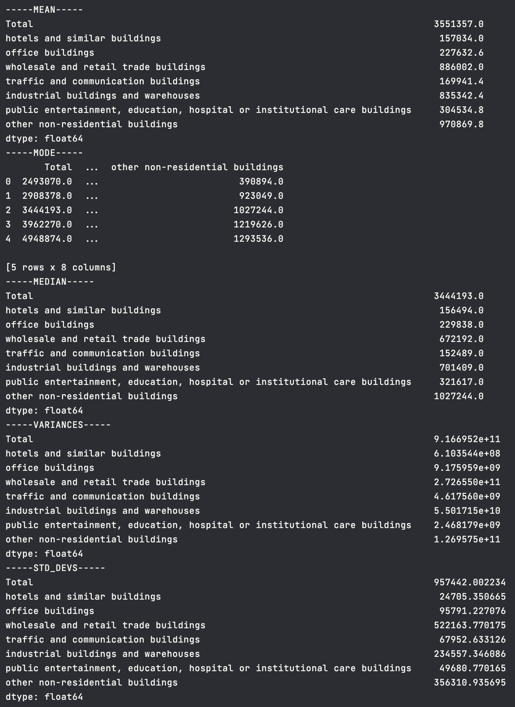
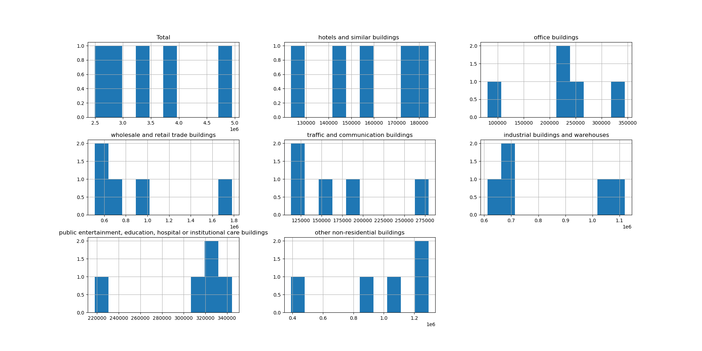
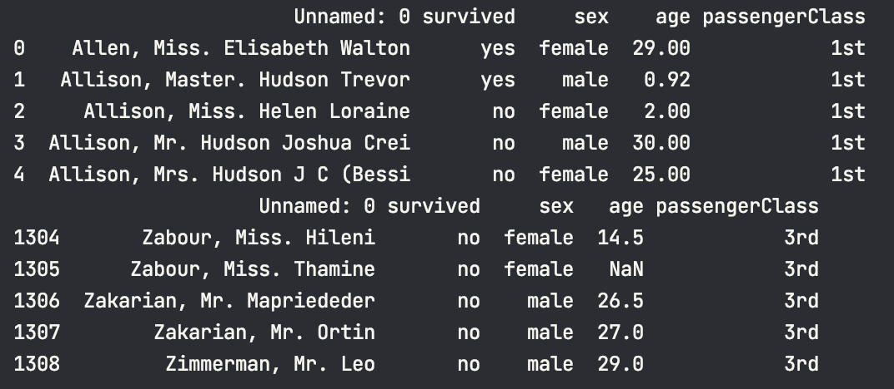

# Лабораторна робота №1

## Тема

Введення в data science

## Завдання

1. На сайті <http://www.ukrstat.gov.ua/> оберати дані які для Вас
є цікавими, можна використати будь-який ресурс з відкритими
даними, та завантажте дані
2. Знайти математичне сподівання, медіану, моду, дисперсію,
середньоквадратичне відхилення (поясніть їх зміст)
3. Візуалізувати завантажені дані за допомогою гістограми
4. Для цих даних проробити всі дії з пункту колекції Series і
DataFrame бібліотеки pandas
5. Виконати первинну обробку даних
6. Прочитати набір даних катастрофи «Титаніка»
7. Завантажити набір даних катастрофи «Титаніка» за URL-
адресою
8. Переглянути рядки набору даних катастрофи «Титаніка»
9. Налаштувати назви стовпців
10. Провести простий аналіз даних:
11. Побудувати гістограму віку пасажирів
12. Зробити звіт про роботу, який включає:
    1. Титульна сторінка з інформацією про виконавця, темою та номером лабораторної роботи,
    2. Постановку завдання
    3. Скріни коду та скріни результату виконання з коментарями
    4. Висновок
13. Надіслати звіт(.docx або .doc) на **** (Telegram) або********** (e-mail). В повідомленні обов’язково вказати Ваше ПІБ, групу, назву предмету (скорочено)
14. Записати захист роботи на відео та надіслати його разом зі звітом на вище вказані адреси. Під час захисту роботи показати роботу програмного коду! (не звіт) та пояснити свої дії.

## Виконання

Код можна переглянути у проекті [matstat](matstat).

### Завдання 1-6

#### Обробка данних

Код цього завдання розміщенно у [government statistics](matstat/gov_stat.py)

Для початку я завантажив данні та видалив непотрібні додатки, такі як коментарі, назви, ітд. Це було поміщено до файлу data.xlsx, з якого ми далі будемо читати. Його на гітхабі немає, бо тримати бінарні файли некоректно.

При спробі відобразити статистику за допомогою `print(df.mean())`, отримаємо наступний результат:  
  
Ми це отримаємо бо маємо нонсенс в данних, перед прововдженням потрібно виконати первинну обробку данних.

По-перше приберемо значення де намає якихось данних, бо таких не повинно бути, та якщо вони з'явились - це помилка джерела або пошкодження даних при передачі. Використаємо метод `dropna(inplace=True)`

В нас виходить така картина:  

Це вже щось, але в нас є колонка зі значеннями індексів та колонка з роками, нам потрібно індексуватись роками, а не мати їх як окрему. Поправимо це

Видалимо першу колонку(колонку індексів) за допомогою `drop()` та поставимо колонку з датами на місце індексів за допомогою `set_index()`
Виглядає вже непогано  

#### Статистика

Тепер виконуємо завдання зі статистики. Використовуємо стандартні методи pandas та виводимо їх до stdout
Ось що вийшло:

Маємо математичне сподівання, або просто середне арифметичне, значення до якого всі інші прямують.  
Також в нас э мода, тобто яке значення часто зустричаэться, медиана, тобто буквально середнє знаення та дисперсія з квадратичним, які позказують наскільки розкидані значення

#### Гістограми

Зобразімо наші данні за допомогою гістограми. Для цього можна використати `hist()`

Тут ми можемо побачити які значення популярні серед стовпців

### Завдання 7

Для читання наданого файлу використовуємо відповідний метод та зберігаємо до df

### Завдання 8

Переглянути данні. Це можна зробити за домопогою методів tail та head. Отримаємо наступний результат: 
