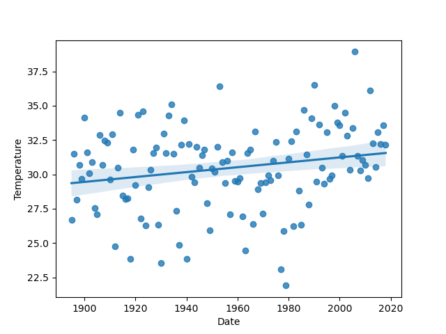

# Лабораторна робота №2

## Тема

Часові ряди і прості лінійна регресія

## Завдання

1. В даній лабораторній роботі Вам треба завантажити метеорологічні дані в 1895-2022 роках з CSV-файлу в DataFrame. Після цього дані треба  буде відформатувати для використання.
2. Бібліотеку Seaborn  використати для графічного представлення даних DataFrame у вигляді регресійної прямої, що представляє графік зміни обраних показників за період 1895-2018 років.
3. Спрогнозуйте дані на 2019, 2020, 2021 та 2022 рік.
4. Оцініть за формулою, якою могли б бути показники до 1895 року.
5. Скористайтесь функцією regplot бібліотеки Seaborn для виведення всіх точок даних; дати представляються на осі x, а показники на осі y. Функція regplot будує діаграму розкиду даних, на якій точки представляють показники за заданий рік, а пряма лінія - регресійну пряму.
6. Виконайте маштабування осі у від (приклад від 10 до 70 градусів):
7. Порівняйте отриманий прогноз для 2019, 2020, 2021 та за 2022 роки з даними на NOAA «Climate at a Glance»: <https://www.ncdc.noaa.gov/cag/> і зробити висновок.
8. Зробити звіт про роботу
9. Надіслати звіт

## Виконання

Код всього завдання доступний за [цим посиланням](./temp-time/main.py)

### Завантажено та відформтаовано данні

Я тут видалив назви вгорі та відформатував данні до int рік та float температура

### Графічне представлення

Просто використовуємо відповідну функцію та відображуємо данні

### Регресія та прогноз майбутніх

За допомогою схилу та точки перетину ми можемо отримати потрібні нам точки. Ось прогноз на наступні роки

### Прогноз минулих

Та сама формула але інші значення

### Відобразити регресійну пряму

При використанні попереднього методу вона вже виводиться, тому не бачу сенсу робити нову, але її можна було б задати як лямбда функцію та потім за точками побудувати графік передавши цю лямбду

### Додати масштабування по осі температур

Тут просто використали метод для масштабування по осі

### Порівняння значень

Як можна побачити, реальні трохи вище але загалом притримуються мого розрахованого

| Рік  | Реальне |  Моє  |
| :--: | :-----: | :---: |
| 2019 |  32.56  | 31.57 |
| 2020 |  35.55  | 31.59 |
| 2021 |  34.59  | 31.61 |
| 2022 |  31.17  | 31.63 |

## Висновок

На цій лабораторні роботі я познайомився з таким методом роботи з данними як лінійна регрессія, яка дозволяє побудувати рівняння прямої яке приблизно описує тенденцію розподілу значень. Я створив модель в пайтоні та за допомогою неї прогнозував нові значення, які виявились схожими на реальні
