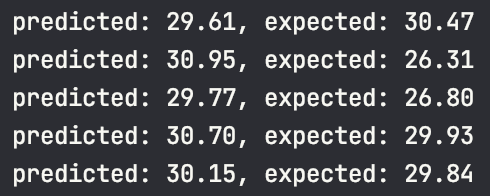
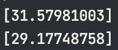
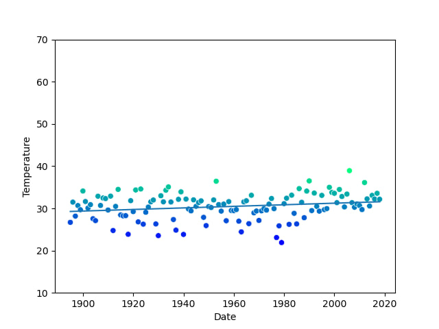
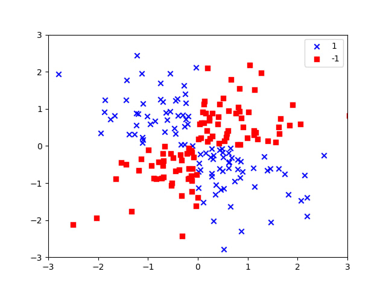
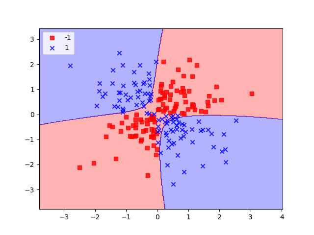
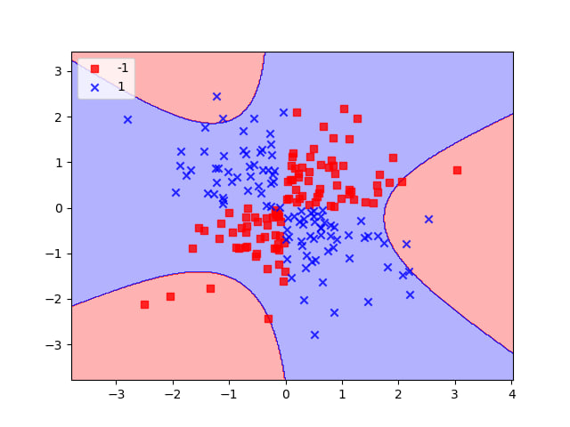
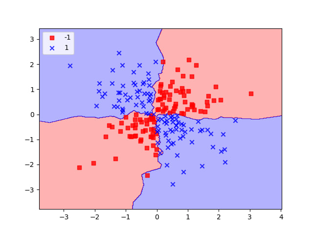
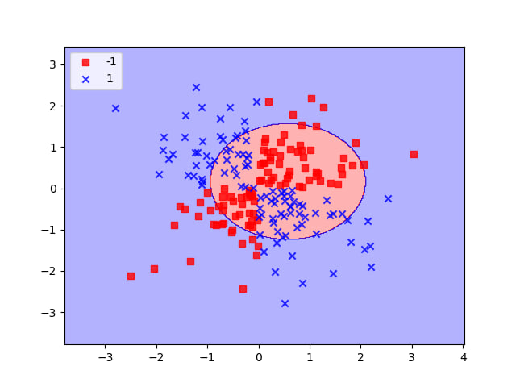

# Лабораторна робота №3

## Тема

Класифікація, регресія і кластеризація з використанням бібліотеки scikit-learn

## Завдання

1. Повторити дії описані в пункті «Часові ряди і проста лінійна регресія частина 2» даної лабораторної роботи та порівняти з результатом попередньої лабораторної роботи.
2. Аналогічно з прикладом з лекції 7 згенеруйте набір даних та класифікуйте його використавши класифікатор SVC (слайд 95).
3. Порівняти декілька класифікаційних оцінювачів наприклад KNeighborsClassifier, SVC та GaussianNB для вбудованого в scikit-learn одного набору даних (вибрати довільний за бажанням).
4. Зробити звіт про роботу, який включає:
    1. Титульна сторінка з інформацією про виконавця, темою та номером лабораторної роботи,
    2. Постановку завдання
    3. Скріни коду та скріни результату виконання з коментарями
    4. Висновок

## Виконання

### Переробка лаби 2

Ця частина виконана у файлі [linr2](./linreg2/linr2.py). Частину з підготуванням данних було взято з минулої лабораторної роботи, тому результат перетворень такий самий.  
  
На скрін шоті видно вигляд данних та як було їх поділено для навчання та тестування.  

Після використання лінійної регрессії з бібліотеки sklearn, отримаємо такі значення нахилу та перетину:  
  
Вони майже не відрізняються від попередньої лабораторної.  

Переглянемо частину значень з данних для перевірки:  
  
Оскільки в нас доволі проста модель, прогнози виходят не дуже точними, але в середньому в нас правильна тенденція.  

Переглянемо прогнози на 2019 та 1890 роки:  
  
Це співпадає з прогнозими минулої лаби  

Та останнє, побудуємо криву та наші значення, щоб побачити саме регрессію  

### Різні класифікатори

Код цього завдання знаходиться у файлі [lecex](./linreg2/lecex.py). Як показано в прикладі з лекції я зробив 2 різних класи точок, та тепер будемо їх порівнювати.

Як у прикладі ми робимо xor на координатах точок для їх розрізнення. Ось так виглядають точки після побудови:  
  
Різними кольорами позначені різні класси, які моделі будть потім намагатись розрізнити.  

Для зручності було створено функцію, яка буде малювати які саме території належать до класу. Далі ми просто робимо моделі та за допомогою функції будуємо території. Ось вони:

  
  
  
  
  

Як бачимо найкраще підходять для цього завдання `svc rbf` та `KNearest`, інші моделі не підходять взагалі, або мають недостатню точність.

## Висновок

На цій лабораторній роботі я використав бібліотеку sklearn для використання лінійної регрессії та для класифікації певних данних. Зміг зобразити красиво області класів та порівняв різні алгоритми.
