# Лабораторна робота №4

## Тема

Класифікація методом k найближчих сусідів і набір даних Digits,
частина 1

## Мета

Навчитись реалізовувати основні етапи машинного навчання:

- Вибір даних для навчання моделі.
- Завантаження та аналіз даних.
- Розбиття даних для навчання і тестування.
- Вибір і побудова моделі.
- Навчання моделі.
- Формування прогнозів.
- проведемо оцінку результатів;
- налаштуємо параметри моделі;
- опрацюємо кілька класифікаційних моделей для вибору найкращої моделі (-ей).

## Виконання

### Підготовка

Завантажемо та переглянемо опис данних. Використовуємо функції `load_digits()` та `digits.DESCR` щоб отримати данні та їх опис. Переглянемо його.

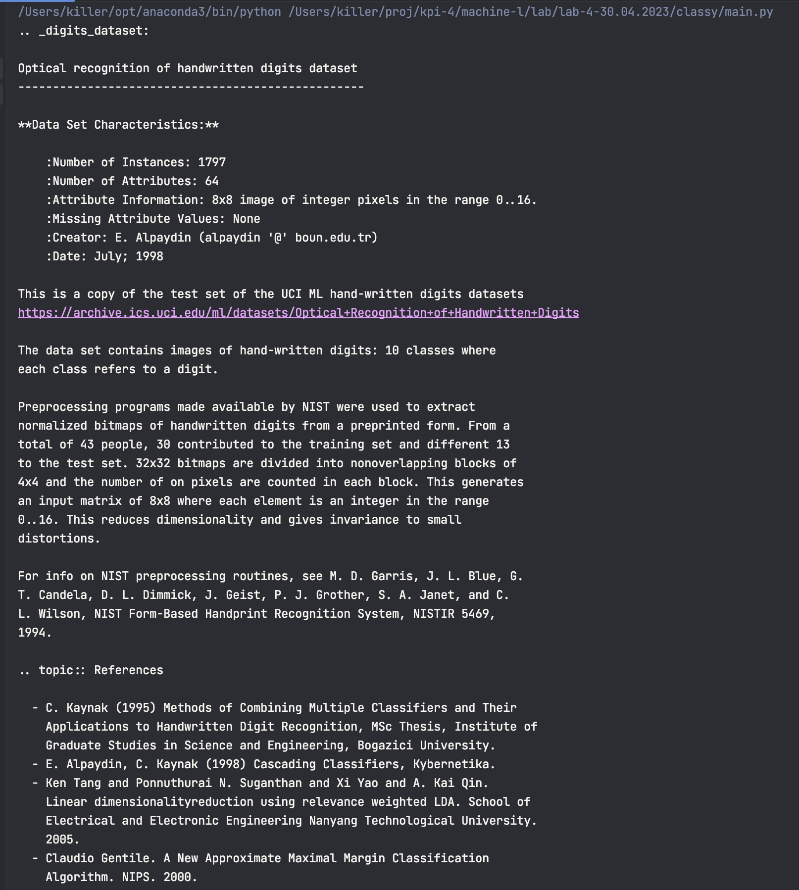

Тепер ми знаємо з чим саме ми працюємо, тоді переглянемо частину массиву target, в ньому лежать мітки зображень, які по суті є классами, які ми потім будемо знаходити. Його можна побачити за допомогою `digits.target[::100]`. Отримаємо

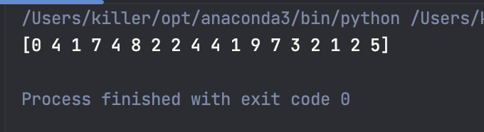

А тепер переглянемо якої форми наші данні, це по суті `digits.data`. Оскільки вони вже приготовлені для використання в нас двовимірний масив, де внутрішні масиви довжини 64(картинки 8 на 8, але в одному вимірі) а зовнішній масив просто тримає всі такі картинки. Якщо подивимось `digits.data.shape`, та одразу ж `digits.target.shape` (в нас повинно бути однакова кількість данних та міток для них). Отримаємо ось таке:

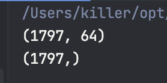

### Вивести зображення

Виведемо зображення які будемо класифікувати у людському форматі(циферки це звісно добре, але давайте картинки)

Цей код відображає 24 зображення з набору даних `digits` у вигляді сірої шкали, разом з відповідною міткою. Код створює підграфіки 4 рядки та 6 стовпців та розміщує на них зображення за допомогою функції `imshow()` з параметром `cmap=plt.cm.gray_r`, щоб вони відображалися в сіро-білому кольорах. Також встановлюється заголовок для кожного зображення з відповідною міткою.

Отриманий результат виглядає наступним чином:

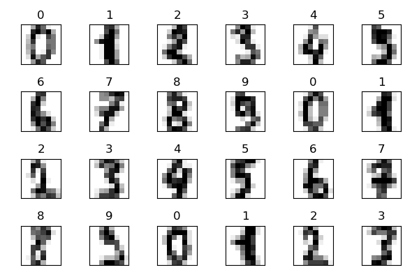

### Розбити данні на тестові та навчальні

Цей код розбиває наші дані на тренувальні та тестові, щоб ми могли перевірити точність нашої моделі. Ми використовуємо функцію `train_test_split()` з бібліотеки `sklearn` для розбиття даних на випадкові тренувальні та тестові набори. Ми передаємо йому наші дані `digits.data` та мітки `digits.target`. Ми також вказуємо випадкове насіння `random_state` та розмір тестового набору не звичайний як сказано в методичці `test_size`.

У нашому коді ми виводимо форму тренувального набору `X_train.shape` та форму тестового набору `X_test.shape` за допомогою функції `shape`, щоб переконатись, що наші дані правильно розбито на тренувальні та тестові набори.

Ось приклад виконання:

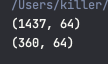

### Моделька

А ось тепер можна вже створювати модельку, використаємо К-найблищих сусідів. Створимо класс за допомогою `KNeighborsClassifier()` та натренуємо модель `knn.fit(X=X_train, y=y_train)`

### Пронозуємо

Коли в нас вже є моделька ми можемо і класифікувати, а от наскільки точно ми ще подивимось. За допомогою `knn.predict(X=X_test)` Можемо класифікувати наші тестові данні, створимо також `expected = t_test`, бо це як в паттерні тестування 3А, в нас є те що ми отримали та те що потрібно було отримати, далі будемо порівнювати.

### Порівнюємо

Для спрощення перегляду(бо там 300 різних картинок), переглянемо тільки 20. `[:20]`. Отримали такі масиви

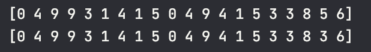

Як бачимо все гарно, але вкінці ми 5 та 3 переплутали, бо вони схожі в написанні та моделька помилилась. Дослідимо детальніше такі помилочки

### Пояснення результату

#### Score

Такс. Почнімо розбиратися наскільки в нас класна моделька. За допомогою метода `score` ми можемо перглянути на скільки відсотків вона справляється з класифікуванням. В мене вийшло

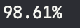

Непоганий такий результат. Продовжуємо аналіз.

#### Матричка

Дуже крута штука - матриця невідповідностей. Це така матриця яка показує які класи як були клисифіковані. Її можна створити за допомогою `confusion_matrix(y_true=expected, y_pred=predicted)`. В нас виходить така краса

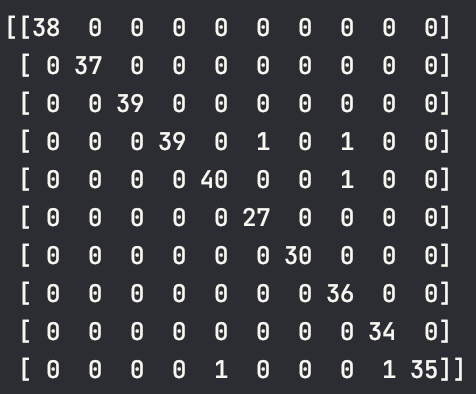

В нас більш за все проблем з 9 та з 3. Та ще інші інколи з 7 плутаємо, але загалом непогано. Якщо в нас так мало помилок, то ми можемо просто порівняти можливі випадки поштового коду з існуючими та автоматично їх виправляти.

### Звіт у звіті

Використаємо функцію `classification_report` щоб переглянути звіт. Там є багато відношень тру позітів до всіх позітів, пропорція тру позітів до просто позітів та багато іншого. Для цієї моделі звіт буде виглядати наступним чином:

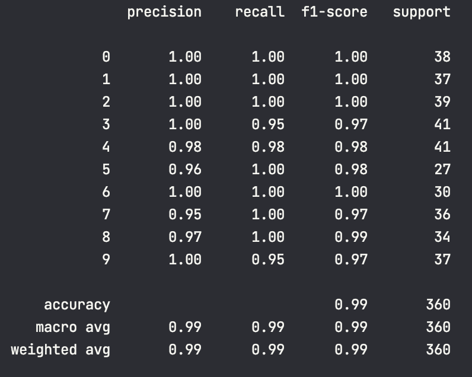

### Більше моделееей

#### SVC

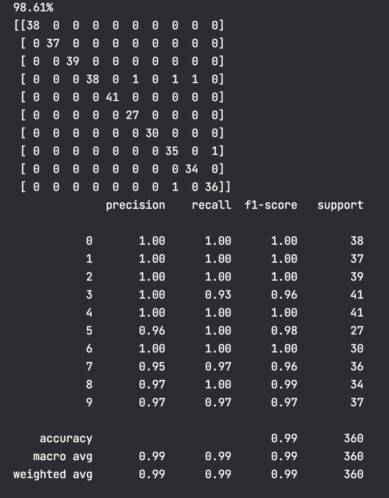

Вийшо так само, але з 3 більше проблем

#### GaussianNB

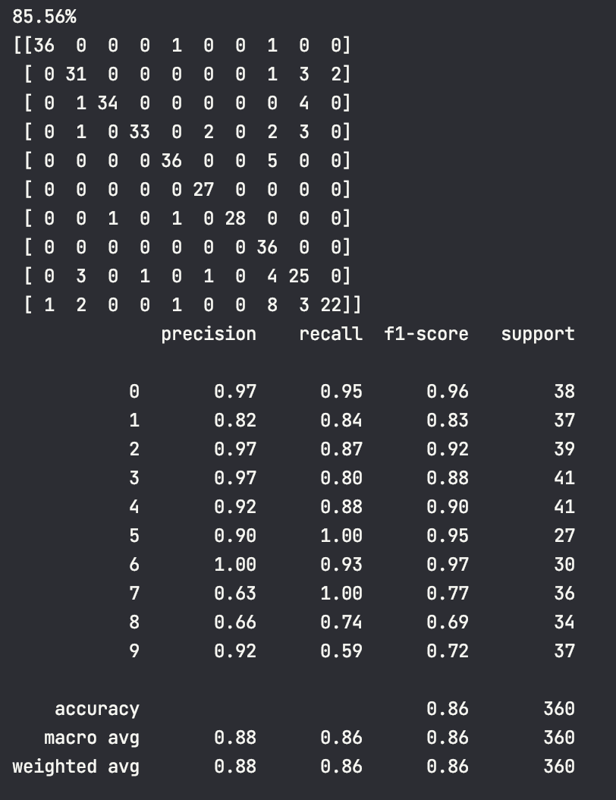

А ось тут вже точність посипалась, краже цю модель тут не використовувати

### Шукаємо різні K

Я оформлю це в табличці щоб спростити перегляд

| Value of k | Accuracy    |
|------------|-------------|
| 1          | 98.61%      |
| 3          | 98.89%      |
| 5          | 98.61%      |
| 7          | 98.33%      |

З таблики видно, що краще використати k=3

## Висновок

На цій лабораторній роботі я познайомився з проблемою класифікації та використав алгоритм к-найблищих сусідів для класифікації числових данних. Дізнався як можна побачити точність класифікування та аналізував натренеровану модельку