# Лабораторна робота №5

## Тема

Проектування та навчання штучної нейронної мережi для задач
класифiкацiї

## Виконання

Код розбито на 6 файлів. Ось табличка за посиланнями, щоб легше було їх переглядати

|                Filename                |                       Description                       |
| :------------------------------------: | :-----------------------------------------------------: |
|  [cook_model](./skynet/cook_model.py)  | Точно за методичкою приклад з числами, створення моделі |
|  [test_model](./skynet/test_model.py)  |    За методичкою використання моделі на моїх данних     |
|       [cifar](./skynet/cifar.py)       |         Як мене раніше навчали створення моделі         |
|  [test_cifar](./skynet/test_cifar.py)  |               Розпізнавання моєї картинки               |
|      [fmnist](./skynet/fmnist.py)      |               Побудова моделі для fmnist                |
| [test_fmnist](./skynet/test_fmnist.py) |               Тестування на моїй картинці               |

### Підготовка та зображення данних

Спочатку нам потрібно данні отримати перед тим як щось робить, тому за допомогою функції `mnist.load_data()` завантажуємо 4 массиви. Данні та мітки для тренування та для тестування.

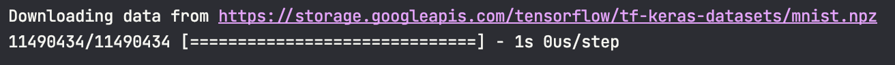

Данні завантажено нормально, далі переглянемо їх. Для цього використаємо матплотліб та намалюємо там фігурки(і підпишемо їх). В циклі робимо підграфіки, де малюємо картинку за допомогою `plt.imshow(train_images[i], cmap=plt.cm.binary)` та додаємо її мітку `plt.xlabel(train_labels[i])` отримаємо наступне

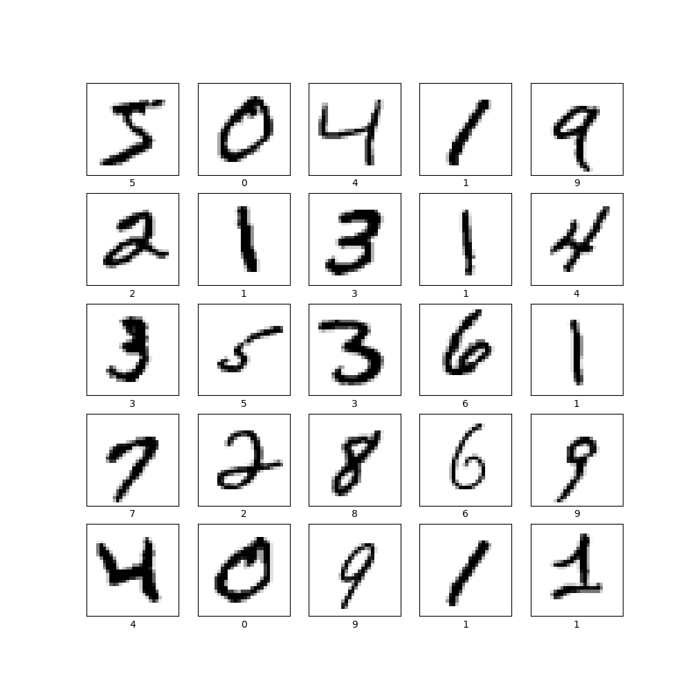

Тепер треба якось нормалізувати ці данні, бо в нас робота йде з одновимірними массивамі, а картинки це двовимірні, та значення сіроти пікселей таке собі з 255, краже від 0 до 1, тому треба зробити `reshape((60000, 28 * 28))` щоб був один массив та `astype('float32') / 255` щоб були знення від 0 до 1

А тепер треба підготувати мітки. Тут все просто - їх завернути в класс з keras за допомогою `to_categorical`

### Архітектура моделі

Тепер нам треба обрати архітектуру моделі яка буде використовуватися. Для простоти в нас буде 3 шари: вхідний, прихований та вихідний. Вони будуть повнозв'язними(кожен з цього шару з кожним з наступного) та треба ще і модель обрати(в нас буде sequantial), тому робимо модель за допомогою `models.Sequential()` та шари за допомогою метода `add(layers.Dense(10, activation='softmax'))` (це для вихідного)

### Компіляція мережі

В нас вже є моделька, але перед навчанням її треба скомпілювати. На цьому єтапі треба надати 3 додаткові параметри: алгоритм оновлення ваги, функція для оцінки якості та метрики для оцінки якості. Обрані варіанти треба задати за допомогою метода `compile`, обираємо ті, що вказані в методичці, а саме rmsprom як оптимізатор, categorical_crossentropy для функції втрат(бо в нас багато классів) та метрики accuracy.

### Навчання

Ось тепер вже можна навчати модель чомусь. За допомогою вже відомого метода `fit` ми можемо надати данні та мітки для навчання, але тут додаються ще епохи та розмір пакетиків. Ці пакетики будуть даватися мережі, а епохи це ітерації підгонки коефіцієнтів. Загалом виклик буде таким `network.fit(train_images, train_labels, epochs=7, batch_size=128)` Ось так буде виглядати вивід при навчанні:

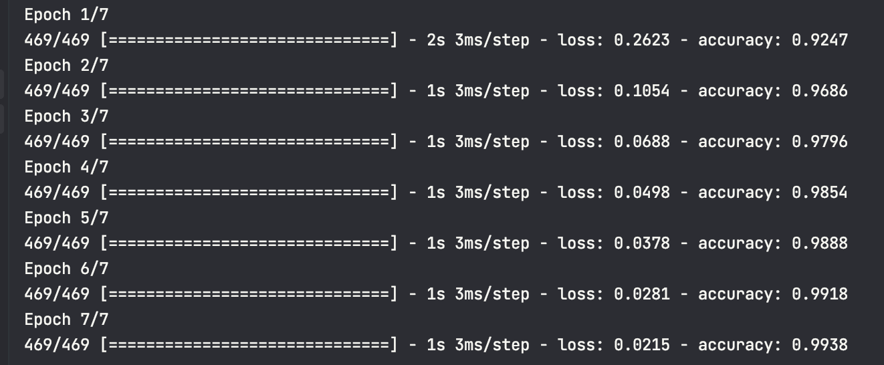

### Тестування

Тепер можемо перевірити наскільки гарна в нас модель на тестовому наборі данних, який отримали та підготували раніше. За допомогою `evaluate`. Ось що ми отримали(доволі непоганий результат)

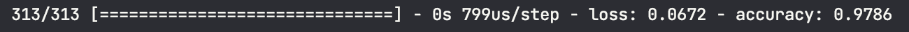

### Збереження

Ми оце все робили та готвували щоб модельку можна було зберегти та потім не перетренеровувати, бо на великих данних це буде довго та дуже дуже довго. Тому просто збережемо модельку у файлик(метод `save`). Ось моя моделька збережена:

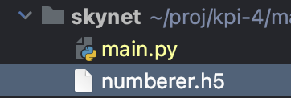

### Використання

Коли в нас вже є готова до роботи моделька, давайте розпізнаємо мою циферку. Ось моя циферка

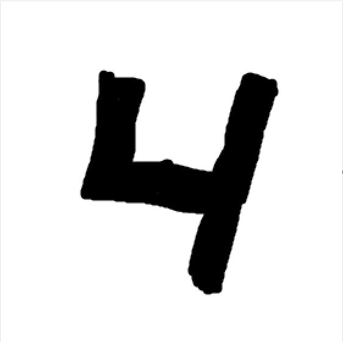

А тепер нехай модель здогадається що це. Завантажемо модель за допомогою `load_model` далі завантажемо картиночку за допомогою `imread` та перетворимо її в той самий формат(28 на 28 в одному рядочку). Ось що в мене вийшло. Модель впевнена що це 4 на 99.999%. Ну... напевно схоже

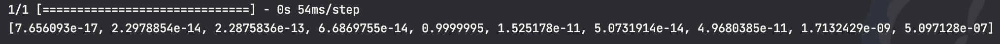

## Модель для cifar-10

Я був інтерном в Торунському університеті імені Коперніка. І я там як раз розробляв невральні мережі та загалом навчався машинному навчанню. Я допомогав готувати данні для майбутніх мереж в одній науковій роботі, тому я знаю як робити гарні модельки. Ось сертифікатик(щоб ви не дивувались тому що я тут написав)

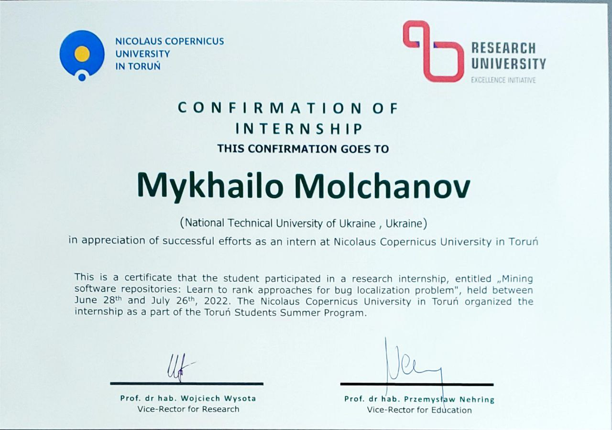

А тепер можемо робити щось веселе(як мене вчили)

Я не буду пояснювати банальне, бо це вже було, а ось шари я розповім детальніше.

Наша модель містить наступні шари:

1. Згортковий шар Conv2D - цей шар призначений для виявлення різних ознак на зображенні. Він використовує матриці зважених коефіцієнтів, які проходять по всьому зображенню та зменшують його розмір. Параметри, які я обрав в цьому шарі - 32 фільтри розміром 3x3, використовуємо «same» для додавання нульових пікселів до входу зображення та функцію активації `relu`.

2. Ще один згортковий шар Conv2D - цей шар також призначений для виявлення ознак на зображенні. Він виконується після першого згорткового шару повинен допомогти моделі навчитися більш складним ознакам на зображенні. Параметри, які ми використовуємо в цьому шарі - 32 фільтри розміром 3x3, функцію активації `relu`.

3. Шар MaxPooling2D - цей шар призначений для зменшення розміру зображення, зберігаючи важливі ознаки. Він пропускає фільтр розміром 2x2 через зображення та обирає максимальне значення з кожної з 2x2 підматриці.

4. Шар Dropout - цей шар є методом регуляризації, що допомагає запобігти перенавчанню моделі(бо в мене багато проблем з цим було). Він випадково забирає певний відсоток ваг між шарами, щоб модель не змогла занадто точно запам'ятати тренувальні дані.

5. Ще один згортковий шар Conv2D - цей шар виконується після попереднього шару MaxPooling2D і має на меті допомогти моделі навчитися ще складнішим ознакам на зображенні. Параметри, які ми використовуємо в цьому шарі - 64 фільтри розміром 3x3, використовуємо `same` для додавання нульових пікселів до входу зображення та функцію активації ReLU.

6. Ще один згортковий шар Conv2D я думаю тут вже понятно навіщо він

7. Шар MaxPooling2D - робить те саме

8. Шар Dropout - те саме

9. Шар Flatten вже новий, цей шар призначений для перетворення вихідних даних з попередніх шарів в одномірний вектор(ми його використовуємо замість перетворення картинки вручну), і вже з нього йдуть данні в шари які були в цій лабі.

10. Повнозв'язний шар Dense класифікує на 10 різних класів, як в першому завданні. Параметри, які ми використовуємо в цьому шарі - 512 вихідних нейронів та функцію активації `relu`

11. Ще один шар Dropout

12. Та ще один повнозв'язний шар Dense цей шар є фінальним шаром моделі та призначений для відповіді на запити класифікації. Параметри, які ми використовуємо в цьому шарі - 10 вихідних нейронів, використовуємо функцію активації `softmax`, щоб отримати розподіл ймовірностей для кожного з 10 класів.

Начебто все. А тепер давайте трохи детальніше про те як саме працюють класси.

1. Conv2D - згортковий шар (Convolutional Layer) використовується для виявлення ознак у зображенні. Кожен згортковий шар складається з набору фільтрів, які скользять по вхідному зображенні та відокремлюють різні ознаки, наприклад, кути, краї та текстуру. Фільтри взаємодіють з пікселями вхідного зображення та генерують вихідну карту ознак, яка передається до наступного шару. Функція активації `relu` (Rectified Linear Unit) використовується для активації згорткового шару, щоб додати нелінійність до моделі.

2. MaxPooling2D - цей шар зменшує розмір вихідних карт з попереднього згорткового шару, зберігаючи при цьому тільки найважливіші ознаки. Це зменшує кількість параметрів моделі та зменшує обсяг обчислень, що потрібні для тренування моделі. MaxPooling2D шар шукає найбільше значення у фільтрі розміром pool_size та передає його наступному шару. Цей процес повторюється на кожному кроці під час обчислення.

3. Dropout - цей шар випадковим чином виключає деякі нейрони в моделі під час тренування, щоб запобігти перенавчанню. Випадковість відбирається шляхом встановлення випадкових ваг у підмножині нейронів в кожному епоху тренування. Це змушує модель шукати шляхи до різних ознак та поліпшує роботу моделі, допомагаючи уникнути перенавчання та забезпечуючи більш ефективне використання ресурсів під час тренування. Dropout шар допомагає знизити співзвучність між нейронами та забезпечує більш робастну модель, яка може краще працювати на нових, раніше невиданих даних.

І далі просто вивести матрицю заплутаностей та відсоток точності, шоб переглянути якість нашої модельки, та зберігаємо її(бо я 25 епех готував хвилин 20). Ось картиночки які нам потрібно характеризувати:

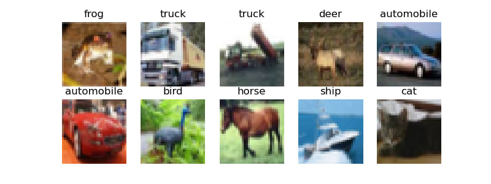

Далі, ось характеристика моделі, як для таких складних данних доволі непогано!

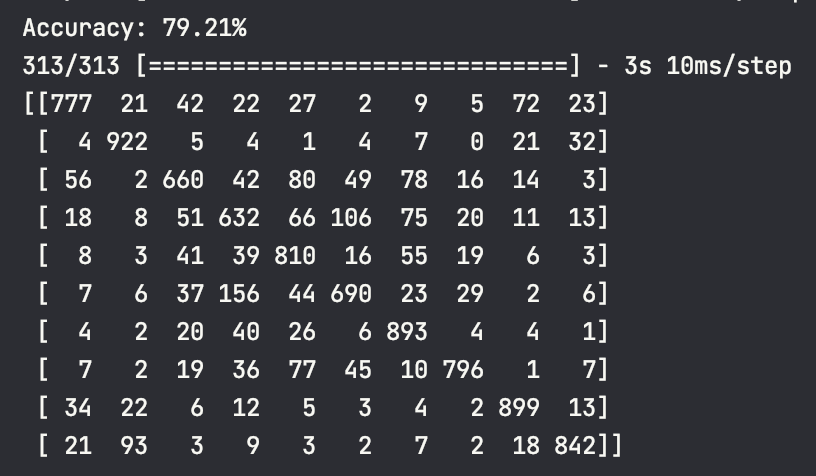

А тепер давайте спробуємо охарактеризувати картиночку машинкою. Ось машинка яку ми дамо моделі:

А ось що каже модель:

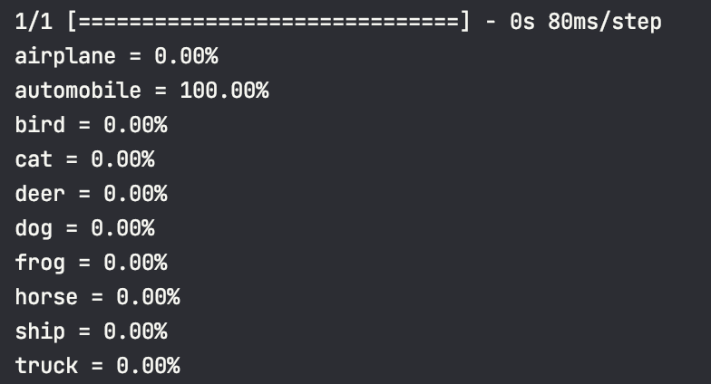

Машина на 100%! Моделька працює

## Модель для fmnist

Я буду використовувати ту саму, бо данні схожі для них. Тут вже без пояснень, тільки приклади.

Приклад зображень, які будемо розрізняти:

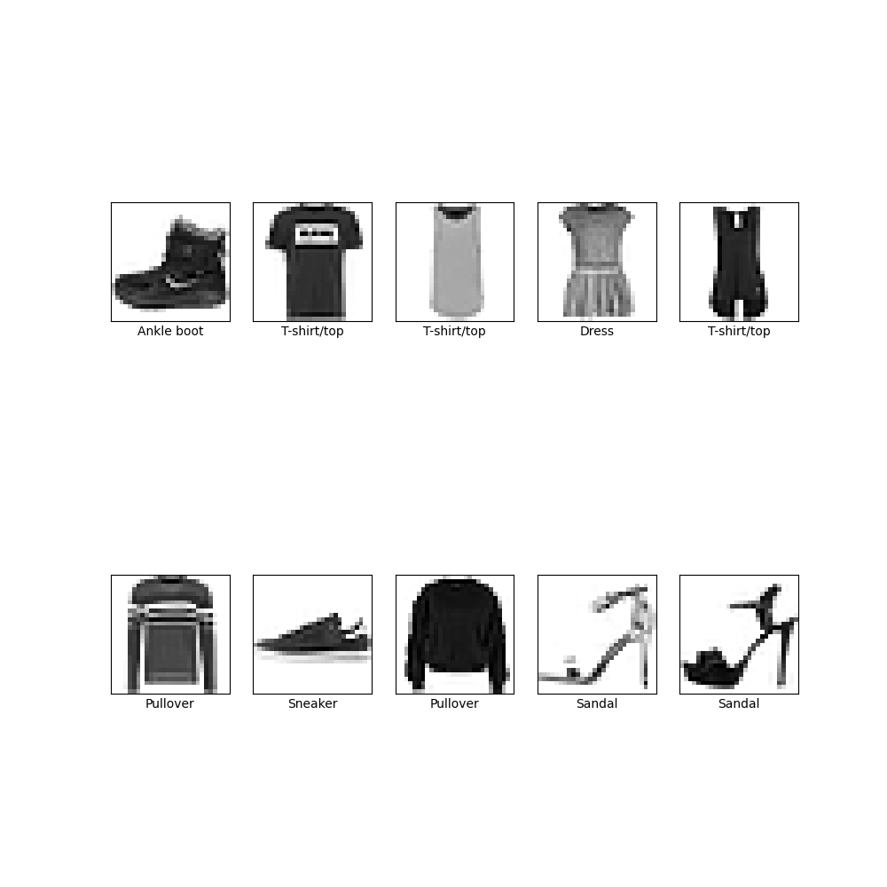

Якість моделі

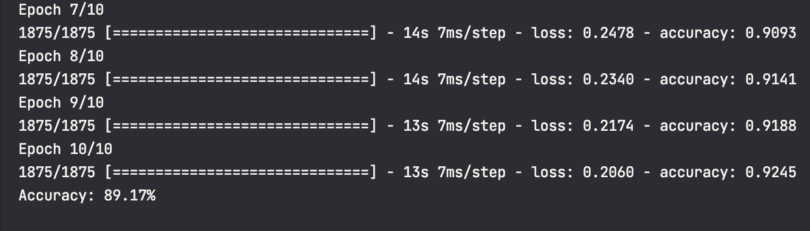

Тестова футболка

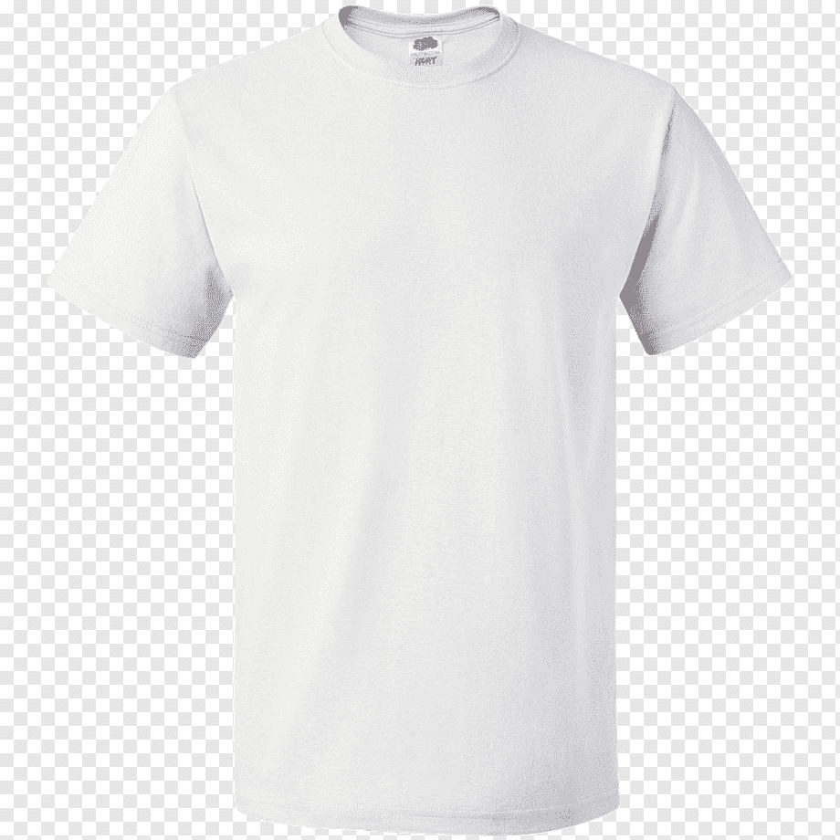

Модель нажаль не зрозуміла що це таке, може якість або розміри картинки невлалі були, але це тепер сумка

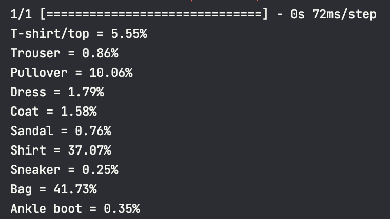

## Висновок

На цій лабораторній роботі я будував штучні невральні мережі для розв'язання проблем класифікації. Я дізнався про різні формати моделі та різні типи шарів нейронів які в них можуть бути. Застосував мої знання з інтернатури для побудови та для тестування моделі для різних датасетів
