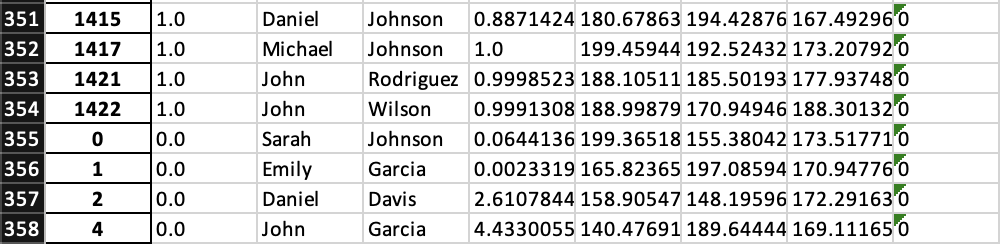

# Лабораторна робота №6

## Тема

Прикладна задача машинного навчання

## Завдання

1. Створити, навчити і апробувати багатошарову нейронну мережу з прямою передачею сигналу для ухвалення рішення про зарахування до Університету абітурієнтів, які здали вступні іспити з математики, англійської та української мови.
Правила прийому наступні:
   1. Рейтинг абітурієнтів формується за формулою 0,4 БМ+0,3БА+0,3БУ, де БМ-бал з іспиту з математики, БА-бал з іспиту з англійської мови, БУ-бал з іспиту з української мови.
   2. Мінімальний прохідний бал на вступ 160 для абітурієнтів без пільг.
   3. З математики для абітурієнтів без пільг мінімальний бал іспиту не може бути менший 140 балів.
   4. Абітурієнти, які мають пільги, зараховуються при мінімумі 120 балів з усіх іспитів і їх рейтинг не може бути меншим ніж 144 бали
   5. Університет може прийняти на навчання 350 абітурієнтів, з них не більше 10% це абітурієнти з пільгами.
   6. Статистика минулих років показує, що в середньому до Університету подають документи 1500 абітурієнтів.

Для навчання мережі слід використовувати всі вивчені методи адаптації та навчання та провести аналіз їх ефективності. Слід також визначити мінімальну кількість шарів і нейронів, що забезпечує задовільне рішення поставленої задачі. У звіті навести архітектуру мережі та код реалізації. Результат має бути візуалізований та представлений у формі Еxcel таблиці, як список зарахованих абітурієнтів.

2. Зробити звіт про роботу

## Виконання

Завдання було виконано у файлі [main](./univers/main.py) для створення данних та тренування моделі та я її тестував у файлі [test](./univers/test.py). Створення ексель файлу зі студентами відбувається в цьому файлі [sheet](./univers/sheet.py)

### Створення данних

Для виконання завдання створимо тестовий набір данних студентів та оцінемо їх відповідно до алгоритму. Використаємо нормальний розподіл з центром в 175 та дистерсією 15 для створення оцінок з кожного екзамену `np.random.normal(175, 15, size)` та рандомний вибір для отримання пільновий студент чи ні `random.choices([0, 1], [80, 20], k=size)`

Сумістимо їх в одного студента та відкинемо можливі значення за 200 `students = [[math, eng, ukr, ben] for math, eng, ukr, ben in zip(math, eng, ukr, ben) if math <= 200 and eng <= 200 and ukr <= 200]`

Переглянемо студентів та їх оцінки:


Перша колонка - рейтинг, далі йдуть оцінки за екзамени та їх пільги, останнє -  чи пройшли вони чи ні. Приберемо їх рейтинг та зробимо кількість студентів що пройшли та ні - рівною.

Оскільки в нас тих хто пройшли набагато більше ніж тих хто ні - нам потрібно це збалансувати. Зробимо за допомогою бібліотеки `imbalanced learn`.


Після балансування:


Тепер можемо робити модель.

### Розробка моделі

На вхід буде подаватись 4 значення: результати кожного екзамену та чи пільговий студент чи ні.

Я поексперементував кілька разів з моделями та прийшов до висновка, що краще використати 3 прихованих шари типу Dense з 1000 нейронами в кожному та 1 на виході з сигмоїдальним типом активації. я використав adam оптимізатор, оскліьки з ним в мене найкращий результат та після пів години роботи в мене вийшла така точність:


Що виглядає неймовірно гарно.

Я округлив значення які надавала модель та порівняв їх з мітками для діаграми заплутаності, та в нас неймовірно гарний результат. В вибірці тільки 5 студентів отримали false positive, що на мою думку дуже гарно. Те що в нас 15 false negative, не так погано, бо отримати новину що ти не поступиш а ти поступив набагато краще ніж отримати новину що ти поступиш, але не поступив

### Тестування на моїх данних

Я створив кілька студентів які можуть бути. Серед них є я та на мою думку середньостатистичні оцінки можливих студентів.

```(python)
me = Student("Mike", 191, 182, 193, 0)
super = Student("Super", 200, 200, 200, 0)
good = Student("Good", 180, 180, 180, 1)
average = Student("Average", 175, 175, 175, 0)
bad = Student("Bad", 150, 150, 150, 0)
reallyBad = Student("REALLY bad", 0, 0, 0, 0)
```

Виглядають оцінки прилбизно так. Поглянемо що на це скаже ця модель.


На перший вигляд оцінки виглядають нормально, та можна побачити що хороший студент з середнім балом у 180 скоріше за все пройде, але в студента с середнім балом у 175 вже шансів майже нема. Про інших мовчу

### Створення таблиці

Я створив 2 масиви з іменами та фаміліями та буду їх комбінувати щоб в студентів були ім'я та фамілії. Далі я за допомогою моделі їх характеризую та створюю датафрейм, який потім в ексель конвертую. Ось як виглядає цей ексель файл



Як видно в нас пройшло 354 студента, що вього на 4 більше ніж насправді, тобто модель відмінно виконала свою роботу.

## Висновок

На цій лабораторній роботі я розв'язав прикладну задачу машинного навчання за допомогою навичок які отримав в процессі вивчення цього предмету. Я створив свій тестовий набір студентів та натренував модель на них. Далі протестував їх на придуманих мною студентах та на мені в тому числі. Далі я зренерував студентів з іменами та фаміліями та за допомогою моделі створив ексель таблицю з ними
