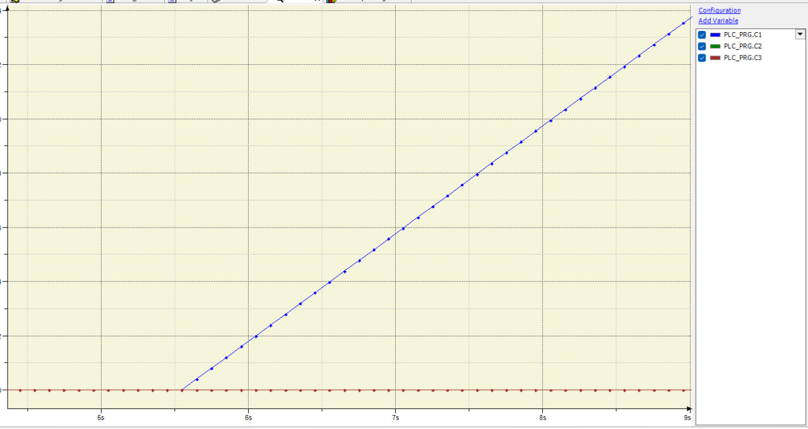
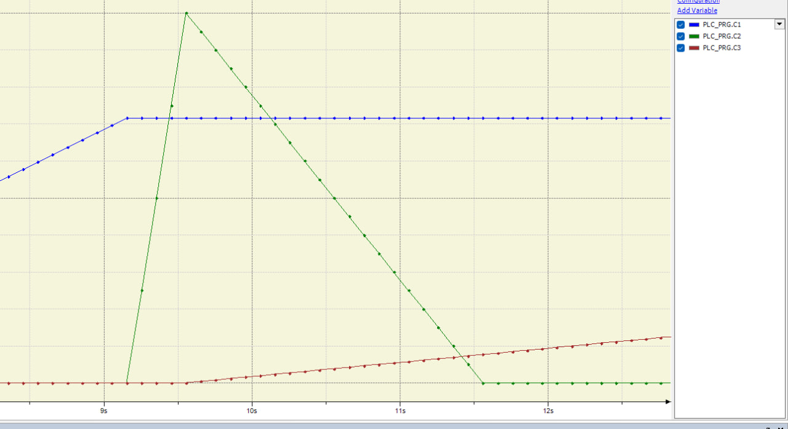
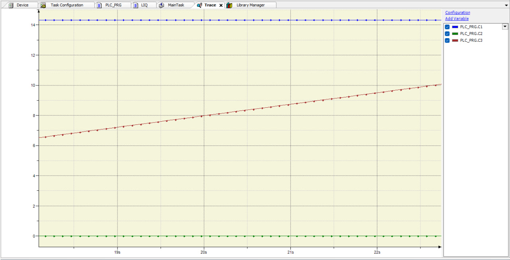
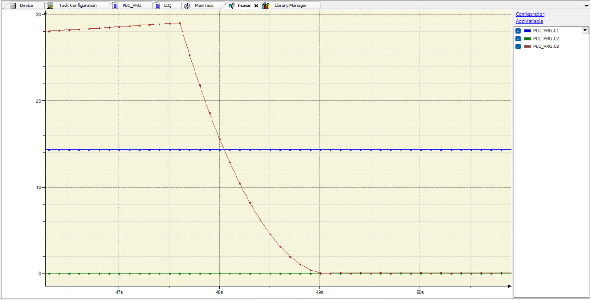

# Лабораторна робота №3

- [Лабораторна робота №3](#лабораторна-робота-3)
  - [Тема](#тема)
  - [Мета](#мета)
  - [Виконання](#виконання)
    - [Код](#код)
    - [Робота застосунку](#робота-застосунку)
  - [Висновок](#висновок)

## Тема

Моделювання гідродинамічних об'єктів

## Мета

Засвоїти основні принципи запису ММ типових технічних ОК, на при- кладі баку з рідиною аналітичними виразами у вигляді неперервних дифе- ренціальних та алгебраїчних рівнянь, що пов'язують між собою вхідні та ви- хідні параметри ОК.

## Виконання

### Код

З попередньої лабораторної роботи в нас вже є схема гідродинамічного об'єкту який нам потрібно моделювати, тому потрібно просто зробити застосунок який це зможе робити.

Для роботи, земулюємо керування нашою системою. Для цього створемо наступні змінні:

```(CoDeSys)
PROGRAM PLC_PRG
VAR
 valve_b: BOOL := FALSE;
 valve_c: BOOL := FALSE;
 valve_d: BOOL := FALSE;
 lab_model: LIQ;
END_VAR
VAR_OUTPUT
 C1:REAL := 0;
 C2:REAL := 0;
 C3:REAL := 0;
END_VAR
```

Та керування будемо виконувати так:

```(CoDeSys)
IF C1 > 14 THEN
 valve_b := TRUE;
END_IF
IF C2 > 19 THEN
 valve_c := TRUE;
END_IF
IF c3 > 29 THEN
 valve_d := TRUE;
END_IF
lab_model(valve_b := valve_b, valve_c := valve_c, valve_d := valve_d, h1 => C1, h2 => C2, h3 => C3);
```

Тут вказані трохи зменшені ліміти, на ємність, щоб на високих кроках моделювання, система не зламалась.

Як видно з коду, в нас є lab_model, яка відображає саме стани баків. Розглянемо її. В ній використовуються наступні змінні:  

```(CoDySys)
FUNCTION_BLOCK LIQ
VAR_INPUT
 valve_b: BOOL := FALSE;
 valve_c: BOOL := FALSE;
 valve_d: BOOL := FALSE;
END_VAR
VAR_OUTPUT
 h1: REAL := 0;
 h2: REAL := 0;
 h3: REAL := 0;
 delta: REAL := 1;
 v1_tmp: REAL := v1;
 v2_tmp: REAL := v2;
 v3_tmp: REAL := v3;
 v1: REAL := 0;
 v2: REAL := 0;
 v3: REAL := 0;
 PI: REAL := 3.14159;
 v1_max: REAL := PI * 2 * 2 * 15;
 v2_max: REAL := 2 * 2 * 20 / 3;
 v3_max: REAL := PI * 5 * 5 * 30;
 flow: REAL := 0;
END_VAR
```

Вхідні та вихідні змінні, крок в секундах, проміжні значення об'єму та реальні значення об'єму, та максимально можливі об'єми які можна вмістити в баки.  
Наступний код керує об'ємом води в першому баці:

```(CoDeSys)
IF v1_tmp < v1_max THEN
  flow := 5 * delta;
  v1_tmp := v1_tmp + flow;  // Поступ води в бак 1
  IF v1_tmp >= v1_max THEN
   v1_tmp := v1_max;
  END_IF
 END_IF
```

Тут є додаткові перевірки для того щоб не перенаповнити бак.  
Наступний код працює з баком 2, та бере воду з баку 1:  

```(CoDeSys)
IF valve_b AND v1_tmp > 0 AND v2_tmp < v2_max THEN
  flow := (5 * delta);
  v1_tmp := v1_tmp - flow; // Витік води з баку 1 через трубу B
  IF v1_tmp <= 0 THEN
   v1_tmp := 0;
  END_IF
  flow := (5 * delta);
  v2_tmp := v2_tmp + flow; // Поступ води в бак 2 через трубу B
  IF v2_tmp >= v2_max THEN
   v2_tmp := v2_max;
  END_IF
 END_IF
```

Також важливо зазначити, що замість літрів на секунду, я пришвидшив процес до метрів кубічних на секунду, бо інакше заповнення баку 1 буде тривати 3 тижні.  
Наступний код керує станом баку 3:

```(CoDySys)
IF valve_c AND v2_tmp > 0 AND v3_tmp < v3_max THEN
  flow := 6 * delta;
  v2_tmp := v2_tmp - flow; // Витік води з баку 2 через трубу C
  IF v2_tmp <= 0 THEN
   v2_tmp := 0;
  END_IF
  flow := (6 * delta);
  v3_tmp := v3_tmp + flow; // Поступ води в бак 3 через трубу C
  IF v3_tmp >= v3_max THEN
   v3_tmp := v3_max;
  END_IF
 END_IF
```

Останнє що залишилось - працювати зі стоковою трубою:

```(CoDySys)
IF valve_d AND v3_tmp > 0 THEN
  flow := (PI * (4/2) * (4/2) * SQRT(2 * 9.81 * h3) * delta);
  v3_tmp := v3_tmp - flow; // Витік води з баку 3 через стокову трубу D
  IF v3_tmp <= 0 THEN
   v3_tmp := 0;
  END_IF
 END_IF
```

Тут було використано формули для відкритої труби, де швидкість витікання буде залежати від висоти рідини в сосуді.  
В кінці кожної ітерації, нам потрібно оновити вже існуючі змінні та розрахувати висоти.

```(CoDySys)
v1 := v1_tmp;
 v2 := v2_tmp;
 v3 := v3_tmp;
 h1 := v1 / (PI * 2 * 2);
 h2 := v2 / ( 2 * 2 / 3);
 h3 := v3 / (PI * 5 * 5);
```

### Робота застосунку

Ця система працює як задумано, та на графіках під час симуляції можна побачити основні єтапи алгоритму. Розглянемо їх:  

  
На цьому зображені наша система тільки запустилась, вода набирається до баку 1.  

  
На цьому етапі вода досягла потрібного рівня в баці 1 та зайва почала перекачуватись до баку 2, оскільки його розміри дуже малі, вона швидко набралась та ми перейшли до наступного кроку алгоритму. Вода почала перекачуватись до баку 3, оськільки вона все одно поступає до баку 2 але швидкість недостатня, він поступово спустошується, тим самим набираючи бак 3.  

  
Далі бак 3 поступово набирається, оскільки він найбільший це займає багато часу, При цьому бак 1 заповнений, а бак 2 повністю пустий та вся вода з нього переходить до баку 3.  

  
Завершальний етап роботи системи, коли бак 3 повністю заповнений, відкривається стокова труба та повністю спустошує бак 3, важливо зазначити, що за допомогою формул, вдалося передати залежність швидкості витікання від рівня води в баці.

## Висновок

На цій лабораторній роботі я змоделював гіднодинамічні об'єкти з системи яку було створено в попередній лабораторній роботі. Знову викоирстав CoDeSys для створення програми яка може відображати процеси які відбуваються в системі
