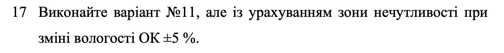
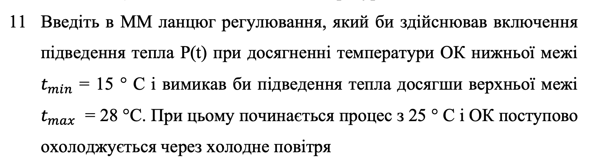
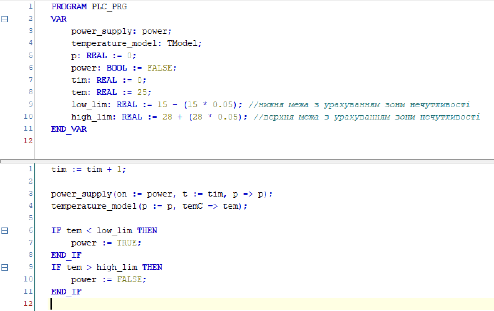
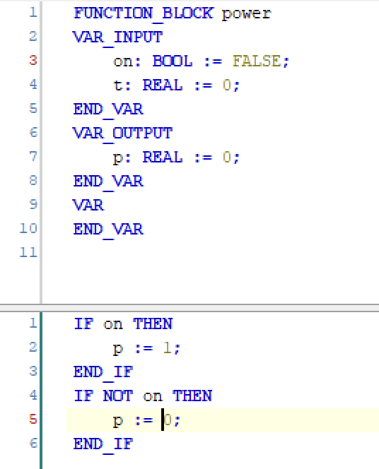
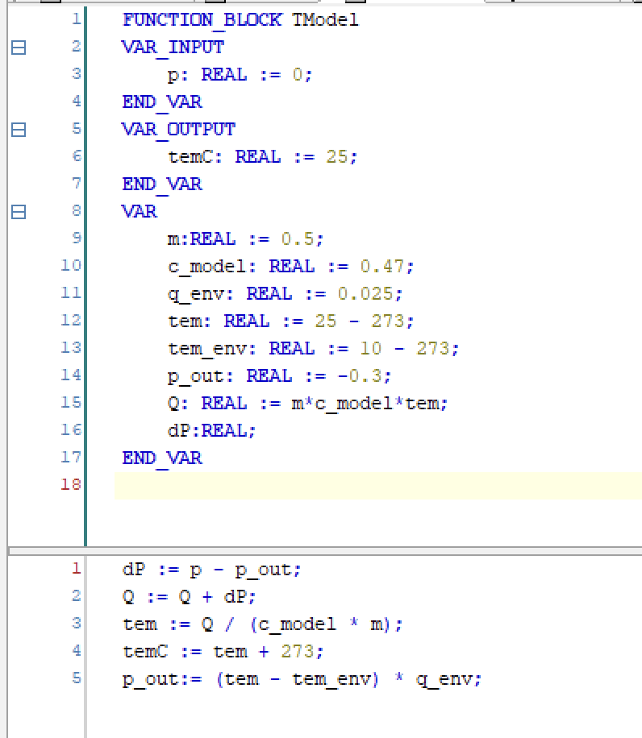
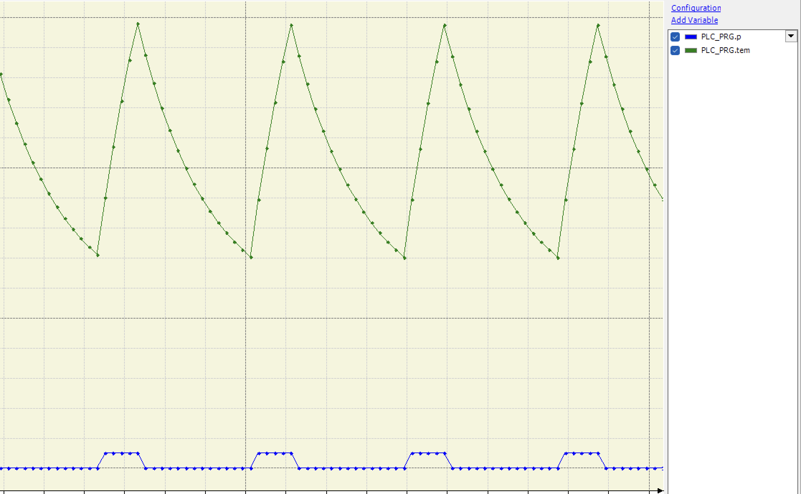

# Лабораторна робота №3

## Тема

Моделювання термодинамічних об'єктів

## Мета

Навчитися розраховувати залежність температури ОК від часу, якщо відома залежність потужності від часу, що підводиться до нього.

## Завдання

## Виконання

### Код

Код було розбито на 3 основні частини. Керування значенням потужності, увімкнення та вимкнення нагрівника та стан самого об'єкту що моделюють.  

Переглянемо код для керування нагрівачем:  
  
Ми отримаємо значення температури та перемикаємо нагрівник відповідно до нього та поправку на вологість.  

Наступна частина - керування потужністю. В умові не було задано певної залежності темрератури від часу, тому чона виконана як просто 1, але її можна легко модифікувати відповідно до вимог.  
  

Найголовніша частина це саме модель, яка змінює температуру відповідно до навколишнього середовища та подачі потужності.  

### Графіки

  
На наведеному графіку видно, що на початку процессу об'єкт має температуру 25 градусів та повільно охолоджується, через те, що знаходиться в просторі з температурою 10 градусів.  
Після досягнення 15 градусів, до нього починає подаватись потужність, швидко нагріваючи об'єкт. На графіку видно як потужність приймає значення 1.  
Це відбувається доки об'єкт не нагріється до температури 28 градусів, де потужність перестають подавати та об'єкт знову починає охолоджуватись.  
Також можна побачити, що швидкість нагріву та охолодження поступово зменшується, оскільки віддається менше енергії чезер малу різницю в температурах між навколишнім середовищем та об'єктом, або навпаки нагрів сповільнюється, бо об'єкт передає все більше і більше енергії за раз.

## Висновок

На цій лабораторній роботі я навчився моделювати термодинамічний об'єкт, температура якого змінюється з часом. Для цього я використав вже відому мені мові CoDeSys. Також трохи застосував мої знання з теорії автоматики, для керування об'єктом та керуючим впливом.
