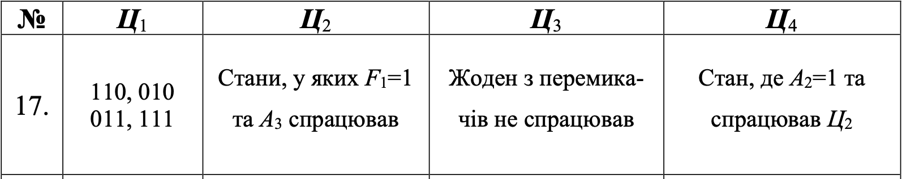
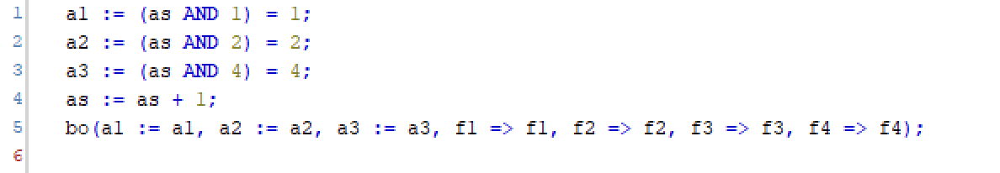
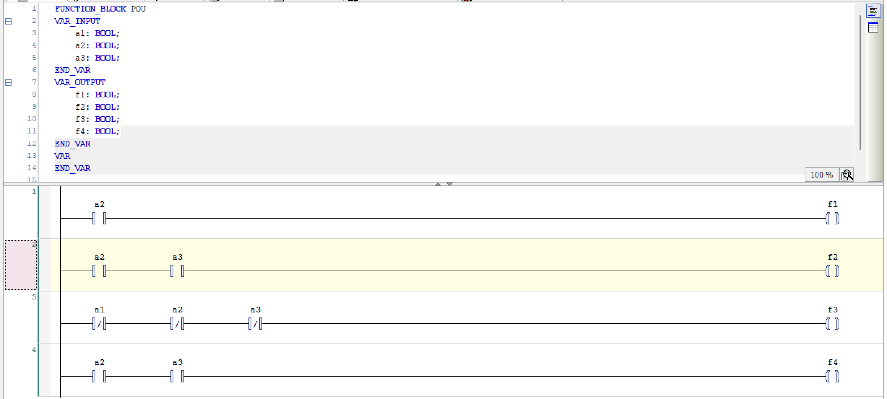
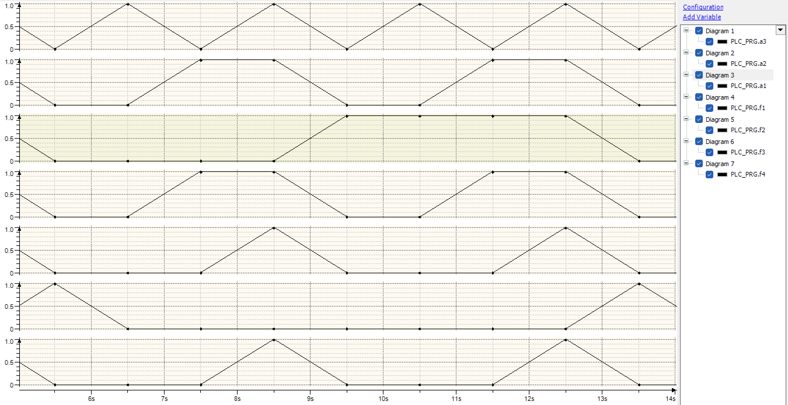

# Лабораторна робота №5

## Тема

Моделювання однотактних систем керування мовою LD

## Мета

Знайомство з принципами програмування однотактних систем логічного керування на мові релейно-контактних схем LD.

## Завдання

Виконати контрольне завдання до ЛР No5.

## Виконання

### Таблиця станів

| A1 | A2 | A3 | F1 | F2 | F3 | F4 |
|----|----|----|----|----|----|----|
| 0  | 0  | 0  | 0  | 0  | 1  | 0  |
| 0  | 0  | 1  | 0  | 0  | 0  | 0  |
| 0  | 1  | 0  | 1  | 0  | 0  | 0  |
| 0  | 1  | 1  | 1  | 1  | 0  | 1  |
| 1  | 0  | 0  | 0  | 0  | 0  | 0  |
| 1  | 0  | 1  | 0  | 0  | 0  | 0  |
| 1  | 1  | 0  | 1  | 0  | 0  | 0  |
| 1  | 1  | 1  | 1  | 1  | 0  | 1  |

### Функції та їх мінімізація

F1 = a1a2¬a3 ∨ ¬a1a2a3 ∨ a1a2¬a3 ∨ a1a2a3 = a2  
F2 = a1a2a3 ∨ a1a2a3 = a2a3  
F3 = ¬a1¬a2¬a3
F4 = ¬a1a2a3 ∨ a1a2a3 = a2a3  

### Реалізація в CoDeSys

Для отримання значень a1-3, я зроблю маленьку хитристь, я зроблю лічильник та буду робити побітове порівняння з 1, 2 та 3 бітами, оскільки при збільшенні лічильника вони булуть приймати можливі значення булевих змінних, я звідти зможу отримати значення A. Далі ці значення передамо в симулятор, який вже буде реалізовувати булеві функції

  

Тут за допомогою мови LD, ми зробили схему яка буде відповідати мінімізованим булевим функціям, та за допомогою неї ми будемо отримувати їх знчення залежно від змінних якиі до нас надійшли.

  

### Використання

На різних графіках ми бачимо значення змінних та функції. Згоди до низу в нас a1, a2, a3, f1, f2, f3, f4. Як видно, a приймають всі можливі набори для функції трьох змінних, та значення функцій відповідають значенням з таблиці.

## Висновок

На цій лабораторній роботі я познайомився з мовою LD. За допомогою неї я побудував схему кількох булевих функції, які я вивів та спростив з таблиці істиності, заданої текстом. Також я використав лічильник щоб задавати стани булевих змінних, бо кожен рядок має свій номер та по ним можна рахувати.
