# Лабораторна робота №6

## Тема

Моделювання релейного регулятора мовою FBD

## Мета

Знайомство з принципами програмування релейних елементів на мові функціональних блоків FBD.

## Завдання

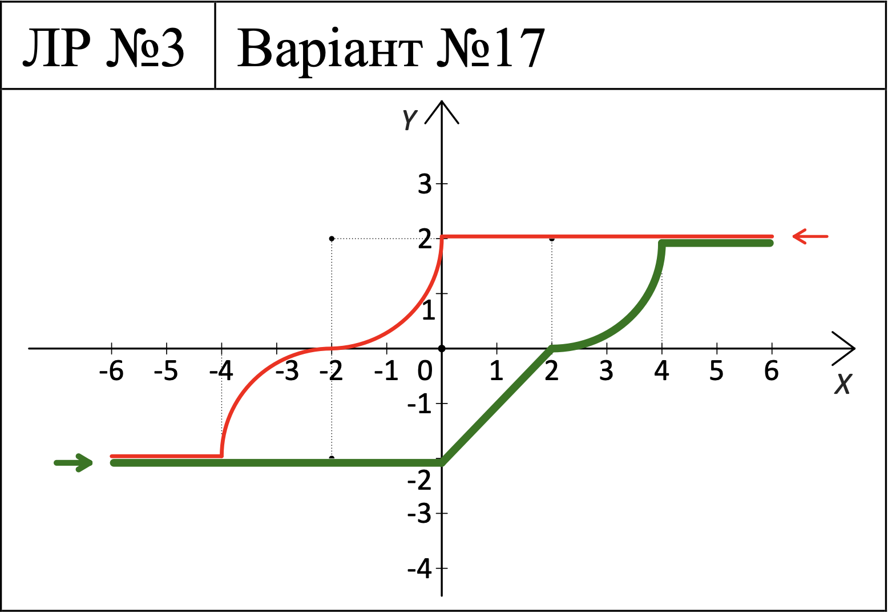

## Виконання

Значення виходу поза інтервалом \[-4; 4\] можна чітко визначити. На інтервалі \[-4; 4\] вихід ДРЛ визначається попереднім станом ДРЛ, тобто за допомогою похідної за часом від вхідного сигналу.
Таким чином, поведінку ДРЛ можна записати у вигляді правил та функцій наступним чином:

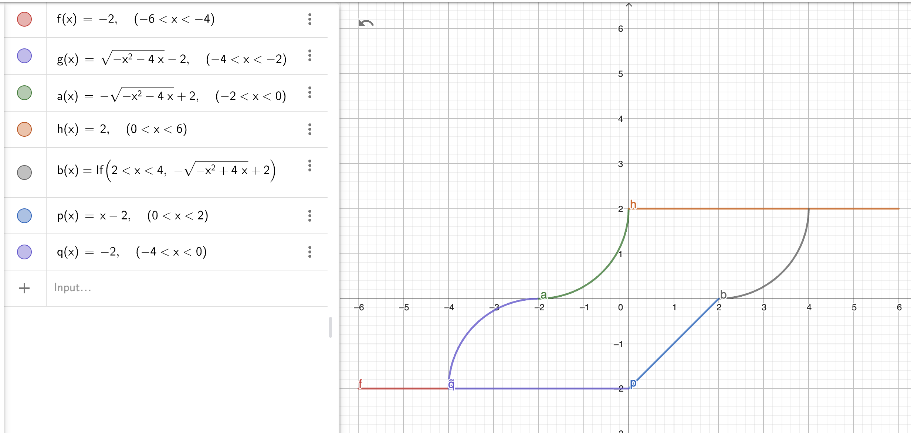

### Написання програми

Я використав пилкоподібний графік для x, який набуває всіх можливих значень для функції та повертається назад

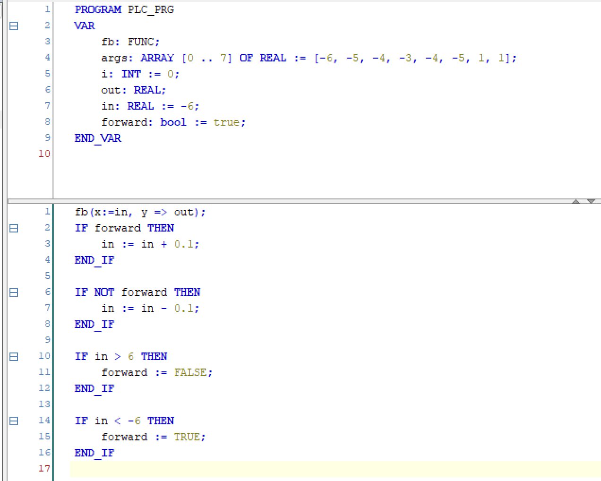

Та сам код та з'єднання для реалізації функції

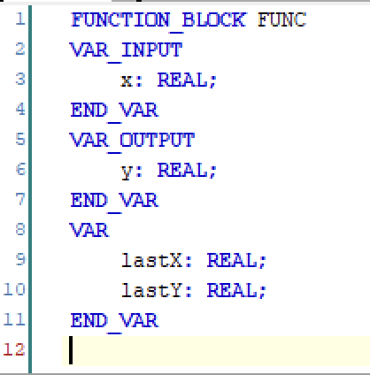

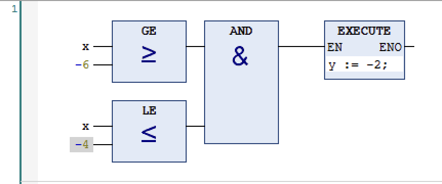  
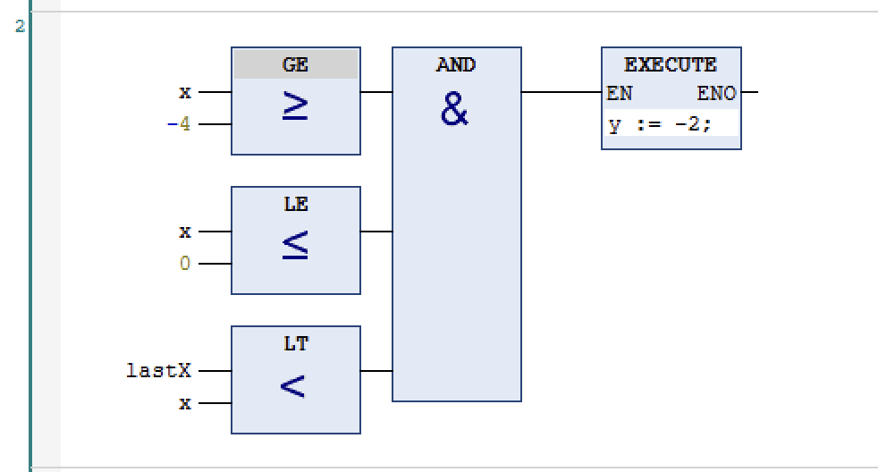  
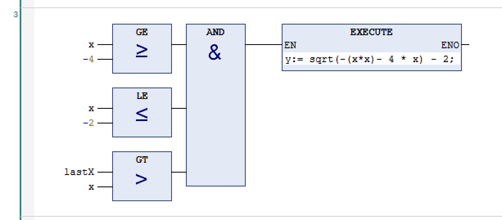  
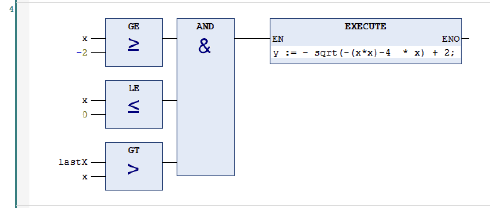  
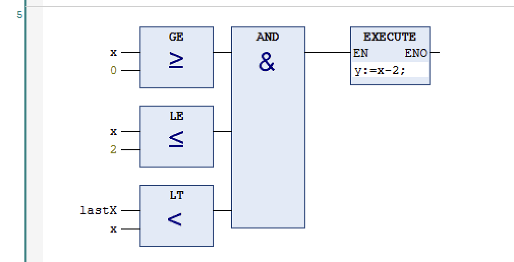  
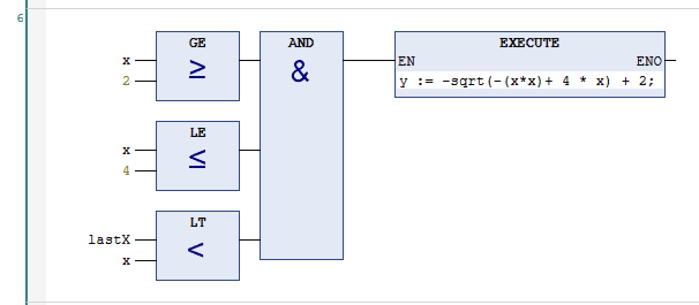  
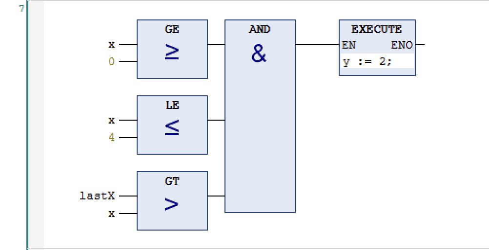  
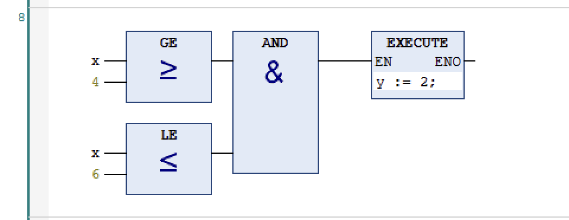  
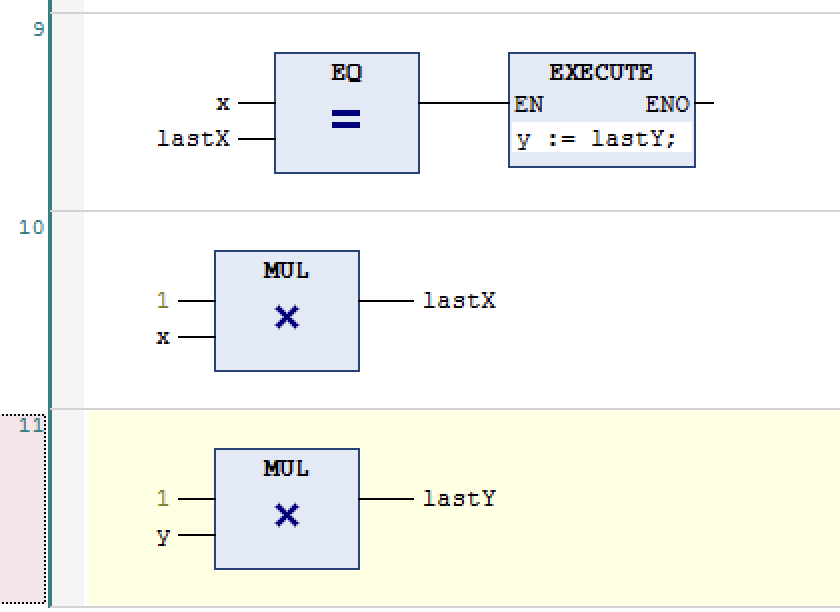  

### Отриманий графік

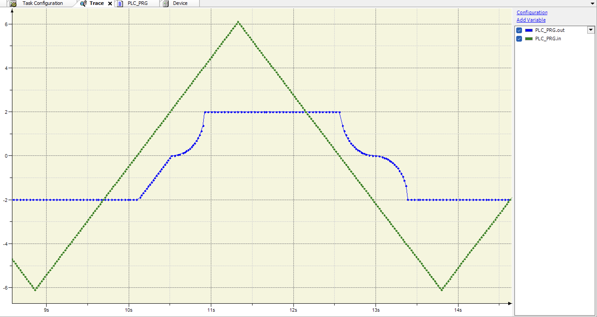

Ось так виглядає графіки отримані при виконанні програми. Як видно, всі частини графіка співпадають з наведеними в завданні, та коли в нас додатня похідна, ми отримаємо нижню частину, а коли рухаємося назад, отримаємо верхню

## Висновок

На цій лабораторній роботі я розробив релейні елементи за допомогою функціональних блоків FBD.
