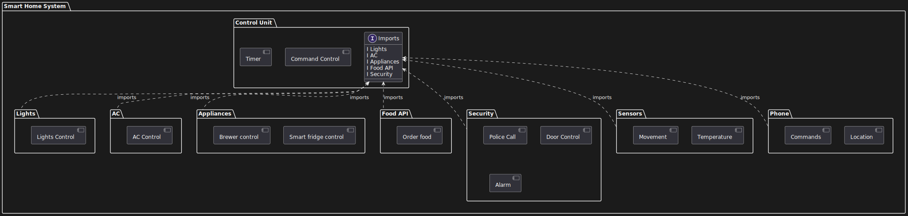

# Лабораторна робота №10

## Тема

Діаграма пакетів

## Мета

ознайомитися із призначенням та побудовою діаграми
пакетів мови моделювання системної інженерії SysML.

## Викоання

На цій діаграмі зображено основні пакети нашої системи. Всі їх функції використовуються пакетом Control Unit, тому він імпортує всі інші пакети. В кожному пакеті є певні свої функції. В самого контрол юніта також є свої функції(речі які він робить)

## Висновок

На цій лабораторній роботі ми розбили нашу систему на пакети та визначили функції кожного з них. Також зробили логічні зв'язки між пакетами які між собою взаємодіють