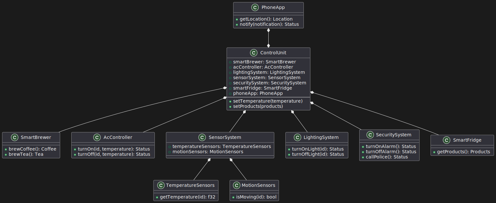

# Лабораторна робота №11

## Тема

Діаграма внутрішньої структури

## Мета

ознайомитися із призначенням та побудовою діаграми
внутрішньої структури мови моделювання системної інженерії SysML

## Виконання

ControlUnit: Це головний компонент системи управління. Він включає в себе інші компоненти, необхідні для керування будинком.

SmartBrewer: Цей компонент відповідає за приготування кави та чаю.

AcController: Він керує системою кондиціювання повітря та дозволяє включати та вимикати кондиціонери з різними температурними налаштуваннями.

SensorSystem: Цей компонент включає в себе датчики температури та датчики руху, які використовуються для контролю температури та виявлення руху у будинку.

LightingSystem: Він керує освітленням у будинку, дозволяючи вмикати та вимикати світло в окремих приміщеннях.

SecuritySystem: Цей компонент відповідає за безпеку будинку. Він може включати або вимикати систему сигналізації та здійснювати дзвінок до поліції у разі потреби.

SmartFridge: Він представляє розумний холодильник, який надає доступ до інформації про продукти, що зберігаються в ньому.

PhoneApp: Це додаток для смартфонів, який забезпечує користувачеві можливість керування системою управління і отримання повідомлень.

Зв'язки між компонентами показують, як вони взаємодіють між собою. Наприклад, ControlUnit має посилання на SmartBrewer, AcController, SensorSystem, LightingSystem, SecuritySystem та SmartFridge для взаємодії з ними. PhoneApp має асоціацію з ControlUnit, що означає, що користувач може керувати системою управління через додаток на своєму смартфоні.

Ця діаграма допомагає зрозуміти внутрішню структуру системи управління розумного будинку, її компоненти та їх взаємодію. Вона може бути використана для розробки та аналізу системи, а також для комунікації між розробниками та зацікавленими сторонами проєкту.

## Висновок

На цій лабораторній роботі ми ще раз продумали внутрішню структуру нашої системи, та прописали як саме можна взаємодіяти з її частинами.
