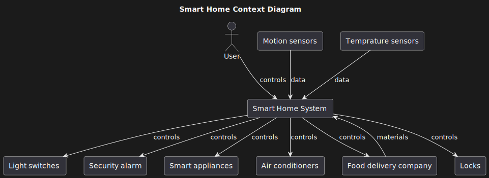

# Лабораторна № 2

## Тема

Контекстна діаграма

## Мета

ознайомитись з призначенням та побудовою контекстної діаграми для потреб системної інженерії

## Хід роботи

1. Визначити об’єкт системної інженерії. Це повинна бути досить складна система.
2. Побудувати контекстну діаграму для обраного об’єкту.

## Виконання

### Об'єкт системної інженерії

Після опанування методичних вказівок до цієї лабораторної, наш об'єкт системної інженерії було трохи змінено. Ми будемо розробляти систему керування для розумного будинку. Тобто прилади котрими наша система буде керувати до неї не входять.

### Побудова контекстної діаграми

Для цього бува використана мова розмітки plantuml.

  

Система отримує дані про температуру та чи є хтось у кімнаті. Від цього система буде вмикати світло або підвищувати температуру обігрівачів. Система буде взаємодіяти з "Смарт" речами та готувати вранці каву або ввечері ставити чайник. Коли мешканець прибуває, система це розуміє та відчиняє йому двері та вимикає сигналізацію. Також вона моніторить що є у смарт холодильнику та робить замовлення на сайтах доставки їжі. Користувач може керувати бажаною температурою, часом вимикання світла, та додавати особливі речі до замовлень за допомогою свого телефону.

## Висновок

На цій лабораторній роботі ми розробили контекстну діаграму нашої системи та побудували більш чіткі межі між нашої системою та об'єктами з якими вона взаємодіє. Навели що саме буде передаватись під час взаємодії та в якому напрямі.
