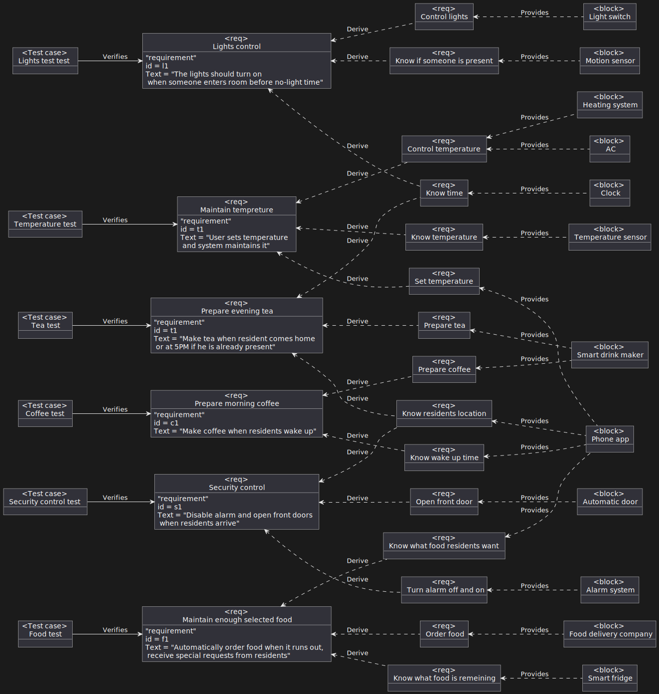

# Лабораторна робота №3

- [Лабораторна робота №3](#лабораторна-робота-3)
  - [Тема](#тема)
  - [Мета](#мета)
  - [Хід роботи](#хід-роботи)
  - [Виконання](#виконання)
    - [Визначити об'єкт](#визначити-обєкт)
    - [Побудувати діаграму вимог](#побудувати-діаграму-вимог)
  - [Висновок](#висновок)

## Тема

Діаграма вимог

## Мета

ознайомитися із призначенням та побудовою діаграми вимог
мови моделювання системної інженерії SysML.

## Хід роботи

1. Визначити об’єкт системної інженерії. Це повинна бути досить складна система.
2. Побудувати діаграму вимог для обраного об’єкту.

## Виконання

### Визначити об'єкт

Вже було визначено в попередній роботі

### Побудувати діаграму вимог

## Висновок

На цій лабораторній ми продумали вимоги які ставляться до нашої системи та які додаткові вимоги вони можуть породжувати, а також які об'єкти можуть вирішити ці додаткові вимоги.
