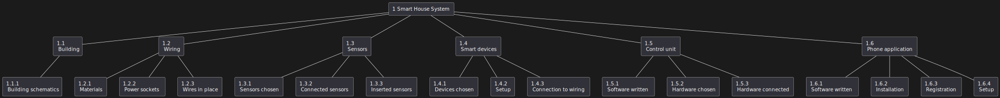
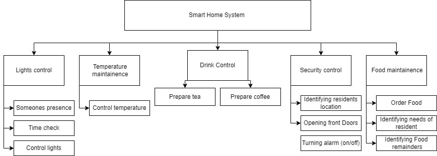

# Лабораторна робота №4

## Тема

Ієрархічна структура робіт

## Мета

ознайомитися із призначенням та побудовою ієрархічної
структури робіт для потреб системної інженерії.

## Хід роботи

1. Визначити об’єкт системної інженерії. Це повинна бути досить складна
система.
2. Побудувати ієрархічну структуру робіт для обраного об’єкту за
допомогою трьох підходів (функціональний та продуктовий – обов’язково,
третій – за власним вибором)

## Виконання

### Продуктовий підхід

### Функціональний

### За фазами

## Висновок

На цій лабораторній роботі ми переглянули способи представлення задач під час розробці системи. А саме, як їх реалізувати та навіщо вони потрібні.
