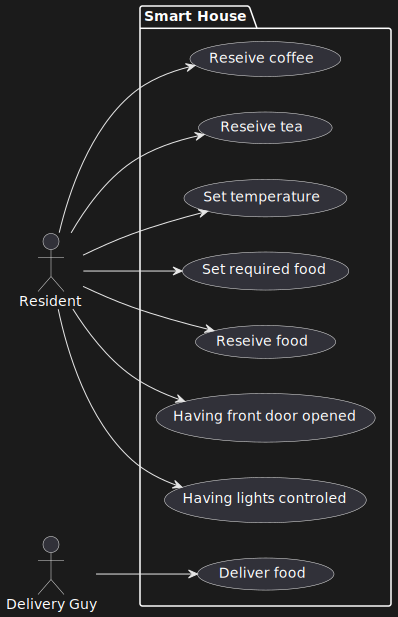

# Лабораторна робота №5

## Тема

Діаграма варіантів використання (прецедентів)

## Мета

Ознайомитися із призначенням та побудовою діаграми варіантів використання (прецедентів) мови моделювання системної інженерії SysML.

## Хід роботи

1. Визначити об’єкт системної інженерії. Це повинна бути досить складна система.
2. Побудувати діаграму варіантів використання (прецедентів).

### Виконання

На цій діаграмі зображено як саме користувач та потенційно інші актори будуть взаємодіяти з системою. Тут важко було називати чері, бо наша система побудована на тому, щоб позбавити користувача потреби щось робити.

## Висновок

На цій лабораторній роботі ми зробили діаграму варіантів використання нашої системи що допомогло більш точно описати що саме з нею можна робити та як нею користуватися.
