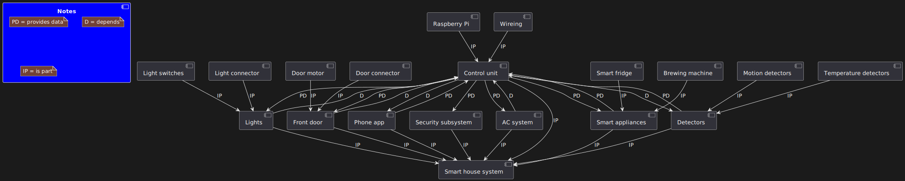

# Лабораторна робота №5

## Тема

Діаграма визначення блоків

## Мета

Ознайомитися із призначенням та побудовою діаграми визначення блоків мови моделювання системної інженерії SysML.

## Хід роботи

1. Визначити об’єкт системної інженерії. Це повинна бути досить складна
система.
2. Побудувати діаграму визначення блоків.

## Виконання

На цій діаграмі зображено блоки нашої системи. Найбільший блок - це сама система, всі інші - це її складові. Деякі блоки залежать від інших, та надають данні іншим. Головний блок це control unit, він приймає всі рішення в системі та оброблює все що система отримує

## Висновок

На цій лабораторній роботі ми побудували блокову діаграму. За допомогою неї ми більше представляємо з чого саме складається система та як там все в ній пов'язано.
