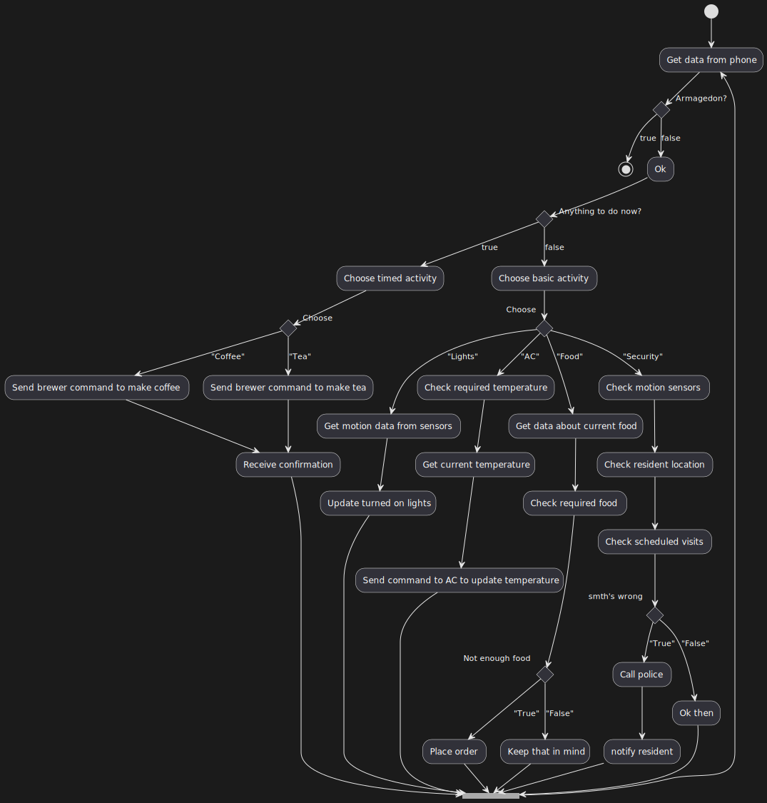

# Лабораторна робота №7

## Тема

Діаграма діяльності

## Мета

Ознайомитися із призначенням та побудовою діаграми діяльності мови моделювання системної інженерії SysML.

## Хід роботи

1. Визначити об’єкт системної інженерії. Це повинна бути досить складна система.
2. Побудувати діаграму діяльності для обраного об’єкту.

## Виконання

Граф діяльностей є різновидом графу станів скінченного автомату, вершинами якого є певні дії, а переходи відбуваються по завершенню дій.

## Висновок

На цій лабораторній роботі ми ознайомилися з призначенням та побудовою діаграми діяльності мови моделювання системної інженерії SysML.
