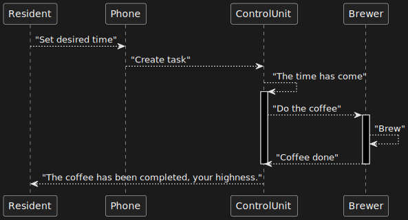

# Лабораторна робота №8

## Тема

Діаграма послідовності

## Мета

Ознайомитися із призначенням та побудовою діаграми
послідовності мови моделювання системної інженерії SysML.

## Хід роботи

1. Визначити об’єкт системної інженерії. Це повинна бути досить складна система.
2. Побудувати діаграму Послідовності для обраного об’єкту.

## Виконання

Діаграма послідовності відображає взаємодії об'єктів впорядкованих за часом. Зокрема, такі діаграми відображають задіяні об'єкти та послідовність відправлених повідомлень

## Висновок

На цій лабораторній роботі ми ознайомилися з призначенням та побудовою діаграми послідовності мови моделювання системної інженерії SysML
