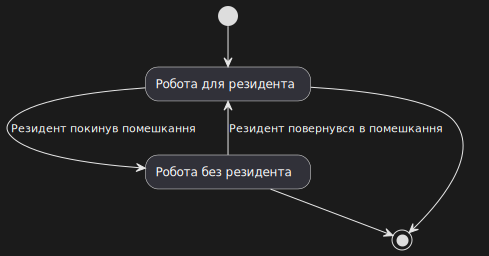

# Лабораторна робота №9

## Тема

Діаграма станів

## Мета

ознайомитися із призначенням та побудовою діаграми
станів мови моделювання системної інженерії SysML.

## Виконання

Ми побудували діаграму станів нашого помешкання. В нас 2 основних стани: будинок працює з користувачем всередині(Готує йому каву, підтримує температуру та інші функції окрім сигналізації) та будинок працює без користувача(Не потрібно нічого готувати, вмикати світло, але система безпеки працює). Також будинок можна вимкнути, перерівши його в термінальний стан.

## Висновок

На цій лабораторній роботі ми продумали в яких різних станах може знаходитись наш застосунок та які переходи можуть відбуватись між ними. Розробити діаграму станів нашої системи та змоделювали її
